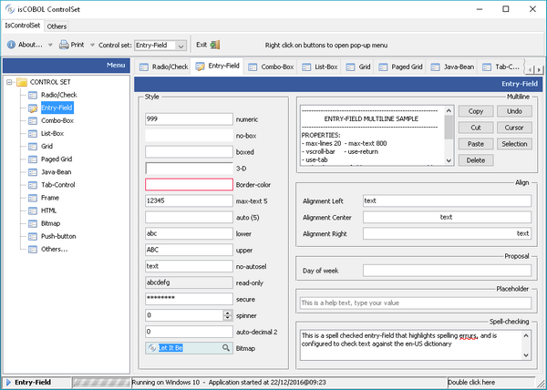
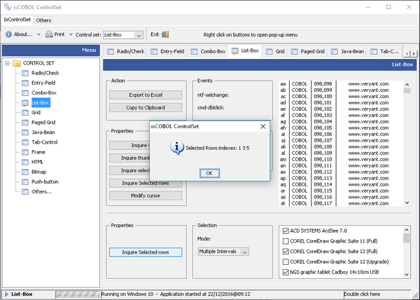
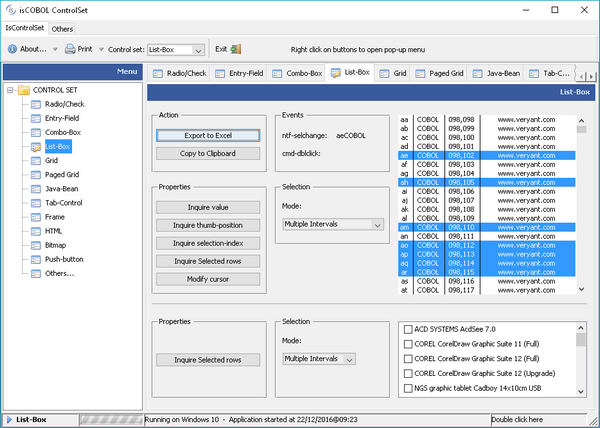
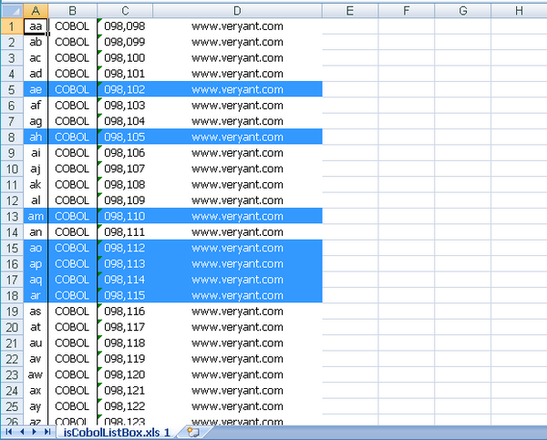
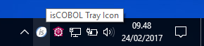
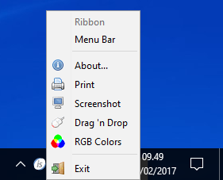

## New User Interface Features

The Entry-field control has been greatly enhanced with new features, and List-box has been upgraded as well. Also new is the ability to create a system tray icon.

New library routines have been implemented to simplify and enhance User Interface handling.

### Entry-field control

Entry-fields now support bitmaps inside the entry-field. This allows showing a bitmap on either the left or right edge of the control, or on both. Click and double-click events can be intercepted, to programmatically implement behaviors when the user interacts with these bitmaps. A specific hint message can be set for each bitmap.

This is the list of all new properties available for this feature:

- BITMAP-HANDLE to specify the handle of the loaded bitmap
- BITMAP-WIDTH to set the width of each bitmap when a strip of bitmaps is used
- BITMAP-NUMBER to set the bitmap number to be displayed on the left edge
- BITMAP-DISABLED to set the bitmap number to be displayed on the left edge when the control is disable
- BITMAP-ROLLOVER to set the bitmap number to be displayed on the left edge when the mouse is over the bitmap
- BITMAP- TRAILING-NUMBER to set the bitmap number to be displayed on the right edge
- BITMAP-TRAILING-DISABLED to set the bitmap number to be displayed on the right edge when the control is disabled
- BITMAP-TRAILING-ROLLOVER to set the bitmap number to be displayed on the right edge, when the mouse is over the bitmap
- BITMAP-HINT to set the hint text of the bitmap on the left edge
- BITMAP-TRAILING-HINT to set the bitmap on the right edge

The following new events are available on entry-field controls:

- MSG-BITMAP-CLICKED is fired when the image is single clicked
- MSG-BITMAP-DBLCLICK is fired when the image is double clicked

Entry-field controls now also support a new Spellchecker feature with suggestions, using the new property SPELL-CHECKING that can be set to a dictionary language.

The following code is used in the provided ISCONTROLSET sample, where the bitmaps and spell-checking features are used in the entry-fields shown in the last line:

```cobol
05 ef-bmp entry-field
                   bitmap-handle h-ef-icon
                   bitmap-width 16
                   bitmap-number 1
                   bitmap-trailing-number 3
                   bitmap-trailing-rollover 2
                   bitmap-hint "Click here to copy text to clipboard"
                   bitmap-trailing-hint "Click here to select a song"
                   event EF-BMP-EV
 
         05  spellcheck entry-field 
                        spell-checking "en-US"
 
 
 
EF-BMP-EV.
    evaluate event-type
    when msg-bitmap-clicked
       evaluate EVENT-DATA-1
       when 1
            modify ef-bmp cursor -1 
            modify ef-bmp action action-copy
       when 2
            set event-action to event-action-terminate
            set perform-lookup to true
       end-evaluate
    end-evaluate.
```



### List-box control

List-box now supports easy multi-selection with check-boxes, as shown in Figure 7, Check-list multiple selection, or single-selection with radio buttons. Those features can be enabled by setting the new style CHECK-LIST and property SELECTION-MODE to specify if a single or multiple selection is to be used. Selected items can be inquired with the property ROW-SELECTED.

Below is a code sample demonstrating the use of CHECK-LIST style and SELECTION-MODE property of list-box:

```cobol
05 my-list-multiple list-box
              check-list
              selection-mode lssm-multiple-interval-selection
05 my-list-single list-box
              check-list
              selection-mode lssm-single-selection
         inquire my-list-single   rows-selected w-row
         inquire my-list-multiple rows-selected w-rows
```



List-box content can now be copied to the clipboard and exported in Microsoft Excel XLS and XLSX formats. The new features can be added automatically or controlled by code.

Using COBOL code, the ACTION property value ACTION-EXPORT will trigger the list-box data export feature. Exported data file name and format can be customized using the EXPORT-FILE-NAME and EXPORT-FILE-FORMAT properties.

Using the ACTION-COPY value of the ACTION property will copy the list-box contents to the clipboard.

Multiple selection modes are now also supported in the list-box control, to allow users to more conveniently select items.

New properties in the LIST-BOX control

- SELECTION-MODE to set the selection type
- ROWS-SELECTED to retrieve the selected items list

The next picture shows how the user can access the new list-box export feature. This can be achieved by properly setting the export properties of the list-box, as shown below.:

```cobol
05 my-list list-box
              selection-mode lssm-multiple-interval-selection
              export-file-name w-path-filename
              export-file-format "xlsx"
   
          modify my-list action action-export
```



The data exported to Excel will look like this



### Tray icon

In W$MENU a new op-code named WMENUNEW-TRAY has been implemented to manage a multi-platform system tray icon.

The menu is shown in the system tray as an icon where the user can either left or right click or double click. With a right click, the sub-menu (if any) is shown, while with a left and double click, exceptions are sent to the current ACCEPT

When calling w$menu with op-code wmenu-new-tray, the text passed in the second parameter becomes the hint/tooltip shown when the user hovers the mouse over the tray icon, the third parameter is the exception value generated when the user clicks the icon, and the fourth parameter is the exception value generated when double clicking. The next three parameters are used to select the bitmap to be displayed from the bitmap strip.

Using the calling w$menu with op-code wmenu-add menu items can be added to the tray icon, as in a normal menu-bar.

The following is an example of the new tray icon usage.

```cobol
call "w$menu" using wmenu-new-tray 
                       "isCOBOL Tray Icon" 
                       78-tray-click-exc
                       78-tray-double-click-exc
                       h-tray-icon 1 16 
                giving h-try-menu.
 
call "W$MENU" using wmenu-add 
                    h-try-menu 
                    0 0 
                    "&About..." 
                    menu-pb-about
```

Running the code above will display the tray icon



Right clicking on the icon shows a pop-up menu



### Library routines

New routines have been implemented to enhance and simplify User Interface handling.

This is the list of new routines:

- W$SAVE-IMAGE saves a bitmap-handle to a disk file
- W$HINT shows hints programmatically. Hints can also have a different hide-timeout than the default one set from configuration
- W$PROGRESSDIALOG easily shows a progress dialog with determinate or indeterminate percentage indicator
- W$CENTER_WINDOW centers a window in the screen without needing any calculation from code

Enhancements in existing routines:

The new op-code WBITMAP-LOAD-FROM-CLIENT in W$BITMAP routine has been added to manage client-side bitmaps in Thin Client architecture. This is also useful to increase Thin Client performance.
