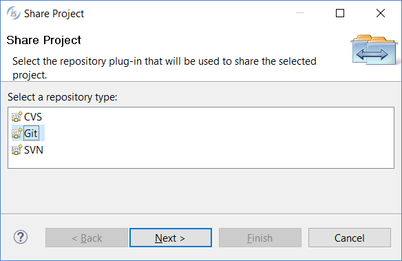
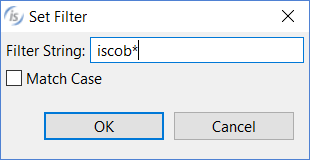
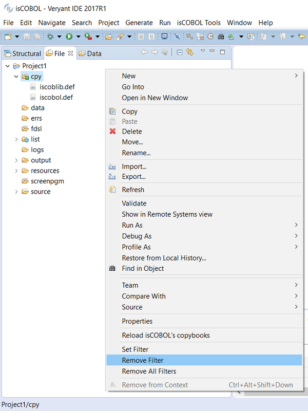
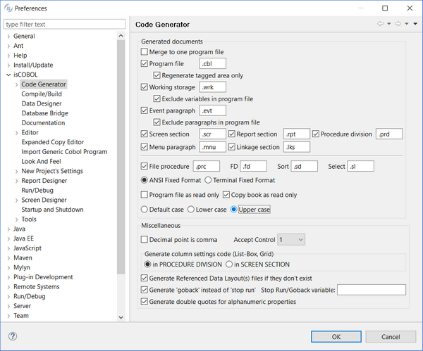

## isCOBOL IDE Enhancements

The isCOBOL 2017R1 IDE is now based on Eclipse 4.5 Mars. These are some of the new features introduced with the new isCOBOL IDE:

- New IDE dark theme, which looks great for dark lovers.
- Powerful terminal emulator, providing access to the system terminal directly from the IDE, as shown in Figure 1, Terminal configuration

- New keyboard shortcuts to split editors horizontally ( CTRL+\_ ) or vertically ( CTRL+{ ) allowing editing of two parts of a file at the same time.
- Native support of Git flow

- New meta-character filtering in the structural, file, and data view for easy navigation of large projects, as shown in the next pictures:

Eclipse’s Local history feature is extended to support screen and report painters (.isp files) and file designer (.idl files). This allows easy rollback of recent code changes without using additional source versioning software.

Moreover, .isp files representing Screen Programs and .idl files representing a File Descriptions can be linked into the project, using Eclipse’s file linking capabilities, allowing sharing of the source code between projects and developers.

Additional options on code generation have been introduced, to allow excluding automatically generated variables or paragraph, if they are already defined in the source code manually maintained outside the tagged areas. File extensions in the file procedure sections can now be customized, and code can be generated in upper or lower case.

Extensive enhancements have been made in the AcuBench migration wizard, improving compatibility with AcuBench 10, the ACUCOBOL-GT IDE.
