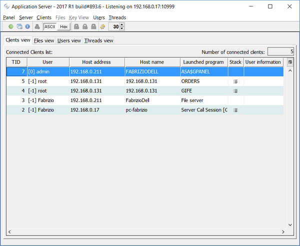
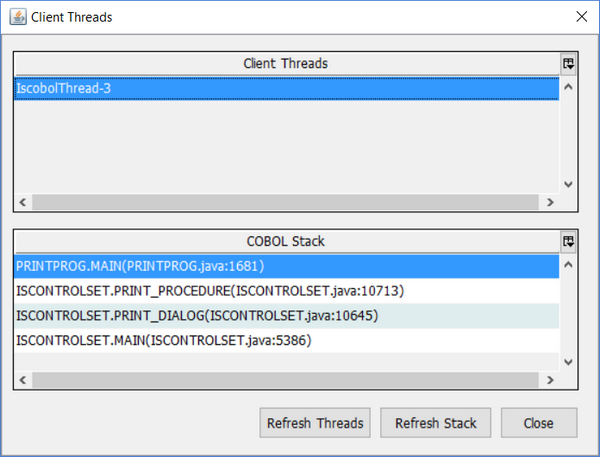

## isCOBOL Server Improvements

isCOBOL Server can now be configured to start additional JVM processes on the server side when receiving connection requests. Moreover, the administrator Panel has been enhanced.

Thin Client TCP/IP traffic generated on statements such as:

```cobol
•display window
•inquire line, col, size, lines
•call "w$font"
```

has been reduced up to 50% enhancing performance.

### Multitasking

This new feature helps when multiple developers need to debug applications running on the same isCOBOL Server.

The new configuration setting, iscobol.as.multitasking allows specifying whether separate JVM processes are used for every thin client (value 1) or only the client programs launched in debug mode (value 2).

Java options can now be passed to the new processes by setting the new configuration iscobol.jvm\_options.

Following is a configuration sample used to configure isCOBOL Server for debugging simultaneously from 2 different Clients:

```cobol
iscobol.as.multitasking=2
```

Using this setting two developers can debug Thin Client applications by only selecting different debug ports:

```cobol
iscclient –hostname ipserver –port 10999 –d –debugport 9991 MYPROG
iscclient –hostname ipserver –port 10999 –d –debugport 9992 MYPROG
```

These debugger sessions don’t interfere with other Clients running without debug mode, allowing debugging applications on production or test environments, while other clients are running.

### Panel improvements

The isCOBOL Server administration Panel has a new "Threads View", which shows CPU usage of all isCOBOL Server threads:


The Clients View in the Panel now has the new Stack column, that can now show the list of running threads for each TID, if the application uses multithread programming, and the COBOL stack trace for each thread



The stack trace of a single thread program looks like this

The stack trace of a multi thread program looks like this


