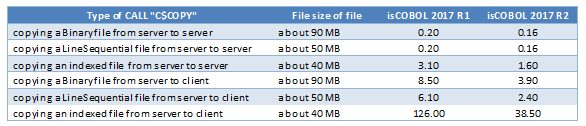

## Framework improvements

isCOBOL Evolve 2017 R2 includes enhancements on XML and JSON stream handling, as well as several improvements to runtime configuration options and compatibility with other COBOLs.

### Performance improvement on C$COPY library routine

C$COPY library routine has been optimized to improve performance by copying files, especially when runnning on an isCOBOL Server architecture to copy to and from clients.

The table below compares file transfer performance between isCOBOL 2017R2 and the previous version.



### New configuration options for XML and JSON streams

New configuration options are available for XML and JSON streams that can be used to configure the way XML and JSON streams are created in isCOBOL EIS.

- iscobol.xmlstream.rtrim=true – allows string trimming when generating XML streams. Defaults value is false.
- iscobol.jsonstream.indent_number=n – sets the number of white space characters to be used for JSON stream indentation. Default is -1
- iscobol.jsonstream.omit_empty_elements=true – allows empty JSON elements to be omitted from the stream. Default is false.
- iscobol.jsonstream.rtrim=true allows trimming of string in JSON streams. The default is false

Other configuration enhancements:

The \* wildcard is now supported in the configuration option iscobol.code\_prefix, to allow loading all JAR files in a directory that contains COBOL programs, as shown below:

```cobol
iscobol.code_prefix=/dir-classes:/dir-jar/*
```
