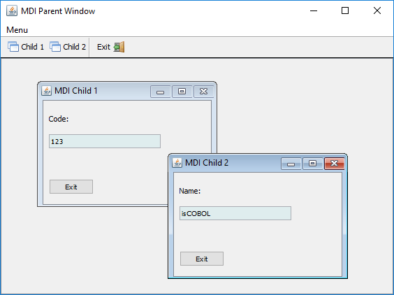
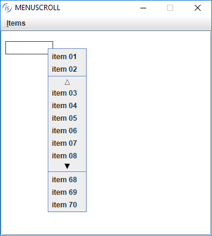
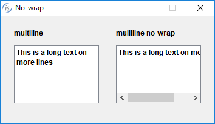
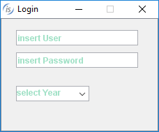

## New User Interface Features

MDI (Multiple Document Interface) windows are now supported to enhance COBOL applications GUIs. Menus and pop-up menus with many items can now be scrolled for easier navigation of complex applications. Several other minor enhancements designed to improve User Interface handling.

### MDI windows

Multiple Document Interface is a user interface model to create applications that enable users to work with multiple documents (screens) at the same time. Each document runs in a separate container with its own controls for user interaction. The user can view and work on multiple documents at the same time, such as customer details, order form, and balance checking, by simply moving the cursor from one window to another.

A parent Window can contain multiple child windows, and child windows can intercept events occurring in buttons placed in the parent window tool-bar. MDI windows can be used both in single and multi-threaded environments, where several “accept” statements are executed concurrently.



Code snippet showing MDI window creation:

```cobol
display mdi-parent window
        background-low
        resizable
        lines 21
        size 70
        min-lines 21
        min-size 70
        title "MDI Parent Window"
        system menu
        event win-evt
        handle h-mdi-parent
display mdi-child window
        upon h-mdi-parent
        title "MDI Child 1"
        line 3
        col 2
        size 30
        lines 10
        layout-manager lm-scale1
        resizable
        system menu
        handle h-mdi-child-1.
display mdi-child window
        upon h-mdi-parent
        title "MDI Child 2"
        line 5
        col 37
        size 30
        lines 10
        layout-manager lm-scale1
        resizable
        system menu
        handle h-mdi-child-2
display screen-1
        upon h-mdi-child-1
display screen-2
        upon h-mdi-child-2
```

### Scrolling menu items

Selected menu items within menus and pop-up menus can now be scrolled. The scrolling behavior can be customized with new parameters implemented in the W$MENU library routine, as shown below:

Usage:

```cobol
CALL "W$MENU" using [WMENU-NEW|WMENU-NEW-POPUP]
                    [ScrollItems, FixedTopItems, FixedBottomItems, ScrollingInterval]
```

where:

- ScrollItems is the number of visible items that can be scrolled

- FixedTopItems is the number of fixed and always visible items at the top of the menu

- FixedBottomItems is the number of fixed and always visible items at the bottom of the menu

- ScrollingInterval is the number of milliseconds used to automatically scroll menu items when hovering on the arrow icons

Code snippet:

```cobol
CALL "W$MENU" USING WMENU-NEW-POPUP, 6, 2, 3, 300
             GIVING h-popmenu.
```

The results of the above code is



### C$DESKTOP routine

The new C$DESKTOP routine allows isCOBOL applications to launch associated applications registered on the native desktop to handle a file or URI.

Supported operations include:

- launching the user-default browser to show a specified URI;
- launching the user-default mail client with an optional mailto URI;
- launching a registered application to open, edit or print a specified file.

The new C$DESKTOP routine also supports “actions” that can be used to open, edit, e-mail or print a file.

Usage:

```cobol
CALL "C$DESKTOP " USING op-code, w-uri, [cs-flag]
```

Where:

op-code is numeric and valid values are defined in the isgui.def file: cdesktop-browse, cdesktop-edit, cdesktop-mail, cdesktop-open, cdesktop-print.

URI is alphanumeric value, and is used as an argument for the op-code operation requested in the call.

CS-FLAG (numeric) is an optional parameter; when set to 1 the operation is executed on the client, otherwise it is executed on the server.

Code Snippet:

```cobol
move "c:\tmp\myfile.png" to w-uri
call "C$DESKTOP" using cdesktop-open, w-uri
```

### Other enhancements

A new NO-WRAP style has been added to multiline entry-fields to avoid text wrapping on the next line.



The new configuration option iscobol.gui.placeholder\_color is provided to set the color used for placeholder in entry fields.



The new MSG-GD-DBLCLICK event can be fired also on read only Grid component.

New methods have been implemented in the com.iscobol.rts.print.SpoolPrinter class to enhance customization of the Print Preview window.

- getSaveDefaultDirectory() to retrieve the Directory previously set
- setSaveDefaultDirectory(String path) to set the Directory shown in the Save dialog
- getSaveDefaultFilename() to retrieve the Filename previously set
- setSaveDefaultFilename(String path) to set the Filename shown in the Save dialog

Performance has been improved by an order of magnitude on sorted list-box and combobox loading.
