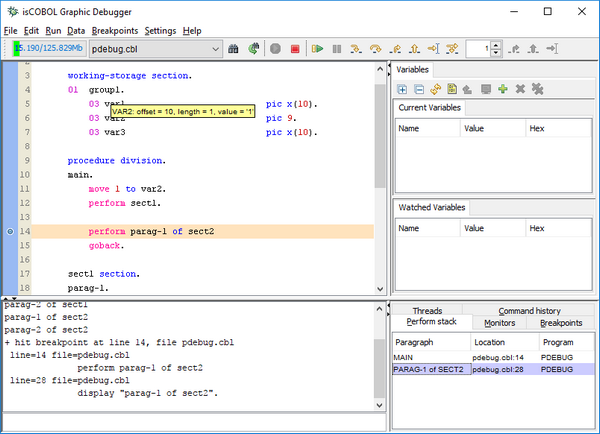

## isCOBOL Compiler and Debugger Enhancements

isCOBOL Evolve 2017 R2 includes changes to developer utilities and debugger to improve productivity.

### Debugger enhancements

The isCOBOL debugger has been updated, improving variable hint examination, and providing an easy-to-read Perform stack view.

The figure below shows the new display variable hint, visible when the mouse hovers on a variable, which now includes the offset, the length and value of the variable. Additionally, the Perform Stack pane now clearly shows the section name of the paragraph in the call stack, making it much easier to read when a COBOL program contains the same paragraph name in multiple sections.



### Stream2wrk utility

This new utility for COBOL developers replaces the previous xml2wrk and wsld2wrk utilities. It can now generate COBOL data structures to manage JSON files, and has been improved to handle XML with XSD schema files and WSDL definition.

The generated source code can also highlight fields declared optional in the WSDL or XSD schema files.

The utility can be run to generate data structure for JSON file as follows:

```cobol
stream2wrk json uri [-o outputfile] [-p prefix] [-d]
```

To import a WSDL file:

```cobol
stream2wrk wsdl uri [-o outputfile] [-v1.1]
```

To import an XML file:

```cobol
stream2wrk xml uri [-o outputfile] [-p prefix] [-d]
```

Some usage samples are shown below:

```cobol
stream2wrk json c:\dir\myfile1.json -o myjson1.def
stream2wrk wsdl http://ws.cdyne.com/ip2geo/ip2geo.asmx?WSDL -o ip2geo.cpy
stream2wrk xml c:\dir\myfile2.xml -o myxml2.def
```
