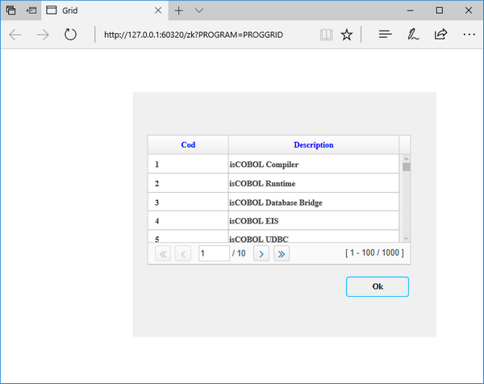

## isCOBOL EIS improvements

isCOBOL EIS has been enhanced with an improved REST Web Service Bridge generation, and WebDirect 2.0 has new features for grids and new routines.

### REST web service

A single REST web service program can now manage both XML and JSON requests and responses, instead of two separate bridges.

EIS bridge programs can detect the correct incoming request format and the desired response format by automatically checking the Content-Type header in the HTTP request, and act accordingly. This means that a single web service program can now serve multiple clients regardless of data type format requirements, for example, a single web service can serve a front-end HTML / javascript application, which typically use JSON format, and a GUI desktop application that uses XML format. Developers just need to write the program that implement the web service requests, and the Bridge will take care of the communication details.

This feature is enabled by default when generating programs with isCOBOL IDE 2017R2 when enabled the Service Bridge Editor, or compiling from command line when configured with the following properties:

```cobol
iscobol.compiler.servicebridge=true
iscobol.compiler.servicebridge.type=REST
```

Developers not using Web Service Bridge generation, integrated in the compiler, can leverage the new methods acceptEx(ICobolVar) and displayEx(ICobolVar) of the HTTPHandler class that auto-detect the format reading the Content-Type of the HTTP request. Web Service now can read the HTTP request method used by the client (GET, POST, PUT, DELETE,…) with the new method getMethod(), which returns a string containing the requested method name. Request methods are usually used to indicate the desired action to be performed on the passed data.

If a request from a client does not specify a content type, developers can set the default format by setting the configuration

```cobol
iscobol.rest.default_stream=xml|json (default json)
```

Additionally, the HTTPClient class has methods that read and write data using the format requested by looking at the Content-Type header (or the default if the Content-Type header is not used):

- doPostEx(ICobolVar url, ICobolVar content)
- getResponseEx(ICobolVar)

The client Beans generated by the compiler have been updated to use the new methods as well.

### WebDirect 2.0 improvements

Grids in WebDirect 2.0 now have a pagination capability, in a web-style.

The new property ROWS-PER-PAGE has been added to the Grid component, to set the

number of visible rows in the grid and to enable pagination. The COBOL program can

load all the available data on the grid, and by setting ROWS-PER-PAGE to a number greater than zero, the runtime will activate automatic pagination. The browser will only display the visible rows, and the runtime will automatically request additional data as the user navigates the grid.

This new feature greatly improves performance and responsiveness of programs that use grids with a large number of records, and frees the developers from having to implement the navigation logic of a classic Paged Grid.

The following screen section snippet produces the grid shown in Figure 12, Grids with ROWS-PER-PAGE in webDirect.

```cobol
03 gd1 Grid
   line 4 column 4 size 65 cells lines 7
   no-box centered-headings column-headings
   heading-color 10
   rows-per-page 100
```

The figure below shows the ouput on video.



Two new library routines: WD2$REDIRECT and WD2$EXECJS.

WD2$REDIRECT can be used to perform a redirect to a new URL.

Usage:

```cobol
CALL "WD2$REDIRECT" USING new-url, [target]
```

where target values are "_blank", "_parent", "_self", "_top" (default "_blank")

The typical use case of WD$REDIRECT is to allow links to be opened from program control, by redirecting the user on a landing page on program’s termination, or to open a PDF document in a new browser page or tab, usually after a print job has been requested.

Code snippet:

```cobol
move "http://www.veryant.com" to w-url
call "WD2$REDIRECT" using w-url "_self"
move "resources/pdf/customer-list.pdf" to w-url
call "WD2$REDIRECT" using w-url
```

WD2$EXECJS is used to run javascript code in a webDirect program.

Usage:

```cobol
CALL "WD2$EXECJS" using js-string
```

The routine accepts straight javascript code, with no script tags, and sends it to the browser for immediate execution in an optimized way.

Code snippet:

```cobol
move "alert('hello world');" to js-string
call "WD2$EXECJS" using js-string
```

Additionally, WD2$EXECJS can be used to create new functions in javascript to send to the browser, to be later called by the COBOL program.

Code snippet:

```cobol
move "function showError(message) alert(message);}" to js-string
call "WD2$EXECJS" using js-string
...
call "WD2$EXECJS" using "showError(‘Invalid customer code’);"

```
