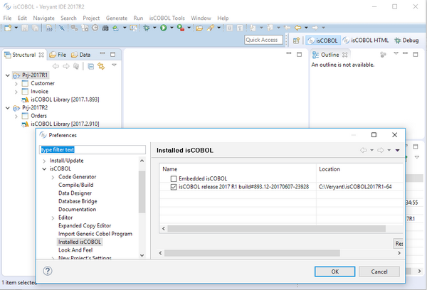
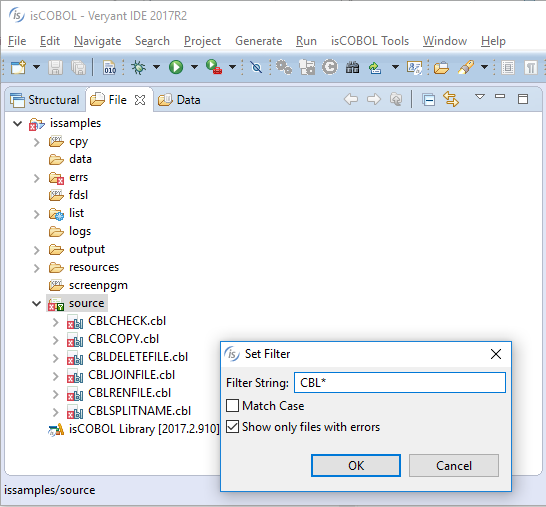
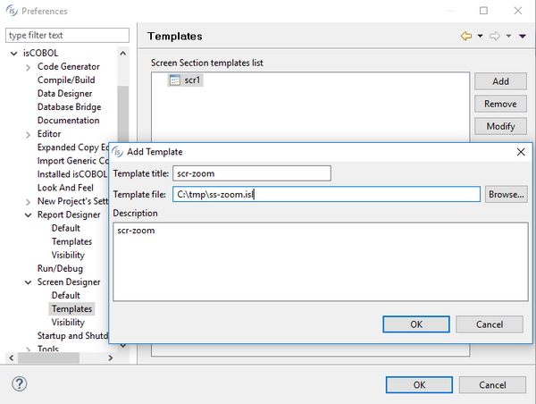
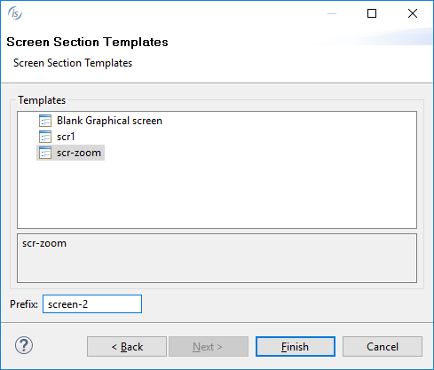
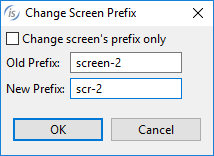
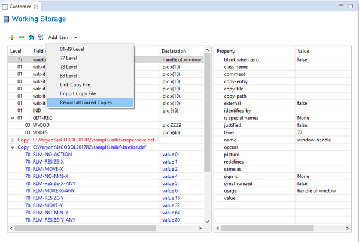

## isCOBOL IDE Enhancements

The isCOBOL 2017 R2 IDE now allows developers to set a different isCOBOL compiler version to use while compiling and testing for each project in the workspace, instead of the one contained within the IDE.

This enables the use of the latest isCOBOL IDE’s features, while still compiling and running programs using different isCOBOL compiler versions, simplifying development and testing of applications already in production with any isCOBOL version compatible with this feature.

The minimum compatible compiler version is 2017 R1.

The "Set Filter” feature has been improved by adding the option to show only programs that have compilation errors, making it much easier to find source files that need fixing in very large projects.

The import Report and Screen features have been improved by allowing the use of custom templates, and by allowing the Report and Screen prefix to be modified when importing the template, enabling teams to set standards when creating new screens and reports in an application. Templates can be set in the “Preferences / isCOBOL / Screen Designer /Templates” and “Preferences / isCOBOL / Report Designer / Templates” pages.

When creating a new screen or report, a template can be selected and a prefix can be specified to generate unique control names.

The prefix can also be changed at a later time, using the Change Prefix dialog.

The new "Reload all Linked copies" option is available in the Working Storage, Linkage Section and Record Definition editors, to reload all the linked copy files used within the editor in a single click. This feature can be automatically executed when starting the editors by checking the new setting in the “Data designer” option page of the IDE’s preferences.

