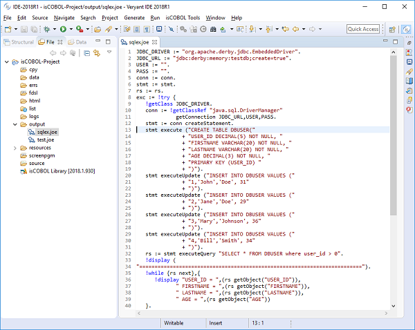

## JOE for isCOBOL

isCOBOL programs can be distributed from a server with isCOBOL Application Server; this is the architecture of choice for multiuser applications due to its many benefits, however, in order to get the best results, it requires all the processing made using isCOBOL environment.

Many legacy applications are developed intermixing COBOL programs and interpreted scripts of some kind (e.g. Bourne shell); in order to get these applications running in isCOBOL Application Server, currently, it is necessary to translate the scripts into COBOL programs and compile them.

This process can be lengthy and eventually the results could be less appealing than the starting point because:

- interpreted procedures are now compiled procedures
- procedures written with a language oriented to manage operating system tasks are now written using COBOL (a Business Oriented Language).

So, in order to speed up the migration process getting at the same time a better result, it would be useful to have a scripting language whose features are:

- ability to access any isCOBOL/Java resource: isCOBOL (as well as Java) is operating system independent therefore the Java environment is its virtual operating system
- easy to change in order resemble any scripting language in terms of capability and readability
- easy to customize in order to get frequently used operations at hand
- easy to extend in order to be useful for future applications’ enhancements, not only for the migration process;
- easy to understand and use;
- 100% compatible with the isCOBOL Application Server architecture.

As an example, the following JOE script asks the user for input, and then displays a salutation:

```cobol
/** JOE says Hello */
!display "What's your name?".
VAR := !accept.
!display "Hello ",VAR.
!exit.
```

and it can be executed by running:

```cobol

```

In Figure 7, *JOE JDBC Example*, shows a more complex script that creates a JDBC connection to a JDBC database and runs basic SQL statements. This example can be executed without any compilation. A new isCOBOL IDE plugin is provided to simplify JOE scripts coding.

**Figure 7.** JOE JDBC Example
