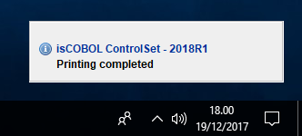
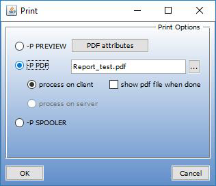
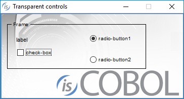

## New User Interface Features

Notification windows have been implemented to advise the end user of events with an elegant and convenient pop up window. Gradient effects can be applied on existing window and multiple monitors are now fully and easily supported.

Several other minor enhancements designed to improve User Interface handling.

### NOTIFICATION windows

Notification windows are useful to provide users with feedback on the outcome of programs execution, such as informing a user that a computation has completed, that a print job has been carried out, or that a form contains errors.

A notification window uses a customizable corner of the desktop to display notifications or status information.

Notification windows can be used to show information that does not require user interaction, showing only a simple message or a specific screen section. If user interaction is required, there is no need to accept the notification screen, and the accept on the current window will terminate with the exception-value generated by the controls on the notification window. The notification window can also automatically close after a timeout, specified in the BEFORE TIME property.

The following code snippet will show the notification window shown in Figure 10, *Notification window in Microsoft Windows*, and Figure 11, *Notification window in Mac OSX*.

```cobol
display notification window
        bottom right
        before time 500
        lines 5 size 40
        handle h-notification
display mask-notification upon h-notification
```

**Figure 10.** Notification window in Microsoft Windows

**Figure 11.** Notification window in Mac OSX

### Gradient effects

Window controls can now display gradients as background color using the two new properties

GRADIENT-COLOR-1 specifies the starting color, and supports RGB notation

GRADIENT-COLOR-2 specifies the ending color , and supports RGB notation

GRADIENT-ORIENTATION specifies the orientation of the gradient effect. Allowed values are: gradient-north-to-south, gradient-northeast-to-southwest, gradient-east-to-west, gradient-southeast-to-northwest, gradient-south-to-north, gradient-southwest-to-northeast, gradient-west-to-east, gradient-northwest-to-southeast.

Code snippet to create a window with gradient effects:

```cobol
display independent graphical window
        title "Print"
        lines 15 size 52
        handle h-win-print
        gradient-color-1 rgb x#ffffff
        gradient-color-2 rgb x#6D8AD6
        gradient-orientation gradient-north-to-south.

```

The result of the above code is shown on Figure 12, *Gradient on window*.

**Figure 12.** Gradient on window

### Multiple monitors

The new C$MONITOR routine allows isCOBOL applications to query the system about the number of attached monitors, get the screen resolution of each, their relative positioning, and to find which one is the primary display.

Usage:

```cobol
CALL "C$MONITOR" USING op-code, other-parameters
```

Where:

- *op-code* is numeric, and valid values are defined in the iscobol.def file: cmonitor-get-no-monitor and cmonitor-get-monitor-info
- *other-parameters* depends on the op-code used.

The op-code cmonitor-get-no-monitor returns the number of monitors available, and the number of the primary monitor.

The op-code cmonitor-get-monitor-info returns configuration information of a specific monitor.

The returned data is shown below:

```cobol
01 cmonitor-data.
   03 cmonitor-usable-screen-height   pic x(2) comp-x.
   03 cmonitor-usable-screen-width    pic x(2) comp-x.
   03 cmonitor-physical-screen-height pic x(2) comp-x.
   03 cmonitor-physical-screen-width  pic x(2) comp-x.
   03 cmonitor-start-y                signed-int.
   03 cmonitor-start-x                signed-int.
```

The DISPLAY WINDOW statement has a new SCREEN-INDEX property that can be used to set the monitor that will be used to display the window.

The W$CENTER_WINDOW library routine has been enhanced to allow specification of a monitor with an additional parameter.

The following code snippet shows how to inquire the number of monitors, read the configuration information of the second monitor, and create an independent window centered on the second monitor:

```cobol
call "C$MONITOR" using cmonitor-get-no-monitor
                       number-of-monitor
                       primary-monitor
call "C$MONITOR" using cmonitor-get-monitor-info
                       2
                       cmonitor-data
display independent window lines 30 size 100
        title "Window on second monitor"
        screen-index 2
        handle in win2
call "W$CENTER_WINDOW" using win2, 2
```

### Other enhancements

New configuration properties have been implemented to customize editing on GUI controls:

```cobol
iscobol.gui.kbd_case=lower/upper
```

used to force characters casing on GUI controls

```cobol
iscobol.gui.entryfield.implied_decimal=true
```

to have implied decimal values on entry-fields, based on the number of decimal digits defined in the picture in the associated variable of the entry field.

The TRANSPARENT style, previously available only on label controls, is now supported on check-box, radio-button and frame. This allows the creation of user interfaces with gradients as background colors.

Code snippet:

```cobol
01 screen-1.
   03 bitmap line 1 column 1 size 100 cells lines 20 bitmap-handle bmp-handle.
   03 frame transparent
      line 2 column 3 size 56 cells lines 10 cells title "Frame".
   03 label transparent
      line 4 column 6 size 10 cells title "label".
   03 check-box transparent
      line 6 column 6 size 20 cells title "check-box".
   03 radio-button transparent group 1 group-value 1
      line 8 column 6 size 20 cells title "radio-button1".
   03 radio-button transparent group 1 group-value 2
      line 8 column 30 size 20 cells title "radio-button2".
```

The result of the above code is shown on Figure 13, *Transparent controls*.

**Figure 13.** Transparent controls
