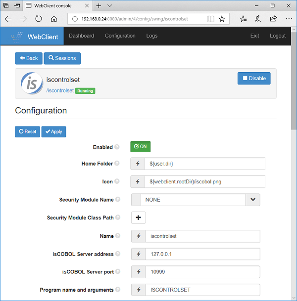
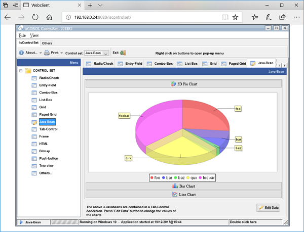
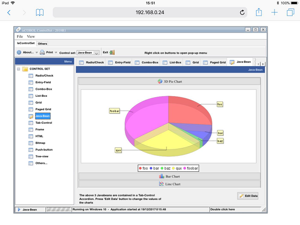
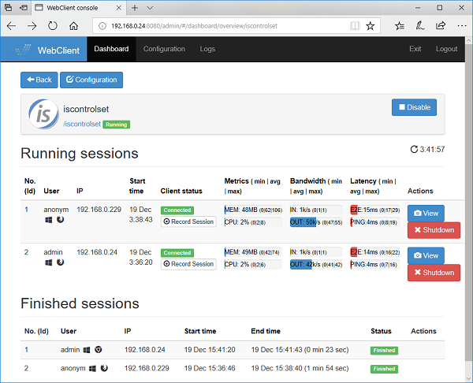
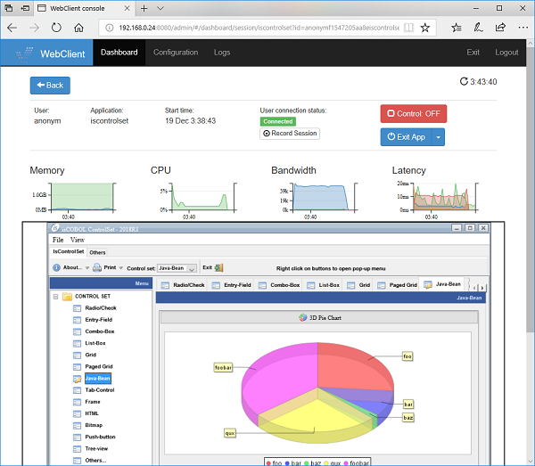
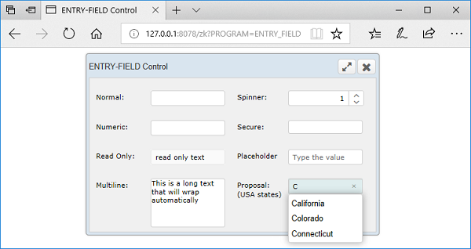

## isCOBOL EIS Improvements

isCOBOL EIS has been enhanced with a new product named webClient. Several other minor enhancements designed to improve the existing capabilities of EIS.

### webClient

webClient allows execution of isCOBOL Thin-Client applications, both graphical and characters based, in any web browser without modification. webClient and webDirect can both create web applications, but they differ in how this is accomplished. webDirect allows the use of external CSS stylesheets and javascript files to spicy up the application, while webClient is an easy way to render isCOBOL user interfaces in a web browser, retaining the look and feel of a desktop application. A webClient server can host several isCOBOL applications, and users can be granted access to them individually.

The isCOBOL program user interface is rendered on the browser, and user interaction, such as mouse moves, clicks and keyboard events, are sent back to the server for processing by the isCOBOL program. Communication between Thin-Client and the browser is handled using web sockets, and communication between the Thin Client application and the isCOBOL program is handled by the isCOBOL Application Server.

This new architecture brings some notable capabilities

- User can interact with the application as if it was a regular desktop application.
- Session resuming allows users to continue the same session after reconnecting or in case a lost connection is re-established.
- Administrators can monitor running applications in real time, viewing important information such as memory usage, CPU usage and response times.
- Administrators can provide assistance to end users by using the built-in remote assistance feature, that mirrors the user program on the webClient administrative console, and allows administrator to take control of the session and help the user accomplish a task or troubleshoot a problem.
- Administration web console to configure users, isCOBOL programs and their settings, as shown in Figure 1, *Configuration page*.

**Figure 1.** Configuration page

The application running in the browser can be seen in Figure 2, *ISCONTROLSET sample running in the browser*, and Figure 3, *ISCONTROLSET sample running in the iPad’s Safari browser*.

**Figure 2.** ISCONTROLSET sample running in the Microsoft Edge browser

**Figure 3.** ISCONTROLSET sample running in the iPad’s Safari browser

Figure 4, *Administrator view of running applications*, shows how administrators can monitor running processes on the webClient server, and view or act on the user’s screen, as shown in Figure 5, *Administrator view of user session*.

**Figure 4.** Administrator view of running applications

**Figure 5.** Administrator view of user session

### Other Enhancements

The XML COBOL definition has been improved to support BASE64BINARY and HEXBINARY, allowing isCOBOL programs to consume web services that, for example, use MTOM communication.

The following is a code snippet that defines the field “a-document” to be handled as base64Binary:

```cobol
01 soap-in-sendFileMtom identified by 'soapenv:Envelope'.
*> ...
   07 identified by 'nameAttachedFile'.
      08 a-nameAttachedFile pic x any length.
   07 identified by 'document' base64Binary.
      08 a-document pic x any length.
```

Certificate validation can now be turned off to simplify testing of web-services in non-production environments with a new configuration setting:

```cobol
iscobol.http.ignore.certificates=true
```

When it is set to true the isCOBOL runtime will ignore certificates, if an SSL connection cannot be successfully established.

IsCOBOL webDirect now supports the PROPOSAL property on entry-field controls

Code snippet:

```cobol
01 screen1.
...
   03 label line 11 col 38 lines 4 size 12 cells
      title "Proposal: (USA states)".
   03 entry-field line 11, col 51 size 19 cells
      proposal (..."California", "Colorado", "Connecticut", ...).

```

The results of the above code is shown on Figure 6, *Proposal in webDirect*.

**Figure 6.** Proposal in webDirect
