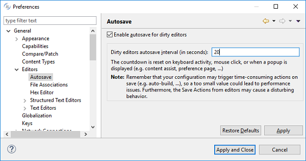
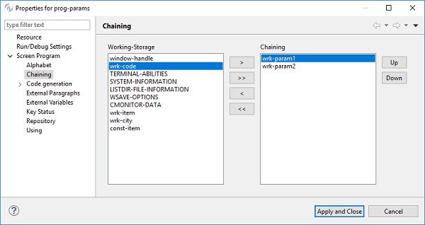

## isCOBOL IDE Enhancements

The isCOBOL 2018 R1 IDE is now based on the new Eclipse Oxygen release, which includes many improvements in functionality and performance.

isCOBOL Screen Painter now allows the definition of chaining parameters and customized linkage that affects the generated source code.

### Eclipse Oxygen

Eclipse Oxygen is based on Java 8 and offers many advantages compared to the previous versions:

- Support for high DPI monitor, such as Apple’s retina screens and 4K displays, improving on the usability of toolbar icons.
- GTK3 support for Linux platforms.
- Autosave to automatically save all open files in the isCOBOL editors. The autosave countdown is reset on any user activities, such as keystrokes and mouse event. See Figure 8, *Autosave feature*.
- Smart projects import and automatic missing editor installation.

The new Launch Group configuration type allows you to launch multiple configurations sequentially, with configurable actions after launching each group member.

**Figure 8.** Autosave feature

### Chaining parameters

The Program Properties of an isCOBOL Screen Program now allows defining a list of parameters that the program needs to receive from the command-line, as shown on Figure 9, *Chaining parameters*. Moreover, it’s also possible to define a customized list of linkage parameters. All data items declared in linkage section are generated in the “procedure division using” by default, but each linkage data item can be individually selected for inclusion in the USING clause.

**Figure 9.** Chaining parameters

The following is the generated code:

```cobol
procedure division chaining wrk-param1 wrk-param2.
```
