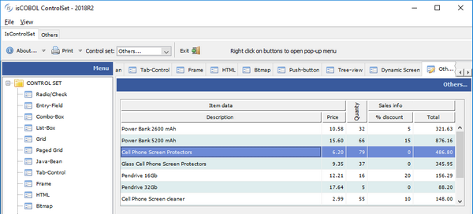
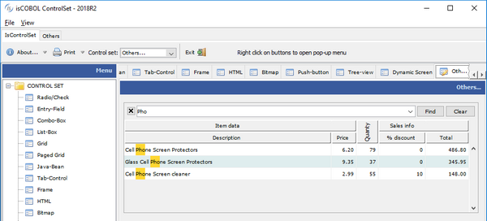
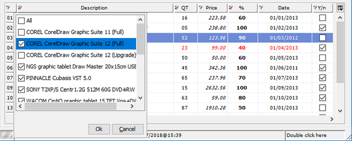
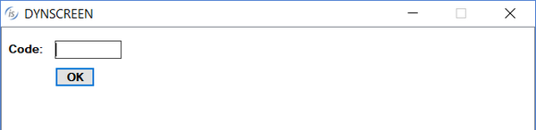

## New User Interface Features

The GRID control has been enhanced with automatic search and filter features. Screen sections are now dynamic, allowing controls to be added and removed at runtime.

Other minor enhancements are designed to improve User Interface handling.

### GRID enhancements

Grid searching is enabled by default and can be activated by the user at runtime by pressing Ctrl-F. A NO-SEARCH style is available to disable the feature when needed.

When the search function is activated, a panel is shown on the top portion of the grid to let the user search the grid for data. In the panel the user can enter the search text or select a previously used one. When the Find button is pressed, the occurrences of the search text are highlighted inside the grid. The Clear button allows the user to reset the search text, and the ‘X’ button allows the user to close the search panel.

The HEADING-MENU-POPUP property of grid now also supports the values GRHM-FIND-ON-RIGHT-CLICK and GRHM-FIND-ON-BUTTON to add the new Find item on the automatic heading menus.

Figure 4, *Grid before activating the search function*, shows the grid while the user is browsing, while Figure 5, *Search on grid* shows the search panel displayed when the user presses Ctrl-F while the grid has focus. This allows the user to search all occurrences of the given text.

**Figure 4.** Grid before activating the search function

**Figure 5.** Grid with the search function active

A new style named FILTERABLE-COLUMNS is supported on grids, to allow data filtering based on column content, as shown in Figure 6, Grid filtering. When activated on a column, a popup window will show every distinct occurrence of the column values, allowing the user to choose one or more values to use for filtering rows. Filters can be added to multiple columns and removed as needed. An icon is displayed on the column header to show an active filter.

```cobol
              05  h-grid, grid
                  filterable-columns
                  ...
```

Figure 6. Grid filtering

### Dynamic screens

Screen sections are now dynamic, allowing controls or entire screen to be added or removed at runtime using the DISPLAY UPON SCREEN and DESTROY syntax.

The UPON target can be a screen section, using the following syntax

```cobol
display screen1 upon screen2
```

or can be any of its group levels, allowing creation of child controls, using the syntax

```cobol
display screen1 upon screen2-group-2
```

The following code displays a screen with only a push-button, and populates it at runtime using DISPLAY statements, before accepting user input.

```cobol
       program-id. dynscreen.
       working-storage section.
       77 key-status special-names crt status pic 9(4).
          88 exit-pushed value 27.
       77 w-code pic x any length.   
       screen section.
       01 screen1.
          05 push-button ok-button
             line 4 col 9, size 6 cells.
       procedure division.
       main.
      *display a window 
           display standard graphical window.
      *display the initial screen
           display screen1.
      *add a label     
           display label upon screen1
                   line 2, col 2, size 6 cells
                   title "Code:".
      *add an entry-field
            display entry-field upon screen1
                    line 2, col 9, size 10 cells
                    value w-code.         
      *accept the screen
           perform until exit-pushed
              accept screen1 
                  on exception
                     continue
              end-accept
           end-perform.
           destroy screen1.
```

The result of running the code above is shown on Figure 7, *Dynamic screen*

**Figure 7.** Dynamic screen

### Other enhancements

The message-box control now plays a corresponding notification sound based on the message type, more closely adhering to the Microsoft© Windows© standard.
