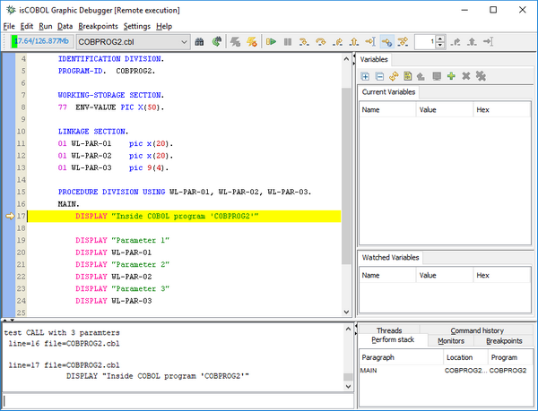
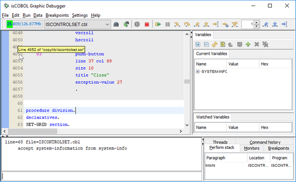
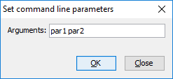

## isCOBOL Debugger

The isCOBOL Debugger has greatly enhanced, with new features aimed at increasing developer productivity, such as a new debugger command, easier code navigation and more.

### New debugger command

The isCOBOL Debugger has been enhanced with the new feature “Run to next program”, using the command PROG. When the PROG command is used, the Debugger continues execution of the current program, stopping at the beginning of the next COBOL program. This is especially useful when the caller program is not a COBOL program, such as a Java or C program, allowing the debugger to stop at the first COBOL program called.

For example, by typing PROG in the command window, pressing the button on the toolbar shown in Figure 8, *Debugger command PROG*, or choosing the option from the menu, the COBPROG2 will be executed and the Debugger will stop when running COBPROG3, which is the next program called by the main Java source.

**Figure 8.** Debugger command PROG

### Hint on line column

In large programs with many copybook files, sometimes it’s difficult to determine which file contains the source code being debugged. With the new debugger, a hint will appear when hovering the mouse pointer over the line number column, located on the left pane of the Debugger window, displaying the file path and line number of the highlighted line. Figure 9, *Debugger hint on line column*, shows the feature in action.

**Figure 9.** Debugger hint on line column

### Hyperlink

To simplify jumping to a given paragraph or variable definition, the hyperlink feature has been introduced. When hovering the mouse pointer on a paragraph name or a variable name, the name will be underlined and the mouse cursor will change to hand shape point, as shown in Figure 10, *Debugger hyperlink*. Left clicking the name will cause the debugger to display the definition.

**Figure 10.** Debugger hyperlink

### Command line parameters

The 'Set command line parameters' values are now saved in the Debugger session file (.isd), making it easier to debug a program with CHAINING parameters in different debugging sessions, as shown in Figure 11, *Debugger Set command line parameters*.

**Figure 11.** Debugger Set command line parameters
