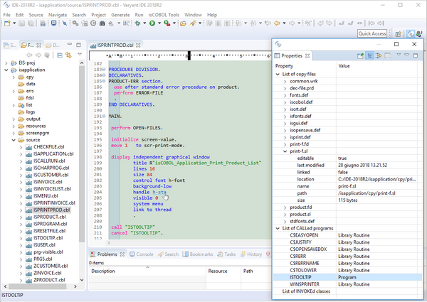
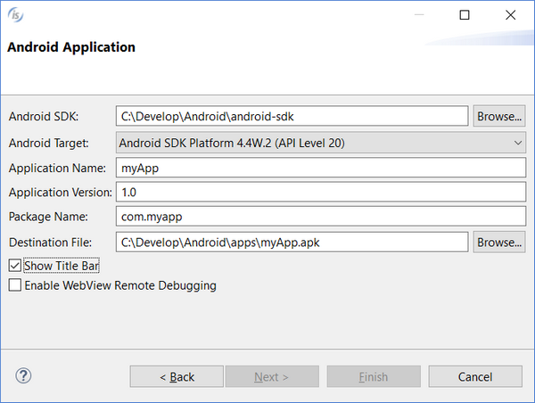
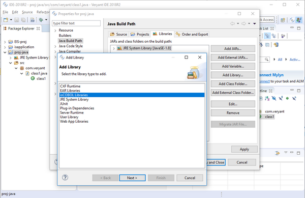

## isCOBOL IDE Enhancements

The isCOBOL 2018 R2 IDE improves the editor by displaying useful additional info to COBOL developers and improving the usability of existing features.

### Editor features

Opening a source file will now list important information in the “Properties” window, by default located on the bottom right of the IDE window, such as:

- a list of copy files used
- a list of called program
- a list of invoked classes

By double-clicking on a line in the property window, the selected copy file or program will be opened in the Editor if the source is available in the current workspace. For example, double-clicking the selected line shown in Figure 1, *IDE Property window and hyperlink*. will open the “ISTOOLTIP.cbl” source file.

The feature that creates a “Hyperlink” on a variable, paragraph or screen-control name in the editor has been simplified. By clicking on the name when the mouse has the “hand” shaped pointer, the IDE will position the editor on the declaration, whether it is located in the same source file, or in a different copy file.

**Figure 1.** IDE Property window and hyperlink 

A program can now be compiled even when the current editor file is a copy file, provided the copy file was opened from its parent source file, while previous versions required a program source file to be active.

### Export to Android

The isCOBOL IDE now allows you to customize the application title bar, when exporting the project as an Android application. If you check the “Show Title bar” option as shown in Figure 2, *Android title bar*, then an Application Bar will be rendered at the top of the HTML UI of the exported application, displaying the application name.

**Figure 2.** Android title bar

### Simpler Java integration

The “isCOBOL libraries” item has been added to the “Add Library” button of the “Java Build Path” section in a Java Properties page, allowing simple integration of isCOBOL libraries to a Java application, as shown in Figure 3, *Add isCOBOL Libraries*. This replaces the need to manually add the isCOBOL libraries to the Java project’s ClassPath, required in previous versions.

**Figure 3.** Add isCOBOL Libraries
