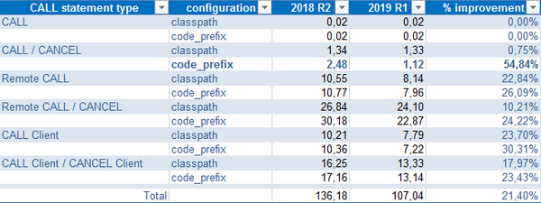
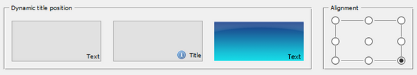

## Framework improvements

Performance of CALL statements has been greatly improved, with up to 55% better performance compared to the previous version. New configuration properties and new library routines have been introduced.

### Performance of CALL statements

Performance of CALL statements have been improved across the board, especially when using CALL/CANCEL statements under code_prefix, the feature that allows hot updates of running programs. Code prefix proves especially useful in server environments, for example when running under isCOBOL Server.

Refining class loading, and allowing developers to control it programmatically has achieved these improvements. When using code_prefix in previous versions, the first call and each subsequent call to the program after a cancel would run a check on the file system to see if the file had been updated since the last call. If so, the runtime unloaded the old version of the program and loaded the new. The check can be time consuming if executed frequently. Developers can now use the new *iscobol.code_prefix.reload=false* property to disable automatic reloading and leverage the new library routine C$UNLOAD to unload the program manually and allow updating.

Another improvement concerns remote calls configured using the remote.code_prefix property, which leverages more optimized runtime TCP communications, and does not need source code modification to enable performance gains in calls using code_prefix or the classpath.

A table of performance gains is shown in the picture below and shows a performance comparison between isCOBOL 2018R2 and isCOBOL 2019R1. The tests were run in Windows 10 64-bit on an Intel Core i5 Processor 4440+ clocked at 3.10 GHz with 8GB of RAM, using Oracle JDK1.8.0_192. All times are in seconds.

The called program contains a linkage group data item with 50 child items. The number of CALL/CANCEL iterations is 10,000.

The code_prefix tests under 2019R1 are in conjunction with code_prefix.reload=false



### New configuration properties

New configuration properties have been introduced in the Framework:

```cobol
iscobol.code_prefix.reload=false
```

to disable the automatic class reload, as discussed in the performance improvement section of this document.

New configuration properties are used for starting up programs with .istc configuration files:

- *iscobol.default_program*=PGM to specify the main program to execute when it's not passed
- *iscobol.default_options*=options to specify the options for isCOBOL execution (standalone or thin client)

Additional configuration properties:

- iscobol.call_run.sync=true to execute the CALL RUN synchronously instead of asynchronously
- *iscobol.esql.indicator_trunc_on_call=false* to set the indicator variable to 0 when the stored procedure’s output parameter value doesn’t fit the host variable
- *iscobol.file.indd=myindd* to associate custom file handlers to the files specified by INDD directive
- *iscobol.file.outdd=myoutdd* to associate custom file handlers to the files specified by OUTDD directive
- *iscobol.gui.entryfield.notify_change_delay*=n to affect all entry-fields
- *iscobol.key.default_shortcuts_enabled=tru to intercept shortcuts like Ctrl+C
- *iscobol.upper_lower_method*=n default value 1, where n can be:

  - 1, to use the method of String.toUpperCase / toLowerCase
  - 2, to use the method of Character.toUpperCase / toLowerCase

### Enhanced push button title position

Push buttons have been enhanced to allow finer control of title placement when a large bitmap is assigned to the button. A title can now be positioned relative to the button bitmap when a bitmap fully covers the button surface.

The picture below shows the result of the following code snippet which applies the new position to the third button:

```cobol
modify pb-3 title-position TITLE_OVERLAPPED_BITMAP_BOTTOM_RIGHT
```



### New library routines

The new C$UNLOAD routine can be used to unload programs loaded in memory without restarting the application. In order to take advantage of this new feature, you need to configure the application to be executed with “code_prefix” class loader as well as set the following configuration property:

```cobol
iscobol.code_prefix.reload=false
```

Two new library routines have been implemented to delete or rename C-TREE files on the

server side.:

- C$FSDELETE to delete indexed files using the File Manager’s internal API
- C$FSRENAME to rename indexed files using the File Manager’s internal API

Miscellaneous routines added in the newest release of isCOBOL 2019 R1 include the following:

- CBL_EXEC_RUN_UNIT can be used to run a unit that inherits the environment variables of the calling program
- C$ENCRYPT and C$DECRYPT can encrypt and decrypt a file using several cryptographic algorithms, as configured in the iscobol.crypt.algorithm property, such as:

| | |
| --- | --- |
| AES | Advanced Encryption Standard as specified by NIST in FIPS 197 |
| AESWrap | The AES key wrapping algorithm as described in RFC 3394 |
| ARCFOUR | A stream cipher believed to be fully interoperable with the RC4 cipher |
| Blowfish | The Blowfish block cipher designed by Bruce Schneier |
| CCM | Counter/CBC Mode, as defined in NIST Special Publication SP 800-38C |
| DES | The Digital Encryption Standard as described in FIPS PUB 46-3 |
| DESede | Triple DES Encryption (also known as DES-EDE, 3DES, or Triple-DES) |
| ECIES | Elliptic Curve Integrated Encryption Scheme |
| GCM | Galois/Counter Mode, as defined in NIST Special Publication |
| RC2 | Variable-key-size encryption algorithms developed by Ron Rivest |
| RC4 | Variable-key-size encryption algorithms developed by Ron Rivest |
| RC5 | Variable-key-size encryption algorithms developed by Ron Rivest |
| RSA | Encryption algorithm as defined in PKCS #1 |
| | |

- The library routine C$FORNAME can be used to check if a class is available on the system.
