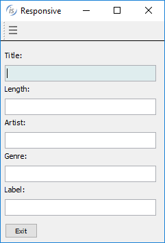
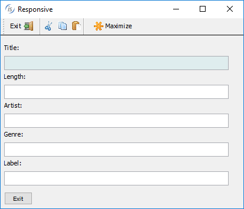
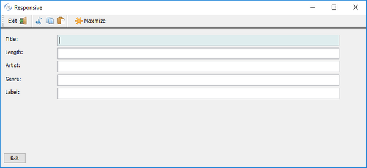

## Responsive Layout Manager

Responsive design is an approach to develop user interfaces that render well on a variety of devices with different window and screen sizes. The viewer proximity is also considered as part of the viewing context. Content, design, and performance are factored across all devices to ensure usability and satisfaction.

Content is like water, “You put water into a cup, it becomes the cup. You put water into the bottle it becomes the bottle, you put water into the barrel, it becomes the barrel…”

Starting with isCOBOL 2019R1 screen sections can now be responsive, allowing the controls to be resized, moved or hidden based on the window’s horizontal size when running in stand-alone, Thin Client and webClient environments. This allows the user interface to adapt to multiple devices, screen sizes, and screen resolutions. It also allows the user to resize an application window or rotate a screen, a required behavior in the era of mobile devices and mobile-first development.

To enable a responsive layout, a new layout manager named LM-RESPONSIVE has been added to the DISPLAY WINDOW and DISPLAY TOOL-BAR statements, and the LAYOUTDATA property on controls can define behavior based on window size. An LMRESPONSIVE layout includes all the same rules provided with LM-SCALE layout.

In a Responsive Layout Manager design, you must define media queries to create sensible breakpoints for layouts and interfaces. These breakpoints are mostly based on minimum viewport widths and allow you to scale up elements as the view changes.

The responsive breakpoints are defined in the LM-RESPONSIVE handle of the layout manager.

The following code snippet defines four sensible breakpoints; “smartphone” with a screen size up to 799 pixels, “tablet” from 800 pixels to 1023 pixels, “desktop” from 1024 pixels to 1599 pixels and “widemonitor” with more than 1600 pixels.

```cobol
       77  responsive-layout handle of layout-manager, lm-responsive
           "smartphone=1 pixels, tablet=800 pixels, " &
           "desktop=1024 pixels, widemonitor=1600 pixels" .
```

COBOL developers can also define sensible breakpoints using a CELL (or CELLS) unit approach. The following code snippet shows how to use CELLS in the handle of a layout manager declared in WORKING-STORAGE SECTION.

```cobol
       77  responsive-layout handle of layout-manager, lm-responsive
           "xsmall=1 cells, small=14 cells, " &
           "medium=40 cells, large=69 cells" .
```

The name of these sensible breakpoints must be used in the SCREEN SECTION to define how LAYOUT-DATA works for each UI control. For example, in the following entry-field the LAYOUT-DATA defines:

- LINE, COL and SIZE properties for the “small” breakpoint are 3.5, 2, and 14 cells respectively, replacing the default values of 2, 1.3, and 54 cells.
- LINE, COL and SIZE properties for the “medium” breakpoint are 3.5, 2, and 38 cells respectively, replacing default values of 2, 1.3, and 54 cells.
- RESIZE-X property is used for “small” and “medium” breakpoints, replacing default LM-SCALE behavior (RESIZE-X-ANY + MOVE-BOTH-ANY)

```cobol
       03  EF-TITLE
           entry-field
           line 2 lines 1.3 col 12 size 54 cells
           layout-data "line-small 3.5 cells " &
           "col-small 2 cells " &
           "size-small 14 cells " &
           "resize-x-small " &
           "line-medium 3.5 cells " &
           "col-medium 2 cells " &
           "size-medium 38 cells " &
           "resize-x-medium".
```

The Responsive Layout manager allows you to specify some directives in LAYOUT-DATA that rule how to make UI components visible or hidden.

For example, in the following push-buttons the LAYOUT-DATA specifies that:

- PB-EXIT is hidden for the “small” breakpoint and visible on all other breakpoints
- PB-MENU is visible for the “small” breakpoint and hidden for all other breakpoints
- NO-SCALE clause replaces the default LM-SCALE behavior MOVE-BOTH-ANY

```cobol
       03  PB-EXIT push-button self-act
           line 2 col 2 lines 16 size 10 cells
           title "Exit"
           ...
           layout-data "hidden-small " &
           "no-scale".
           ...
       03  PB-MENU push-button self-act
           title "menu"
           line 2 col 2 lines 16 size 16
           ...
           layout-data "visible-small " &
           "no-scale".
```

To enable responsive layout, the DISPLAY WINDOW and DISPLAY TOOL-BAR statements also need to use the LAYOUT-MANAGER property:

```cobol

```

The picture below shows how the program runs under small devices according to all “small” breakpoint rules defined in LAYOUT-DATA property with the typical “hamburger” menu.



The picture below shows how the program runs under medium devices. Now the toolbar contains new buttons (visible on “medium” breakpoint) and the “hamburger” button menu is hidden.



The picture below shows the same program running on a large device, with space enough to have a label and an entry-field on the same line.


