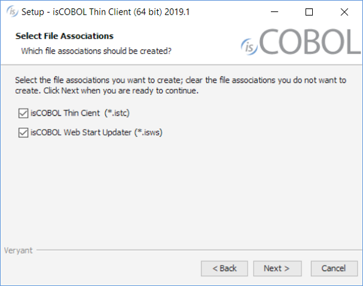

## Support for Java 11 and OpenJDK

isCOBOL Evolve 2019 R1 now supports Oracle Java 11 and OpenJDK 11, the latest releases of Java currently available, bringing isCOBOL up to date with the Java ecosystem.

isCOBOL and isCOBOL IDE installation setups now give you the option of selecting an OpenJDK installation, and all Veryant products are certified to run using Oracle JDK 11 and OpenJDK 11 for maximum flexibility.

The isCOBOL updater tool, isUPDATER, has been expanded in response to Oracle’s decision to drop support for Java Web Start, and now simplifies the startup of isCOBOL Thin Client applications.

Java Web Start (JAWS) is a framework developed by Sun Microsystems (now Oracle) that allows users to start application software for the Java Platform directly from the Internet using a web browser. Some key benefits of this technology include seamless version updating for globally distributed applications and greater control of memory allocation to the Java Virtual Machine. As of JDK9, Java applets are deprecated by Oracle with Java Web Start being the intended replacement. In March 2018, Oracle announced it will not include Java Web Start in Java SE 11 (18.9 LTS) and later. Developers will need to transition to other deployment technologies.

Since isCOBOL now supports Java 11 there is a need to replace the Java Web Start’s functionality for COBOL application startup with the isCOBOL automatic updater, isUPDATER.

The newest isUPDATER supports the HTTPS protocol, which can be configured using the following configuration properties:

- *swupdater.net.ssl.trust_store*=keystore to set the keystore
- *swupdater.net.ssl.trust_store_password*=password to set the password of the keystore
- *swupdater.http.ignore_certificates*=true (default is false) to ignore invalid certificates

### Media Type application

Veryant is in the process of registering two new mime types as applications of vnd.veryant.thin at [www.iana.org](www.iana.org). These will enable the automatic execution of isCOBOL Thin Client and the isCOBOL updater tool.

These file suffix registrations, done from the isCOBOL installation setup screen, will simplify the execution and the automatic update for the end user. The registered files contain all the isCOBOL properties needed to set up the desired execution of isCOBOL THIN and isUPDATER technologies on the client side.

When a registered file is downloaded, a user can execute it immediately without additional configuration steps.

The new file extension associations are:

- *.istc* to run the isclient utility (isclient -lc %1)
- *.isws* to run the isUPDATER (isupdater -c %1)

The new isCOBOL 2019R1 installation screen prompts you to define what mime types need to be registered on the operating system.



Files with the extensions .istc and .isws are property files used to configure and guide isCOBOL Thin Client and isUPDATER applications respectively.

Here’s an example of the contents of a file with the .istc extension:

```cobol
iscobol.hostname=192.168.0.200
iscobol.port=10999
iscobol.default_program=MAIN_PROG
```

Double-clicking (or executing) this .istc file is the equivalent to running the following command:

```cobol
isclient –hostname 192.168.0.200 –port 10999 MAIN_PROG
```

This command will run the program named MAIN_PROG on the isCOBOL Server running on port 10999 at the IP address 192.168.0.200.

Here’s an example of the contents of a file with the .isws extension called *myapp.isws*:

```cobol
swupdater.site=http://192.168.0.200:10996
swupdater.version.iscobol=975
swupdater.directory.iscobol=C:/Users/Veryant/isCOBOL THIN2019R1/lib
swupdater.directory.clean.iscobol=true
swupdater.version.iscobolNative=975
swupdater.directory.iscobolNative=C:/Users/Veryant/isCOBOL THIN2019R1/bin
swupdater.directory.clean.iscobolNative=true
swupdater.version.myApp=0
swupdater.directory.myApp=C:/myApp
swupdater.directory.clean.myApp=true
swupdater.mainclass=com.iscobol.invoke.Isrun –c C:/app/app.properties MYPROG
```

Double-clicking (or executing this .isws file is the equivalent to running the following command:

```cobol
isupdater –c myapp.isws
```

The command above directs the isCOBOL updater tool to download the updated resources from the isCOBOL HTTP Server running on port 10996 of IP address 192.168.0.200 if necessary. When the download is complete, the *com.iscobol.invoke.Isrun* class is executed to run the application.
