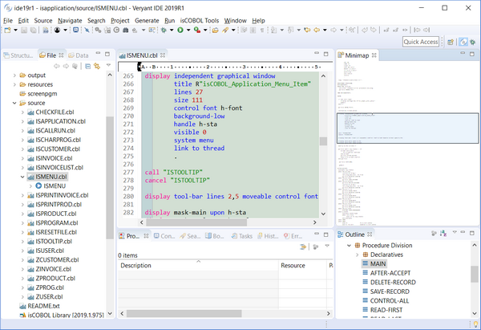
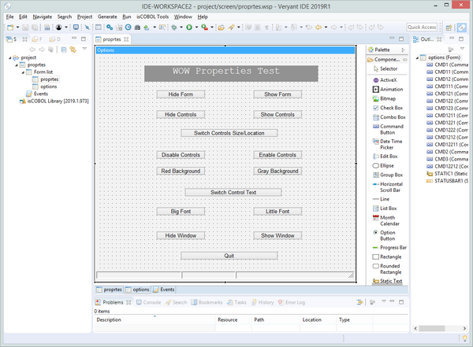
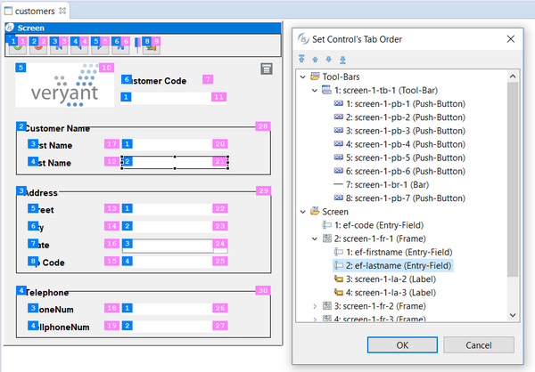
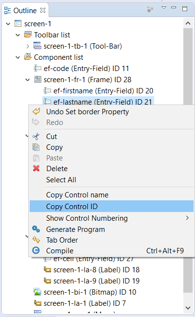

## isCOBOL IDE Enhancements

The isCOBOL 2019 R1 IDE is now built on the latest Eclipse 2018-09. This release is the first quarterly Eclipse Simultaneous Release of Eclipse 4.9 that provides full support of Oracle JDK 11 and OpenJDK 11.

### Eclipse features

The newest release of isCOBOL IDE encompasses all the new features in Eclipse 2018-09 and all new features in Eclipse Photon. One of those new features is the Editor Minimap, which gives developers a high-level overview of the content of the currently active text editor. This aids in navigation and gives you a better understanding of your code, as shown in the picture below.

Default Debug perspective layout changed. The aim is to give the editor area more space and to show more relevant information without scrolling. Display view, Expressions view, and Project Explorer are now shown by default, Problems view replaces Tasks.

### COBOL-WOW support

The isCOBOL 2019 R1 IDE can import existing COBOL-WOW projects, providing screen designers and code editors to ease maintenance and development. When imported in the IDE, developers have access to Eclipse's advanced editor and tools.

All of COBOL-WOW GUI widgets are supported and written in Java for 100% portability across environments, with an updated and modern look. isCOBOL IDE support for COBOL-WOW provides the following UI widget: Command Button, Check Box, Option Button, Static Test, List Box, Combo Box, Vertical, Scroll, Horizontal Scroll, Toolbar, Timer, Month Calendar, Rounded Rectangle, Eclipse Edit Box, Group Box, Bitmap, Animation Control, Progress Bar, Track Bar, Status Bar, Up/Down Control, Tab Control, Data Time Picker, Line, Rectangle.

Also, most of COBOL-WOW routines are provided in order to have a seamless execution of generated COBOL source code: Axbindeventarguments, Axdomethod, Axunbindeventarguments, Checkmenuitem, Closewindow, Deletemenu, Drawmenubar, Enablemenuitem Enablewindow, Findwindow, Getactivewindow, Getcursorpos, Getenvironmentvariable, Getfocus, Getmenu, Getsubmenu, Getwindowsdirectory, Ischild, Iswindow, Messagebeep, Messagebox, Modifymenu, Openicon, Sendmessage, Setactivewindow, Setfocus, Showwindow, Winexec, Wowadditem, Wowclear, Wowclearwaitcursor Wowcreatewindow,Wowdestroywindow, Wowdiscardevents, Wowgetfocus, Wowgetindexprop, Wowgetmessage, Wowgetnum, Wowgetprop, Wowinitallcontrols, Wowinitcontrol, Wowmessagebox, Wowmove, Wowmulticontrolgetprop, Wowmulticontrolsetprop,Wowpeekmessag, Wowrefresh, Wowremoveitem, Wowresetwaitcursor, Wowsetfocus, Wowsetindexprop, Wowsetnextctrl, Wowsetnum, Wowsetprevctrl, Wowsetprop, Wowsetstriptrailing, Wowsetwaitcursor, Wowversion1.

Once your code is in the isCOBOL Evolve environment the possibilities are endless, from object-oriented COBOL programming to all the benefits of working within the Java ecosystem. This includes the close-to-infinite number of libraries and toolkits you can use to tackle every conceivable task as well as the ability to deploy with Veryant's Application Server and Thin Client or webClient technologies.

COBOL-WOW GUI and isCOBOL GUI can be used together, as long as they are in separate programs, giving you greater flexibility. Almost all of the WOW library routines to manage GUI widgets are provided by the isCOBOL Runtime. Developers can choose to implement new requirements using either WOW programming or the SCREEN SECTION approach.

COBOL-WOW programs converted to isCOBOL can also run in Thin client or webClient mode in an Application Server environment, allowing you to leverage all of Veryant's solutions as well as platform independence without any changes.

The picture below shows a COBOL WOW program imported in isCOBOL IDE.

You can see the WYSWYG GUI Painter, the list of supported GUI widgets, the event editor and more.

### New screen painter features

The isCOBOL screen painter can now display tabulation order and control IDs of controls, as shown in the picture below. The tab order of controls is displayed on the left side, while control ID is displayed on the right side of the control.

The Set Control’s Tab Order property window now supports drag and drop of controls to visually set tabulation order.

The Outline view in screen painter has been enhanced to show the controls’ ID, and the context menu of the control now has “Copy Control name” and “Copy Control ID” options to copy names and IDs to the system clipboard.

New IDE preferences can be used to customize foreground and background colors for the Tab Order and Control ID features of the Screen Designer. The new “Generate linked files for copy books not belonging to the workspace” preference can be used to control automatic generation of link files in the copy folder of the project for each copybook specified in the source files. When this option is cleared no link file will be generated, which can be useful to avoid cluttering the copy folder on large projects. The copybooks can still be opened from the source code editor, by clicking the triangle icon in the COPY statement.
