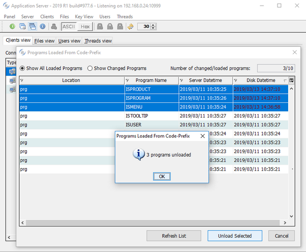

## isCOBOL Server

As depicted in the picture below, the isCOBOL Server Panel now provides a “Programs Loaded From Code-Prefix” dialog that shows programs loaded under *iscobol.code_prefix*, the timestamp of the loaded programs and of corresponding disk class file, and allows unloading of selected COBOL programs without restarting the application server. This feature allows developers to provide new versions of COBOL programs to be loaded to isCOBOL Server’s users for immediate use.

To take advantage of the unload feature, you need to configure the application to be executed with “code_prefix” class loader having *iscobol.code_prefix.reload* set to false.

