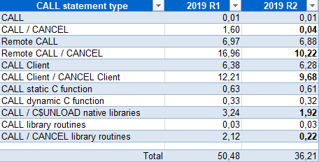
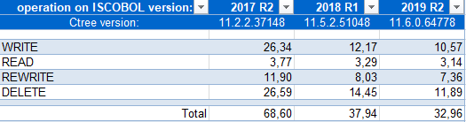

## Framework improvements

Performance of CALL statements and operations on c-treeRTG indexed files have been greatly improved. New configuration properties and new library routines have been introduced.

### Performance of CALL statements

Performance of CALL statements has been improved across the board, especially when using CALL/CANCEL (or C$UNLOAD_NATIVE for native libraries) statements, under all circumstances (CLASSPATH or code_prefix). This is an additional improvement, adding to the optimizations already introduced in 2019 R1 edition, which was limited to the COBOL calls under code_prefix.

The gain has been achieved by saving the information regarding the type of the executed CALL, whether it is a COBOL local call, a COBOL remote call, a library routine call (such as any of the C$\*, CBL_\*, P$\*, WIN$\* calls), or a Native Dynamic call or Native Static call for C functions. In a later call to the same function, the runtime already has access to its type, saving the time needed to determine it once again.

A table of performance gains is shown below. It shows a performance comparison between isCOBOL 2019R1 and isCOBOL 2019R2. The tests were run in Windows 10 64-bit on an Intel Core i5 Processor 4440+ clocked at 3.10 GHz with 8GB of RAM, using Oracle JDK1.8.0_211. All times are in seconds.

The called COBOL program contains a linkage group data item with 50 child items. The number of CALL/CANCEL iterations is 10,000 for the COBOL program and 100,000 for Native calls and Library routines using a single parameter.

### Performance of c-treeRTG indexed files

Performance of c-treeRTG indexed files has been improved constantly with a synergy between isCOBOL and the c-treeRTG file system. All COBOL statements that access indexed files (such as WRITE, REWRITE, DELETE, READ) have been improved. To achieve the maximum performance gain it is strongly recommended that you upgrade all your Veryant products, especially when older releases are still being used in production environments, as new features, performance improvements, and tweaks, are constantly being added to the entire suite.

A table of performance gains is shown below. It shows a performance comparison between different isCOBOL versions (2017R2, 2018R1 and isCOBOL 2019R2) with the embedded OEM c-treeRTG release available for each release (v.11.2, v11.5 and the latest v.11.6). The tests were run in the same environment and using the same hardware as the previous test. All times are in seconds.

The program used for the test is IO\_INDEXED.cbl, which is installed under sample\\io-performances. The number of records used for this test is 500,000. The test is executed under the default c-treeRTG server configuration, and the property iscobol.file.index=ctreej is set in isCOBOL configuration to access c-tree files. It’s important to know that the c-treeRTG file system offers specific configuration settings both client-side and server-side that help in tuning the performances, depending on the architecture and needs, allowing further performance gains.

### New configuration properties

Several new configuration properties have been implemented to enhance character based applications:

- *iscobol.terminal.cursor_blink=n* to set the blinking cursor speed in character accepts, in milliseconds
- *iscobol.terminal.cursor_color=n* to specify the cursor color number (0-15) in character accepts (default -1)
- new value in keystroke configuration: edit=erase-all used to clear all the fields in the character screen section in accepts

New configuration properties to enhance the graphical based application:

- *iscobol.gui.curr_border_color=n* to set the border-color of the currently focused entry-field
- *iscobol.gui.curr_border_width=n1 n2 n3 n4* to set the border-width of the currently focused entry-field
- *iscobol.gui.rollover_border_color=n* to set the border-color of entry-fields when the mouse hovers over them
- *iscobol.gui.rollover_border_width=n1 n2 n3 n4* to set the border-color of entry-fields when the mouse hovers over them
- *iscobol.gui.window_title=xxx* to set the default window title when none is set in the COBOL source
- *iscobol.help_program_mouse_stop_delay=n* to set the time between when the mouse stops over a control and when the configured program is run, when using the “mouseover hook” feature. This can be useful, for example, to manage contextual help systems when existing COBOL applications need to be modernized without code changes.

Additional configuration properties:

- *iscobol.auto_input_mode=true* to activate IME (Input Method Editor) when the focus is on a field associated to a PIC N data-item. This works on both character and graphical user interface and it’s useful when the application needs to input Chinese, Japanese, Korean and Indic characters
- *iscobol.key.accepted_control_characters=\u{hex value}* to specify control characters that should not be discarded during editing. This is useful for applications that use “barcode readers/scanners/guns” to insert values in the COBOL application. Multiple values can be specified by separating each with commas.

New ISUPDATER configuration properties:

- *swupdater.new_jvm_always=true* to always run the mainClass, defined in the swupdater.mainclass property, in a new JVM, even if there is no need to update any component on the machine
- *swupdater.jvm_options=<\java-options>* to specify the Java options for the newly started JVM after updating components, if the new_jvm_always property is set to false (or is not set), or always if the setting is set to true. If new_jvm_always is not set, the same options set on the invoking JVM are used on the newly instantiated one.
- *swupdater.items_list.packagename=file1,file2...filen* and *swupdater.exclude_items_list.packagename=1|0* to exclude (when 1) or include (when 2) specific items in a package from the update process.
