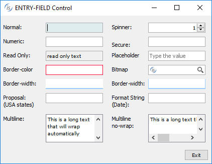
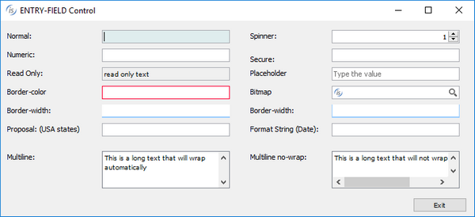
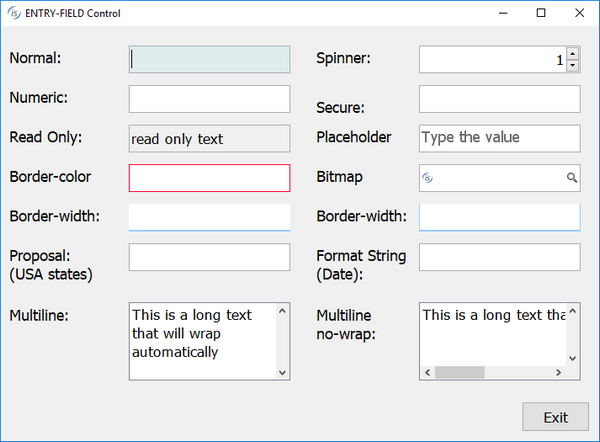
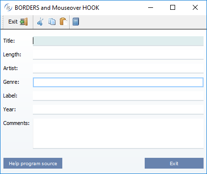
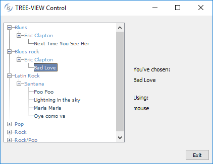
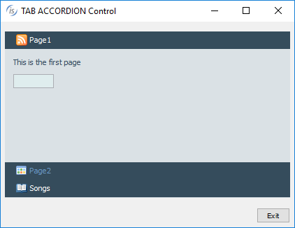
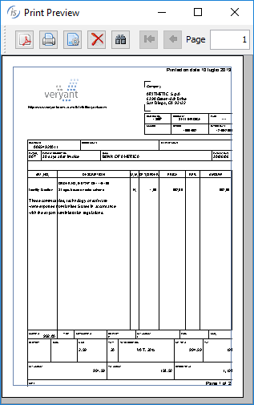
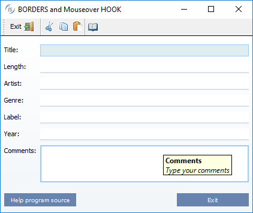

## GUI enhancements

Many improvements to GUI controls have been implemented in this release, such as a new Layout Manager to easily manage scaling GUIs, custom borders that can now be set on controls, more color choices to enrich GUIs, and a new hook for mouseovers..

### Zoom Layout Manager

Starting with isCOBOL 2019R2, all the isCOBOL GUI, Graphical windows, Screen Programs or isCOBOL WOW programs generated by IDE can take advantage of an easy to use and low impact layout manager to handle application resizing.

By setting the configuration setting:

```cobol
iscobol.gui.layout_manager=lm-zoom
```

the new Zoom Layout manager is activated, windows automatically become resizable, and all controls are adjusted in size when increasing the window width, and in font size when increasing the window height. This behavior is completely automatic, requiring no effort from developers. All that is needed to enable this behavior is to set a configuration property.

This helps quickly and easily to solve the resizing issues of running applications on a variety of monitors with different sizes and resolutions, with zero code changes.

Individual windows can be targeted by enabling the LM-ZOOM layout manager in the display window statement, as shown in the code below.

```cobol
           77 zoom-layout handle of layout-manager, lm-zoom.
           
           display standard graphical window resizable
                   layout-manager zoom-layout
```

When migrating programs from COBOL-WOW, the LM-ZOOM Layout Manager can be enabled on specific forms by setting the new layoutManager property in the isCOBOL IDE WOW Painter.

The picture below shows how the program runs at startup, before the user resizes the window.

The picture below shows how the GUI looks like after the user stretches the window horizontally.

The picture below shows how the GUI reacts after the window is resized both horizontally and vertically.

### Custom borders

Controls have always had a border-color property that allows custom border colors to be applied. A new property, border-width, now allows you to control how borders are created on selected controls. The property is an array of 4 integers that specify the width in pixels of the top, left, bottom and right side of the control.

For example, by setting the following property of an entry-field

```cobol
border-width (2, 2, 2, 2)
```

the control will have 2 pixels-width borders on all sides. Values can be combined to give the application a more modern look, or to make specific controls stand out from others. For example, by setting the following borders on an entry-field

```cobol
border-width (0, 0, 1, 0)
```

only the bottom border will be activated, resulting in a control that looks much like Google’s material design guidelines input elements.

Using the values:

```cobol
border-width (0, 1, 1, 1)
```

a “basket-like” effect can be achieved.

These styles can be combined with new additional configuration settings to generate different border-widths and have them applied automatically when controls gain focus (*iscobol.gui.curr_border_width*) or when the mouse hovers over controls (*iscobol.gui.rollover_border_width*).

See more details in the [New configuration properties](./Framework-improvements#new-configuration-properties) paragraph in the Framework improvements section below.

The picture below shows a modern looking GUI using the border-width property to set the default border, the currently focused control border, and the border style for controls being hovered by the mouse.

### Additional color settings

New properties have been added to set different colors for specific items or the selected item in controls that handle items, such as tree-views, list-boxes and combo-boxes. Combining all the new properties will ease the effort of modernizing existing GUI applications.

The code snippet below shows how to set a specific color for the selected item in the tree-view declared in the screen section:

```cobol
 03 Tv1 tree-view
        selection-color 483 
        ...
```

The code snippet below shows how to set colors on a specific item added to a tree-view using code run at runtime:

```cobol
 modify Tv1 item-to-add "item1"
            item-color 5 
 modify Tv1 item-to-add "item2"
            item-foreground-color rgb x#FF0000
            item-background-color rgb x#84FFFF     
```

The picture below shows how to enhance the looks for tree-views using different colors on different item levels.

Accordion tab-controls also support the new properties and styles to enhance the color selection, allowing a specific color to be set for the title tag area and the color to be applied when the mouse hovers over the control. Additionally, the new style *tab-flat* will cause the tab title to be rendered with a flat style.

The *tab-delay* property allows you to set the duration of the animation effect displayed when the user selects a different tab, resulting in a smooth transition effect.

The code snippet below configures additional colors in the accordion declaration in screen section:

```cobol
03 Acc1 tab-control accordion
        tab-flat
        background-color rgb 145
        foreground-color rgb 10745433
        tab-background-color rgb 145
        tab-foreground-color rgb 10745433
        tab-rollover-color rgb 16711680
        tab-delay 2000
        ...
```

The picture below shows the effect of setting colors with the tab-flat style. 

Push-button controls with the flat property set to true will now render all configured colors, no matter what LAF is active at runtime.

The printer preview dialog now allows you to set the color of the Printable Area Box. To read and write the color, two new methods class have been implemented in the com.iscobol.rts.print.SpoolPrinter class.

- java.awt.Color getPrintableAreaBoxColor()
- setPrintableAreaBoxColor(java.awt.Color)

The picture below shows the result of setting a different color for the preview printable area box.

### Hook on mouseover

Traditionally, there has been a single way to execute programs using a function key when a specific control has focus. This has usually been exploited to provide contextual help on specific controls, typically using the F1 key. The exception value to be used can be set with the following code:

```cobol
SET EXCEPTION VALUE 1 TO ITEM-HELP
```

The following configuration variable is used to configure the program to run when the function key is pressed:

```cobol
iscobol.help_program=myhelp
```

The program being run (in this example: myhelp), receives the information needed to determine which control has focus in the linkage section, as well as relative actions to be taken.

Now, the same functionality can be obtained by hovering the mouse on a control, without the user needing further interactions. A new property is available to set the delay from the moment the mouse stops and when the program is invoked.

```cobol
iscobol.help_program_mouse_stop_delay=n
```

The called program has access, in the linkage section, to the following information:

- the control's handle
- the control’s ID
- the control’s help ID
- the handle of the control’s owning window

The picture below shows the result of programmatically showing a hint when the configured program is run. Also shown is the flat push-button with background-color.
