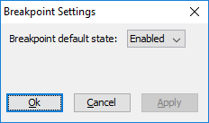
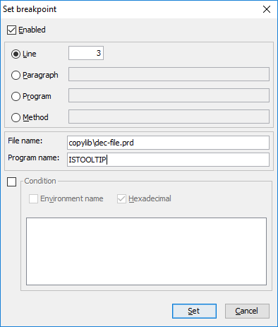

## isCOBOL Remote Debugger

Starting from isCOBOL 2019R2, the isCOBOL Remote Debugger allows stopping execution only on breakpoints specifically set, instead of automatically breaking on the first statement of the first program compiled in debug mode. This is very useful in multithreaded environments, such as a J2EE container. To activate this feature, a new configuration setting needs to be set on the server side where the COBOL program is running:

```cobol
iscobol.rundebug.auto_pause=false
```

this setting works in conjunction with the existing:

```cobol
iscobol.rundebug=1
```

With the new configuration active, when Remote Debugger starts up and connects to the isCOBOL program’s process, the execution can be interrupted or breakpoints can be set using debugger commands such as pause, break, b0 or m0.

The rundebug.auto_pause configuration setting is set to true by default, to maintain the existing behavior.

A new dialog accessible from the “settings” menu has been designed to allow setting the default state of new breakpoints, using a combo-box, as shown the picture below. This provides an easy way to set the initial state of newly added breakpoints.

The “Set breakpoints” dialog, depicted in the picture below, has been improved by allowing you to set a breakpoint for a specific program on a specific file name, typically a copy file. Such a breakpoint will trigger on that file name, at the specified line number, only for a specific program.

If a program name is not specified, the breakpoint will trigger at any program that contains the specific copy file.


