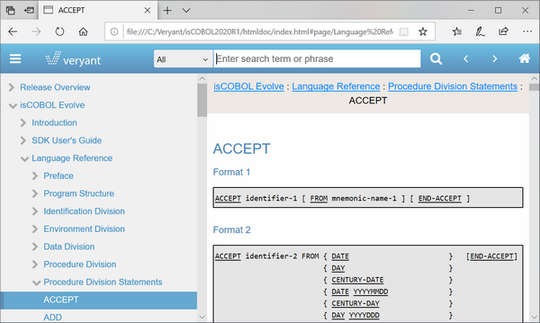
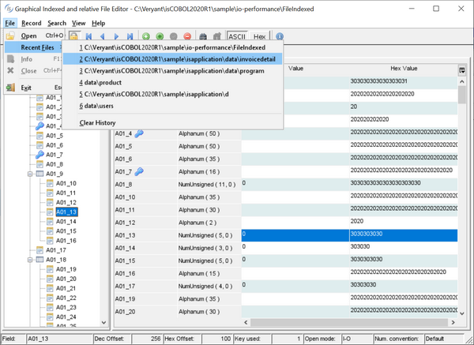
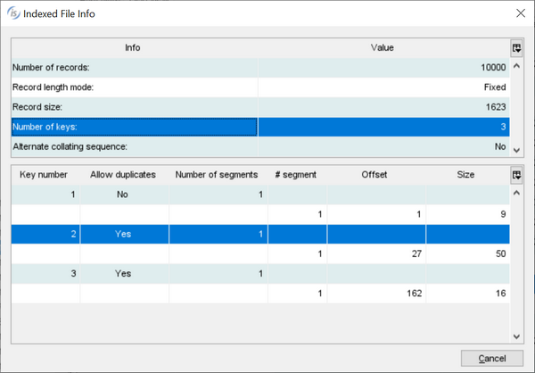

## Additional improvements

Since devices are becoming more and more diverse, the isCOBOL Documentation has been redesigned with a new modern look and feel and is now fully responsive, allowing it to be accessible to developers from mobile devices. 

GIFE, the Graphical Indexed and relative File Editor, now manages recently opened files, making it simpler to reopen with recently used settings, such as Open Mode and Efd file. The picture below shows the new recent opened file menu items, allowing the developer to select a file with a single click. The recently used file is saved in the $user/gife.properties file when the user exits the GIFE utility.

The GIFE’s File info dialog displays the file record size, collation and key definitions.
