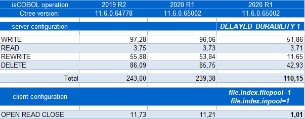

## Database improvements

Performance of data access from Database Bridge to RDBMs tables and c-treeRTG indexed files when logging is enabled has been greatly improved. New configuration properties have been implemented in the isCOBOL runtime to better manage the “InPool” feature of c-treeRTG, which avoids the performance costs of opening an indexed file for the connected client.

### Performance of Database Bridge

Performance of Database Bridge for MySQL has been improved with a new option during the EDBI generation to take advantage of MySQL hints, a feature that allows developers to control the SQL optimizer. This can be set on the edbiis wrapper level with the new –mh option or with the new compiler directive

```cobol
iscobol.compiler.easydb.mysql.hints=true
```

A table of performance gains is shown below, comparing isCOBOL 2019R2 to isCOBOL 2020R1 without and with the new –mh option.

The test was run in Windows 10 64-bit on an Intel Core i5 Processor 4440+ clocked at 3.10 GHz with 8 GB of RAM, using Oracle JDK 1.8.0_231 and MySQL 5.6. All times are in seconds. The COBOL program executes the START on different keys, then executes READ NEXT for all the records in a table containing 200,000 records.

The EDBI routine uses light cursors (-dmld wrapper option or compiler configuration *iscobol.compiler.easydb.light_cursors=2*), causing a new cursor to be opened every 100 records. The use of hints saves the time spent by the MySQL query optimizer to choose which index to use to scan the table.

A new Database Bridge configuration option has been added to generate a smarter START statement that executes less query instructions:

```cobol
iscobol.easydb.limit_dropdown=n
```

where n can be:

| | |
| --- | --- |
| 0 | off, the default behavior |
| 1 | partial, to activate the optimization on START with the WITH SIZE clause |
| 2 | full, to activate the optimization on START without WITH SIZE clause |
| 3 | all, to activate the optimization on any START statement |
| | |

As shown in the picture below, a performance comparison is made between isCOBOL 2019R2 and isCOBOL 2020R1 without and with the new configuration. The test was run in Windows 10 64-bit on an Intel Core i5 Processor 3210M 2.50 GHz with 16 GB of RAM, using Oracle JDK 1.8.0\_231 and Oracle 11 Database server. All times are in seconds. The COBOL program executes the START statement followed by a loop of READ NEXT to read the records that satisfy the conditions set on segments of the key. The table contains 100,000 records.

### Performance of c-treeRTG indexed files

A new c-tree server configuration variable, DELAYED\_DURABILITY, has been implemented in the embedded isCOBOL 2020R1 c-treeRTG version to increase performance of c-treeRTG indexed files when the logging feature is active.

Enabling logging is beneficial for a number of reasons:

- Safety: in case of file corruption caused by events such as hardware failure or unexpected power loss, when the c-treeRTG server is restarted with logging enabled, files are rebuilt automatically, ensuring data integrity, and is user-transparent.
- Replication: c-treeRTG replication requires logging to be enabled, since the replication engine uses logging information to properly update all the servers involved. Replication can be one-directional, where data saved on a master server is replicated to a backup server, or multi-directional, where two or more servers continuously update each other in real-time. Replication has a great benefit: failover, since if a server goes offline, any other server in the replication cluster can fulfill requests for the missing server.

Since logging could slightly impact performance and increase disk usage, it is possible to enable it on only specific, highly modified files, while other less important files such as lookup tables can be used without logging to maximize performance.

The following command can be used to activate logging on a specific file:

```cobol
ctutil -tron filename
```

All COBOL statements that update records (such as WRITE, REWRITE, DELETE) have been improved, as shown in the picture below, a performance comparison between isCOBOL 2019R2 and isCOBOL 2020R1 without and with the new configuration variable. The test was run in Windows 10 64-bit on an Intel Core i5 Processor 3210M 2.50 GHz with 16 GB of RAM, using Oracle JDK 1.8.0\_231. All times are in seconds. The indexed file contains 300,000 records.

The OPEN-READ-CLOSE test showcases the performance gains that can be obtained using the InPool feature of c-treeRTG. The test program performs a loop consisting of a single READ inside OPEN and CLOSE statements. The configuration options that handle pooling allow developers to flexibly configure which files can use the InPool feature. These are:

```cobol
iscobol.file.index.filepool=true
iscobol.file.index.inpool=true
iscobol.file.index.filepool.size=n
iscobol.file.index.#.inpool=true
```


