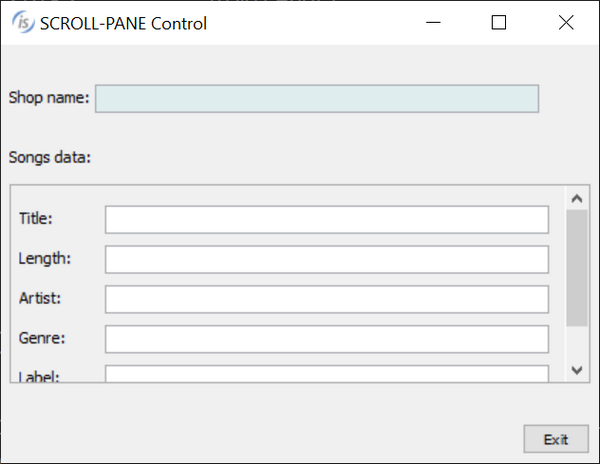
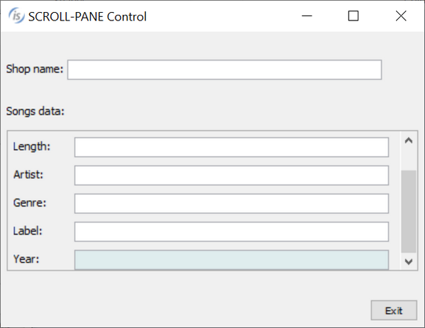
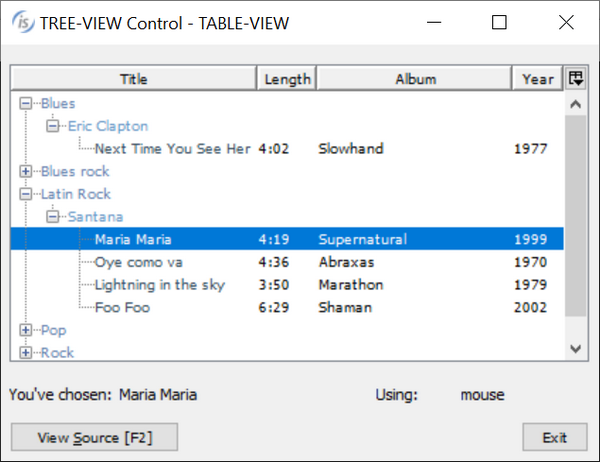
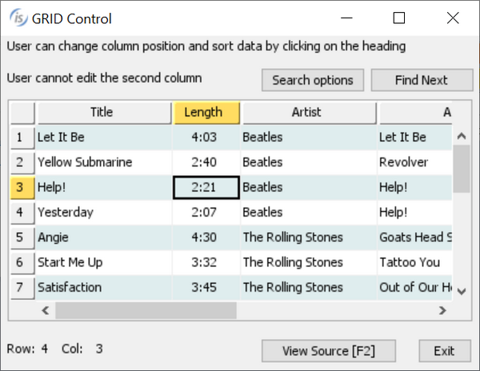
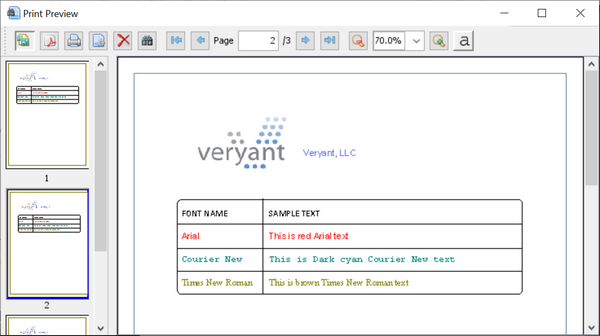

## GUI enhancements

Many improvements to GUI controls have been implemented in this release. A new control, the SCROLL-PANE, is a container that can host other controls. It will display scrollbars as needed to allow the user to pan the visible area.

### Scroll-Pane

IsCOBOL compiler supports this new control and a new property, scroll-group, is available on child components to select their host component.

An example of a scroll-pane is shown below:

```cobol
         03 scroll-pane-1 scroll-pane
              line 8 column 2 size 68 lines 10
              transparent 
              border-color rgb x#ACACAC
              .
           03 scroll-pane-page scroll-group scroll-pane-1.
              05 label
                 line 2 col 2 size 8 cells title "Title:"
                 .
              05 entry-field
                 line 2 col 12 size 52 cells id 1 
              .
```

As focus changes in the child components, the isCOBOL runtime will automatically pan inside the scroll-pane to make sure the focused component is visible. Users can freely use the scroll bars and pan in the content area.

The picture below shows a program running with a scroll-pane container. Initially the upper left portion of the children is displayed. As the user tabs through the controls, the scroll-pane automatically scrolls to show each focused component.

The picture below shows the scroll-pane when the last child has focus.

### Table-View

The tree-view control now supports a new TABLE-VIEW style that activates support for column definitions inside the tree-view. This new style is useful to provide a hierarchical view with tabular data.

The following code snippet declares a tree-view with the table-view style:

```cobol
       01  Mask.
           03 tree-table-t tree-view table-view
              buttons lines-at-root
              line 2 col 2 lines 15 size 68 cells virtual-width 65  
              display-columns (1, 30, 37, 60)
              data-columns    (record-position of rec-multi
                               record-position of rec-length
                               record-position of rec-album
                               record-position of rec-year)
              column-headings tiled-headings centered-headings
              heading-color 257 heading-menu-popup 3 end-color -16774581
              adjustable-columns reordering-columns
              event TV-EVT
              .
```

Several properties associated with column management of grid controls are supported in the table-view style, such as display-columns, data-columns, column-headings, and more.

The picture below shows the new style in action.

### Other GUI enhancements

The grid control has been enhanced by adding new properties to manage grids when rows are hidden as a result of active filters, when filterable-column style is set, or because the user is using the automatic search feature, activated by pressing the keyboard shortcut Ctrl-F.

Now the visible rows can be inquired by using the property ROWS-FILTERED, as shown by the following code:

```cobol
inquire my-grid rows-filtered in w-filtered
```

The list of returned rows is the same as with the ROWS-SELECTED property: row1 row2… rowN. If no filter is set on the grid, and there are no hidden rows, inquiring ROWS-FILTERED will return the special value -1.

The property ROWS-SELECTED has been enhanced to allow developers to set a special-value “all” in the modify statement to select all rows, as shown in the code below:

```cobol
modify my-grid rows-selected "all"
```

The new SEARCH-PANEL property has been implemented to force the grid to show the search panel over the column headings. When set to 1, the search panel is always visible even if the grid has the NO-SEARCH style, and the user will not be able to remove it. To enable this behavior, the property can be set in the control’s definition, or use the code below:

```cobol
modify my-grid search-panel 1
```

The grid can now be configured to highlight the cell’s current row and column heading with a specific color, helping the user identify the current cell content.

Three new properties can be used to configure the colors:

- heading-cursor-background-color
- heading-cursor-foreground-color
- heading-cursor-color

For example, by having the following code set on the screen declaration level:

```cobol
heading-cursor-background-color rgb x#FFDC61
```

the grid will look like popular spreadsheet programs at runtime, as shown in Figure 12, Heading-cursor-color. The heading colors will highlight the current focused cell position.

The new NOTIFY-MOUSE style is now supported on all controls, and is used to fire the new events MSG-MOUSE-ENTER, MSG-MOUSE-EXIT, MSG-MOUSE-CLICKED, MSG-MOUSE-DBLCLICK.

This allows developers to have finer control on the user interface and the management of mouse events, and provides more freedom in user interface design.

New GUI configurations properties available in the 2020R1 release:

- *iscobol.gui.grid.find_delay* to set the delay in milliseconds for the Grid search feature
- *iscobol.gui.messagebox.bcolor* to set the default background color of message boxes if not set explicitly on the display statement
- *iscobol.gui.messagebox.fcolor* to set the default foreground color of message boxes if not set explicitly on the display statement
- *iscobol.gui.messagebox.font* to set the default font name and size of text in the message boxes if not set explicitly on the display statement
- *iscobol.gui.windows_modality* to set the thread blocking behavior of floating windows and message boxes. This is useful on multithread applications.

### Print Preview

The Print Preview dialog will now show page thumbnails, enabled by default, allowing the user to quickly jump to a specific page in a multi-page report. To dynamically control the thumbnails panel, new methods have been implemented in the com.iscobol.rts.print.SpoolPrinter class.

```cobol
void setShowThumbnailsButton(boolean showThumbnailsButton)
boolean isShowThumbnailsButton()
```

The new print preview with thumbnails is shown in the picture below.
