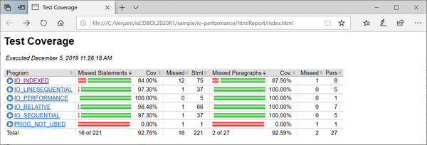
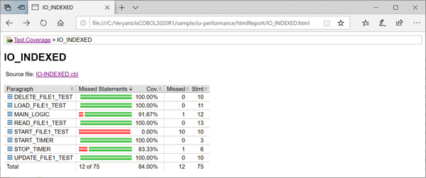
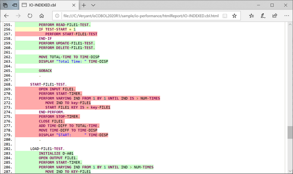
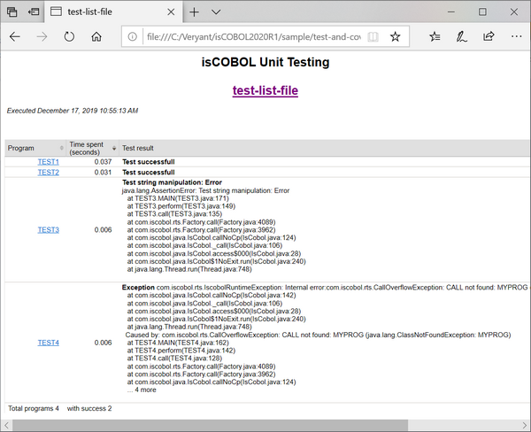
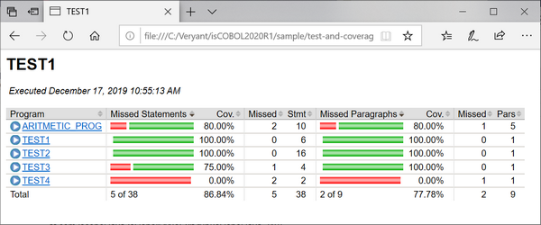

## isCOBOL Code Coverage and isCOBOL Unit Test features

Starting with the 2020R1 Release, isCOBOL is introducing features with enterprise users in mind: isCOBOL Code Coverage and isCOBOL Unit Test. These features have been available in other languages, such as Java, and now they’re available to isCOBOL developers as well. They will help developers produce better quality tests for COBOL applications.

These features are now available in the isCOBOL Evolve suite, and can be accessed from the command line or from the Eclipse-based isCOBOL IDE.

isCOBOL Code Coverage will measure the degree to which the source code of a program is executed during test suite runs. A program with high code coverage, measured as a percentage, has had more of its source code executed during testing, which suggests it has a lower chance of containing undetected software bugs compared to a program with low code coverage. This feature can also be used without a real test suite, and it can be enabled via a runtime option. The only requirement is that programs must have been compiled with the -g compiler option.

When running the command:

```cobol
iscrun –coverage IO_PERFORMANCE
```

isCOBOL Code Coverage creates a folder called “htmlReport” which contains an HTML report of the code analysis. The picture below shows the report with a list of all programs executed and the percentage of total and individual program code coverage.

The report shows both the percentage and number of missed statements and paragraphs in each program.

Clicking on the specific program name opens the report related to the single program, highlighting all COBOL paragraphs with the specific percentage of code coverage, as shown in the picture below.

Clicking on the source file name shows the corresponding source code, with a green background showing executed code, and a red background showing non-executed statements. A yellow background shows executed conditional statements. All colors are Eclipse’s standard for code coverage available for the Java language.

In the picture below, it’s easy to understand that the paragraph START-FILE1-TEST was never executed because the IF condition was never satisfied. With this information in mind, better tests can be developed to cover all of the code base.

New configuration settings allow you to customize the report generated by isCOBOL Code Coverage:

- *iscobol.coverage.sessionname=name* sets the name of the coverage session; the default value is the name of the main program
- *iscobol.coverage.sourcefiles=path* sets the list of paths where the COBOL source files are located. If not set, the current folder will be used
- *iscobol.coverage.classfiles=path* sets the list of paths where the class files are located, and are used by isCOBOL Code Coverage to build the report. If not set, the report will be built using the loaded isCOBOL classes
- *iscobol.coverage.html=path* sets the directory in which isCOBOL Code Coverage will create the report. If not set, the default value is "./htmlReport"
- *iscobol.coverage.xml=path* sets the file path of xml report. If not set, the xml report is not generated. This is needed when using isCOBOL Code Coverage inside the IDE to take advantage of its specific View.
- *iscobol.coverage.analysis.excludes=path* sets the list of isCOBOL classes that will be excluded from the analysis. It can contain the wildcard '\*', for example A\*
- *iscobol.coverage.analysis.includes=path* sets the list of isCOBOL classes that will be included in the analysis. It can contain the wildcard '\*', for example B\*

isCOBOL Unit Test lets developers create automated test suites, which are designed to test that sections of code execute as intended. The more comprehensive the tests included in a suite are, the more stable the resulting application will be. The goal of unit testing is to isolate sections of a program and ensure that they are working correctly.

This feature is activated using a command line option, such as:

```cobol
iscrun –iut –J-ea
```

The –ea Java option is needed to take advantage of the ASSERT statement used in the test programs to show the reason of the failure in the isCOBOL Unit Test report. For example, the following assert statement checks that the condition of a variable named string1 is equal to “my string”. If the check fails, the string in the “otherwise” clause will be added in the report:

```cobol
assert string1 = "my string"
       otherwise "Test string manipulation: Error"

```

If the assert condition is true, the program continues to the next statement. If the entire program is executed without any assert statements failing and no exceptions are raised, it means that the test is successful.

The only mandatory configuration option to set is:

```cobol
iscobol.unit_test.list_file=path
```

where *path* is a single file path or a list of paths that define the list of programs to be executed.

For example, if the test suite needs to execute four programs called TEST1, TEST2, TEST3 and TEST4, the file declared in the iscobol.unit_test.list_file needs to contain:

```cobol
TEST1
TEST2
TEST3
TEST4
```

The picture below shows the html report created after running the test suite. In this example, the first 2 programs are executed correctly while TEST3 fails because the above ASSERT statement is executed and the condition is evaluated to false. TEST4 fails because a runtime exception has been raised.

The report will show a list of executed programs, the execution time, and if the tests completed with success. If not, the failed assertions or runtime errors will be included.

The Unit Test reports con be customized using the following configuration properties:

- *iscobol.unit_test.html=name* sets the directory in which the Unit Test will create the report. Its default value is "./htmlReport"
- *iscobol.unit_test.xml=path* sets the file path of xml report. If not set, the xml report is not generated. This is necessary when using the Unit Test feature inside IDE to take advantage of its specific View

It’s useful to run isCOBOL Unit Test in conjunction with isCOBOL Code Coverage, and both can be activated from the command line:

```cobol
iscrun –coverage –iut –J-ea
```

This can help identify which portions of code still don’t have tests associated with them, to make sure the test suites are complete enough to cover all the application code.

In this scenario the isCOBOL Unit Test report contains a test-list-file link to isCOBOL Code Coverage reports, as shown in the picture below. 
