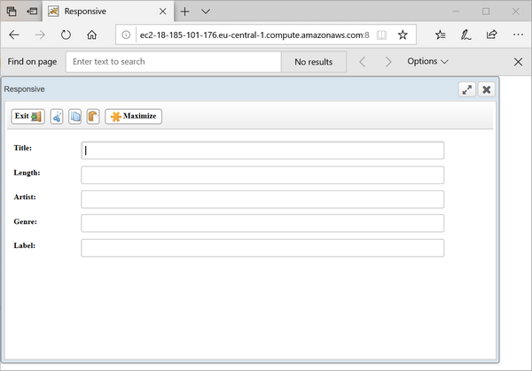
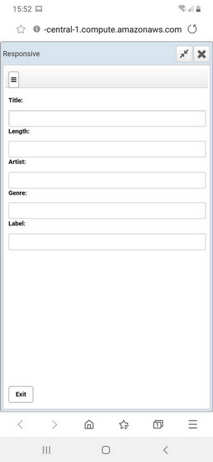

## isCOBOL EIS

isCOBOL EIS, Veryant’s solution to write web-enabled COBOL programs, is constantly updated to provide more comprehensive web solutions. In isCOBOL 2020R1, there are many updates to webDirect and webClient. Also, the HTTPClient class can now consume existing web services with PUT and DELETE requests.

### webDirect enhancements

webDirect, Veryant’s technology that allows programs with screen sections to run in a web browser by converting them to HTML/CSS/Javascript equivalents, has been updated with several enhancements.

The grid control now allows keyboard navigation as its desktop counterpart, and supports inquiring the ROW-CAPACITY property.

A new configuration property has been added to allow numeric input field to display a numeric keypad on mobile devices:

```cobol
iscobol.wd2.mobile_numpad=1
```

All layout-managers are now fully supported in WebDirect, including the “lm-responsive" layout manager. This allows developers to target multiple devices with different screen sizes and resolutions using WebDirect without having to use HTML/CSS implementation or WebClient, and to have the application respond properly when the user resizes the application or browser windows.

The picture below shows the user interface of a program running on a desktop system, where each entry field is displayed next to it, since screen real estate allows it.

The picture below shows the same application running on a smartphone screen, where labels are displayed above the entry fields to optimize the limited width of the screen.

### WebClient enhancements

WebClient is Veryant’s solution for running desktop applications on a remote server and interacting with it through a web browser. To interact with the application on devices that do not have a physical keyboard, WebClient provides a “Keyboard” soft button that displays the device’s virtual keyboard when pressed. The keyboard now can also be activated by double tapping on the screen. A new application configuration field has been added, "Minimum display width in pixel for keyboard button". This allows the developer to set a minimum display resolution for the keyboard button. When the display size is less than this setting the Keyboard button is hidden, leaving all the screen real estate available to the application, and minimizing the chance of the “Keyboard” button covering the user interface elements.

Additionally, IME keyboards are now fully supported, extending support for languages such as Chinese, Japanese and Korean.

### HTTPClient

HTTPClient is a class that allows COBOL programs to interact with Web Services. It has been updated to manage PUT and DELETE requests, in addition to the already implemented GET and POST requests.

The new method signatures are shown below:

```cobol
public void doPut(strUrl)
public void doPut(strUrl, params)
public void doPutEx(strUrl, content)
public void doPutEx(strUrl, type, content)
public void doPutEx(strUrl, type, content, hasDummyRoot)
public void doDelete(strUrl)
public void doDelete(strUrl, params)

```
