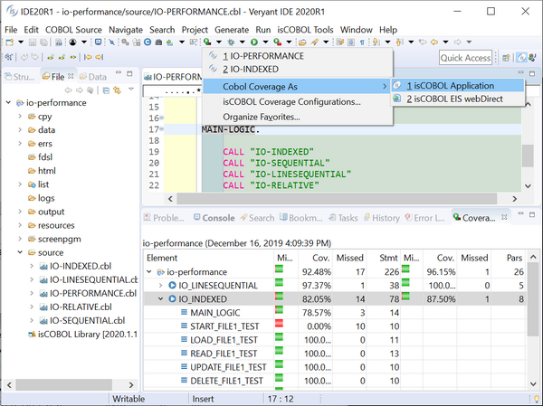
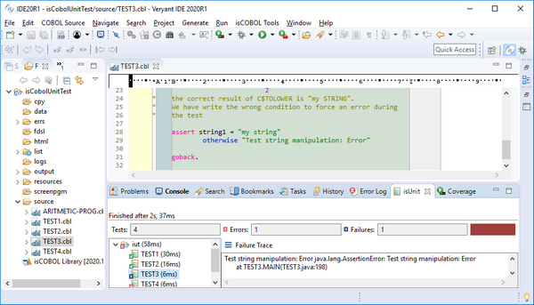
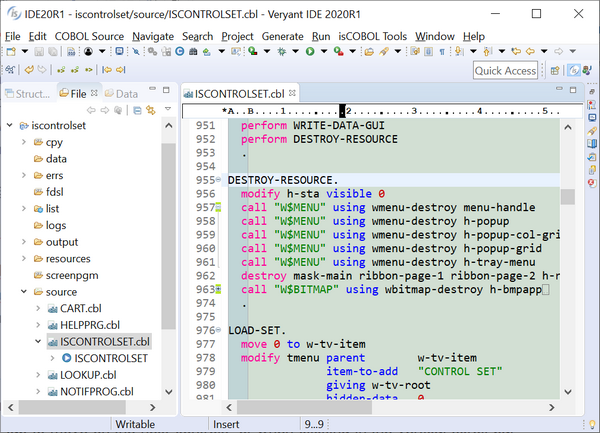

## isCOBOL IDE enhancements

In isCOBOL IDE 2020 R1 you can also execute the new Enterprise features in an integrated system, activating dedicated Views to show and analyze the results of isCOBOL Code Coverage and isCOBOL Unit Test.

To execute the isCOBOL Code Coverage feature, as shown in the picture below, the toolbar button “Cobol Coverage As” can be used, and the result of the analysis is shown in the Coverage view. The same menu item is available under the main menu Run and in the source file’s context menu.

Note that programs must have been compiled with the -g compiler option in order to be processed by the Code Coverage feature.

isCOBOL Unit Test feature can also be accessed from the isCOBOL IDE via a specific run, debug or coverage configuration option. When test execution is completed a specific view will be shown, the isUnit view, as depicted in the picture below. This view shows the list of executed programs, the total number of errors (exceptions) that occurred, the number of failed ASSERT statements and a color bar showing if all tests passed or one or more failed.

Clicking a program in the list displays details relative to that program.

The view is inspired by the standard Eclipse Unit Test view available for the Java language.

The isCOBOL IDE’s Code Editor now supports customized code folding. This feature is useful when working with a large source code file, and can help developers hide less relevant pieces of code while concentrating on the important parts.

To enable this feature, the Enable folding option must be set in the *Preferences / isCOBOL / Editor* configuration section, which activates standard folding on sections and paragraphs. To activate a custom folding, select the relevant lines, right-click the folding bar and select the option “Add custom folding”. Custom folding sets can be added and removed as needed.

The picture below shows standard folding and two custom folding sets, the first one of which is opened and the second is closed.
