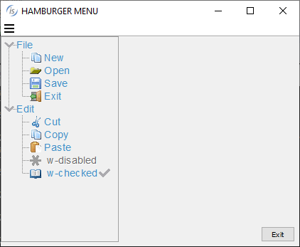
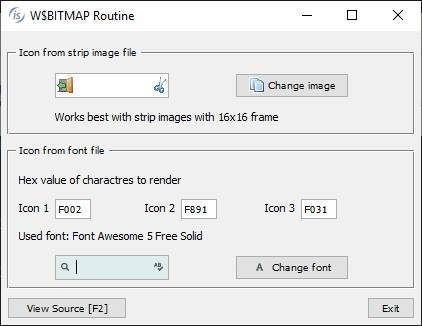
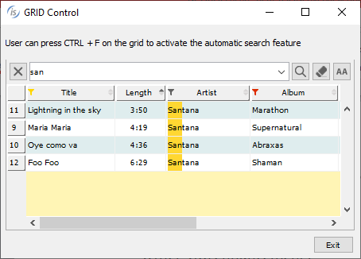
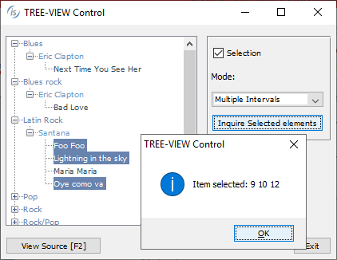

## GUI enhancements

GUI controls have been improved in the 2020 R2 release. A new menu style is now available, the Hamburger menu, that arranges its items in a tree-view style.

The W$BITMAP library routine can now render glyph font characters as images that can be used as icons in any control that can handle bitmaps.

### Hamburger menu

The isCOBOL compiler now supports a new menu style that arranges items in a hierarchical tree-view which appears after pressing an “hamburger” icon, and can replace the classic menu bar. This new feature can be used to give applications a more modern look, or to replace a standard menu bar in a responsive application to adapt to a resized surface area.

A new op-code, wmenu-new-hamburger, has been added to the W$MENU library routine to enable the creation of hamburger menus.

A code snippet to create a hamburger menu is shown below:

```cobol
           call "W$MENU" using wmenu-set-attribute
                               "default-font" h-menu-font
           call "W$MENU" using wmenu-set-attribute
                               "width" 160
           call "W$MENU" using wmenu-new-hamburger giving menu-handle
```

The new wmenu-set-attribute op-code allows full customization of the graphical appearance of the menu, such as fonts, colors and icons. The full list of supported attributes is: check-icon, default-background-color, default-font, default-text-color, disabled-background-color, disabled-font, disabled-text-color, dropdown-icon, dropdown-open-icon, hamburger-icon, hamburger-open-icon, hover-background-color, hover-font, hover-text-color, position, tool-bar-covering, style, width.

Existing W$MENU op-codes can be used to manage the hamburger menu the same way as regular menus.

A new attribute called "menu-bar-flavor" has been implemented to easily change the default menu style of the application. Executing the code

```cobol
    call "W$MENU" using wmenu-set-attribute "menu-bar-flavor" "hamburger"  
```

sets the hamburger menu as default menu type, and the entire application will use hamburger menus instead of the classic menu-bar.

Figure 9, Hamburger menu, shows a program running with a hamburger menu opened after pressing the hamburger button.

Figure 9. Hamburger menu

### Glyph fonts

Glyph fonts are vector fonts that contain icons instead of characters, and have been widely used in web applications. Being vector-based make them especially suitable to scale without visual quality loss when used on high-DPI displays.

In the isCOBOL 2020 R2 release they are available for COBOL programs, using the new "wbitmap-load-symbol-font" op-code of the W$BITMAP library routine. Using this op-code, text and symbols can be converted to bitmaps, and can then be used on any control that supports bitmap-handle and bitmap-number properties, such as push-button, entry-field, grid, tree-view.

The following code snippet loads a font using the W$FONT routine, then it loads the glyph symbols of 3 characters identified by their Unicode numbers. Using the new op-code, the W$BITMAP routine can be called passing the font handle, the list of characters, the font-size and color to be used. The routine will generate a bitmap strip that can be used in controls that can handle bitmaps strips,

```cobol
          working-storage section.
          77  h-font                  handle of font.
          77  h-font-icon             pic s9(9) comp-4.
          77  icon-size               pic 9(2).
          77  icon-color              pic s9(9).
          77  icon-characters         pic n any length.    
          ...
          screen section.
          01  Mask.
          ...
              03 ef-font entry-field
                 bitmap-handle h-font-icon bitmap-width 16
                 bitmap-number 1  bitmap-trailing-number 2
                 ...
              03 pb-font push-button title "Change font"
                 bitmap-handle h-font-icon bitmap-width 16
                 title-position 2 bitmap-number 3
                 ...
          procedure division.
              ...
              move "Font Awesome 5 Free Solid" to font-name
              call "w$createfont" using "Font Awesome 5 Free-Solid-900.otf" font-name
              initialize wfont-data
              set wfdevice-console to true
              move font-name       to wfont-name
              move 10              to wfont-size
              call "W$FONT" using wfont-get-font h-font wfont-data
              move nx"f002f891f031" to icon-characters
              call "w$bitmap" using wbitmap-load-symbol-font h-font
                                    icon-characters icon-size icon-color 
                             giving h-font-icon
              display Mask
              ...
```

The final result is shown in Figure 10, Controls with glyph symbols, where the zoom icon is bitmap-number 1, and is loaded from the “Awesome 5 Free-Solid-900.otf” font, and has Unicode character nx”F002“.

Figure 10. Controls with glyph symbols

This new feature makes it easy to enhance isCOBOL GUI applications to use glyph fonts as icons instead of loading bitmap images from disk.

### Other GUI enhancements

The Grid control has been enhanced by adding a new filter-types property to better manage filter types for each column.

It’s now possible to specify at a column level if the filter feature is available and the type of filter, as shown in the following code:

```cobol
    filter-types (0, 2, 0, 2, 1, 2, 2, 1)
```

A value of 0 will disable filtering for the column, 1 will remove the filter after a click on the red funnel icon, and a value of 2 will reopen the previously defined filter when clicking the yellow funnel icon.

The search panel has been enhanced by adding the ability to search with case insensitive rules. All buttons in the panel have now an icon.

The search panel can now be opened programmatically using the new action-search value, as shown in the code below:

```cobol
    modify my-grid action action-search
```

The sort feature activated with sortable-columns or sort-types properties now have new icons. All grid icons can be customized by adding a JAR file that contains the image files to the CLASSPATH.

All these new grid features are shown in Figure 11, Grid filter, sort and search features.

Figure 11. Grid filter, sort and search features

The tree-view control now supports selecting multiple elements of the same level. This can be activated with the selection-mode property as shown in the code snippet:

```cobol
   selection-mode tvsm-multiple-interval-selection 
```

With this feature enabled, multiple items can be selected using the usual Control and Alt key combinations.

Selected items can be inquired by the program using the items-selected property that returns the list of item handles:

```cobol
   inquire tv1 items-selected tv-items-sel
```

Figure 12, Tree-View selection-mode, shows the new tree-view feature in action.

Figure 12 also shows the new message box, which has been revamped to provide a more modern look and feel. Additionally, the message box can now be centered in the monitor instead of the parent window using the CENTERED keyword, as shown in the following code snippet.

```cobol
           display message "Are you sure to continue?"
                   title "Confirmation"
                   type mb-yes-no
                   icon mb-warning-icon
                   default mb-no
                   timeout 800
                   centered
                   giving mb-return 
```

A new configuration property can be used to automatically apply the new CENTERED option at the application level:

```cobol
iscobol.gui.messagebox.centered=true
```

It is also possible to provide a custom message box implementation using a new configuration property:

```cobol
iscobol.gui.messagebox.custom_prog=PROGRAM_NAME
```

PROGRAM_NAME is a compiled COBOL program that is automatically called by the isCOBOL framework every time a display message statement is executed. The program receives the details of the message box as linkage section parameters as defined below, and can provide a customized implementation:

```cobol
          linkage section. 
          77  msgbox-text               pic x any length.
          77  msgbox-title              pic x any length.
          77  msgbox-type               pic 9. 
          77  msgbox-icon               pic 9. 
          77  msgbox-default            pic 9. 
          77  msgbox-timeout            pic 9(5).
          77  msgbox-centered           pic 9.
          procedure division using msgbox-text
                                   msgbox-title
                                   msgbox-type 
                                   msgbox-icon
                                   msgbox-btn-default
                                   msgbox-timeout
                                   msgbox-centered
                                   .
```

The web-browser control can now be used with the JxBrowser Java component, a powerful Chromium-based integrated browser for Java applications that processes and displays HTML5, CSS3, JavaScript, Flash etc. Customers that used JxBrowser in Java applications can now use it in isCOBOL applications by setting the following configuration:

```cobol
iscobol.gui.webbrowser.class=com.iscobol.browser.jx.JXWebBrowser?licenseKey=...
```
