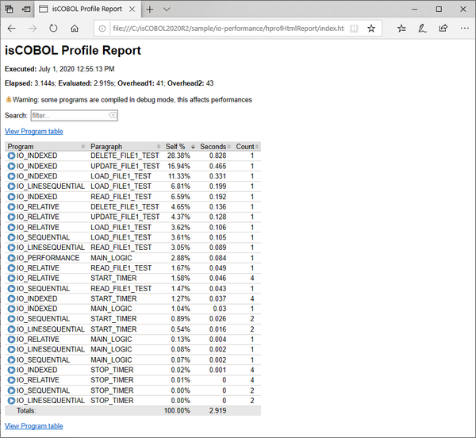
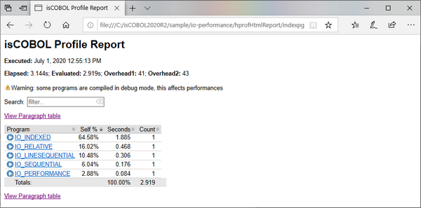
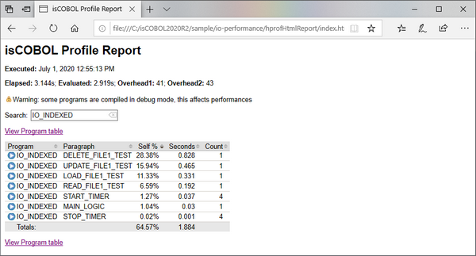

## New isCOBOL Profiler

Starting with the 2020R2 Release, a new Profiler has been implemented to allow performance analysis on applications, making it easy to identify which program or paragraphs take longer to execute. Developers can view the gathered information in a clean HTML output, and take actions to perform code optimizations accordingly to maximize gains.

This feature is now available in the isCOBOL Evolve suite, and can be accessed from the command line or from the Eclipse-based isCOBOL IDE.

The Profiler can be enabled in different ways depending on deployment architecture. It can be activated using a runtime option, as shown in the command line below:

```cobol
iscrun –profile IO_PERFORMANCE
```

With this command, the isCOBOL Profiler creates a folder called “hprofHtmlReport” containing an HTML report of the profile analysis. Figure 1, isCOBOL Profile report, shows the report with a list of all executed programs and the percentage of the total run time, as well as individual paragraph profile results.

The report shows both the percentage of total time and the number of seconds spent in each programs’ paragraphs. It also shows how many times a paragraph has been executed in the “Count” column.

Another way to start the profiling process, compatible with the previous profiler feature, is using a java option:

```cobol
-javaagent:/Veryant/isCOBOL2020R2/lib/isprofiler.jar
```

This method of activating the profiler is most useful when running in an Application Server architecture, or in scenarios such as Java programs calling isCOBOL or running isCOBOL EIS applications in a J2EE container like Apache Tomcat, when the main class is not the COBOL program.

In isCOBOL 2020 R2, the Profiler can also be activated or stopped dynamically at runtime, by performing a CALL “C$PROFILE” instruction. An example of this usage will be shown in a later section of this document.

Figure 1. isCOBOL Profile report

Figure 2. isCOBOL Profile program table

Clicking on a source file name, for example IO_INDEXED, the Paragraph table view is loaded, with the filter automatically set to the selected program, thus showing all its paragraphs performance details.

In Figure 3, isCOBOL Profile filter, shows how to filter the output by program name.

Figure 3. isCOBOL Profile filter 

The report can be filtered by typing in the Search field, to select specific programs or paragraphs. The filter is applied to all columns in the table. The report shows a warning if programs are profiled when compiled in debug mode, or if logging is enabled, as that will impact performance. Should this occur, developers should recompile the programs without the debug option, and run with the iscobol.tracelevel configuration option disabled in order to profile with maximum performance.

Profiler reports can be customized using new configuration options:

- iscobol.profiler.html=path sets the folder in which isCOBOL Profiler will create the report. If not set, the default value is "./hprofHtmlReport"
- iscobol.profiler.xml=path sets the file path of xml report. If not set, the xml report is not generated. This is needed when running the isCOBOL Profiler inside the IDE to take advantage of its specific View.
- iscobol.profiler.excludes=path sets the list of isCOBOL classes that will be excluded from the profiling analysis. It is a comma-separated list of regular expressions defining the programs, for example IO_INDEXED,IO_RELATIV[A-Z_]
- iscobol.profiler.includes=path sets the list of isCOBOL classes that will be included in the profiling analysis. It uses the same syntax explained above.

The new library routine C$PROFILE is handy when trying to profile a program that contains ACCEPT statements, since performance analysis is affected by the time the user takes to complete the ACCEPT statement. Developers can easily suspend the profiling process when such events occur, and resume it when it’s done. The routine also allows you to dynamically set the report format and the folder in which to create the report.

The code snippet below shows how to perform all the steps explained above from code:

```cobol
           call "C$PROFILER" USING cprof-disable
           accept mask-parameters
           call "C$PROFILER" using cprof-set "html" "html-profiler-output"
           call "C$PROFILER" USING cprof-enable
           perform elaboration.           
           call "C$PROFILER" USING cprof-disable
           display message "processing completed"
           call "C$PROFILER" USING cprof-flush
```

The Code Coverage options have analogous settings to control its behavior at runtime using the C$COVERAGE library routine with new op-codes, as shown in the snippet below:

```cobol
           call "C$COVERAGE" using ccov-set "html" "html-coverage-output"
           ...
           call "C$COVERAGE" USING ccov-flush
```

The Code Coverage feature, which was previously available when running stand-alone programs using iscrun, is now fully supported in other environments, such as the Application Server, using the new property options for –javaagent, as shown below:

```cobol
-javaagent:/Veryant/isCOBOL2020R2/lib/isprofiler.jar=coverage;html=html-coverage;profiler;html=html-profiler
```

When run with this option, the Application Server, upon termination, will create the Code Coverage and the Profiler reports in two different folders, unless the C$PROFILER or C$COVERAGE routines are called by running programs to flush the reports.

The –javaagent option enables the customization of additional parameters of both Code Coverage and Profiler features:

- includes= comma separated list of regular expressions to specify the classes to be included in the report
- excludes= comma separated list of regular expressions to specify the classes to be excluded from the report
- xml= name of the xml output file

Additional options are available for the Coverage feature:

- sourcefiles= the location of the source files
- classfiles= the location of the class files
- append= the xml file to be appended to the output. This can be specified multiple times
- sessionname= the name of the coverage session

All these features enhance Veryant products and complete the isCOBOL Code Coverage and isCOBOL Unit Test features introduced in the 2020 R1 release, and are especially appealing to enterprise users.
