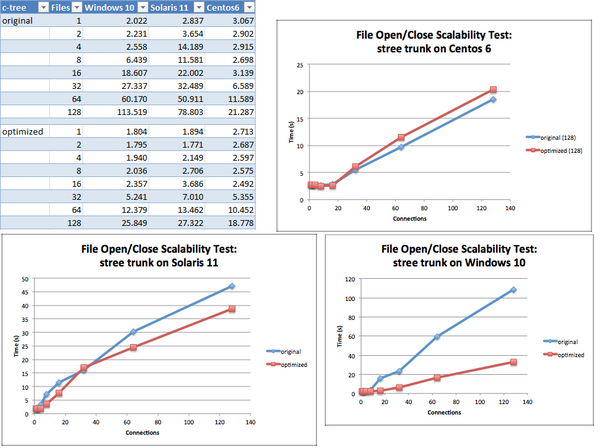
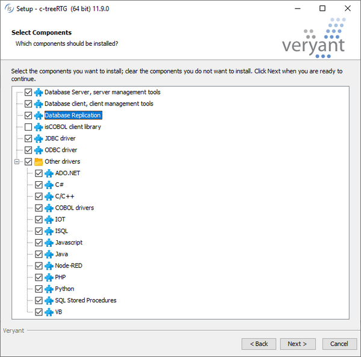

## c-treeRTG v11.9

A new version of c-treeRTG. V11.9, is available and embedded in the Veryant 2020R2 release. Version v11.9 contains many new features such as TLS/SSL security communication between client and server and other improvements.

Additional details are explained in the installed documentation located in the “c-treeRTG v11.9.0\Server\V11.9.0_Veryant_Delivery.pdf” folder.

### TLS/SSL

SSL communication is enabled with a new server configuration setting in the ctsrvr.cfg configuration file, as shown below:

```cobol
          SUBSYSTEM COMM_PROTOCOL SSL {
                SERVER_CERTIFICATE_FILE ctree_ssl.pem
                SSL_CONNECTIONS_ONLY YES
          }
```

The settings allow the definition of the SSL certificate file, and whether an SSL connection is mandatory (default setting is NO). Additional configuration settings are optionally available.

If a client is configured with a standard c-tree xml client configuration file, the new attributes “ssl” and “sslcert” in the  configuration element must be set, as shown below:

```cobol
          <config>
             <instance ssl="yes" sslcert="ctsrvr.pem" server="FAIRCOMS@hostname" 
                       user="admin" password="ADMIN"
                       connect="yes" versioncheck="no">
             ...
             </instance>
          </config>
```

If the client is configured using an isCOBOL properties file, the new settings can be configured as shown below:

```cobol
iscobol.file.index.server=FAIRCOMS@hostname
iscobol.file.index.user=admin
iscobol.file.index.password=ADMIN
iscobol.file.index.ssl=true
iscobol.file.index.sslcert=/path/filename
```

### Other improvements

Additional c-tree client configuration properties have been implemented, such as:

- iscobol.file.index.prefetch.ttl=n to specify how long pre-fetched records should be kept, in seconds
- iscobol.file.index.keycompress.rle=true to enable RLE compression on keys
- iscobol.file.index.keycompress.vlennod=false to restore the legacy LEADING compression on keys
- iscobol.file.index.memoryfile.persist=false to unload memory files when the run unit terminates, instead of when the c-treeRTG server shuts down.

The performance of c-treeRTG Server, when handling concurrent file open and close operations, has been improved, especially when scaling to systems with a large number of CPU cores and concurrent database connections. Figure 16, c-treeRTG scaling test shows scaling test results, with the number of files ranging between 1 and 128, running 2,000 iterations and 128 connections. Result times are in seconds.

Figure 16. c-treeRTG scaling test 

The new c-treeRTG Veryant setup, as shown In Figure 16, c-treeRTG 11.9 setup, contains additional components, such as the Replication agent, making it simpler to install, and provides new Drivers with tutorials for additional languages, including C#, C/C++, IOT, ISQL, Javascript, Node-red and VB. This enhances the interoperability of languages that share the same data. To enable these features, you need to replace the embedded license, which only allows access from isCOBOL, with a full license that allow full SQL access and enables the Replication feature.

Figure 17. c-treeRTG 11.9 setup
