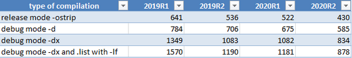

## isCOBOL Compiler

The isCOBOL 2020R2 compiler is faster in massive compilations, a new EasyLinkage feature has been implemented to easily convert C calls into pure Java libraries and additional syntax is supported to increase compatibility with other COBOL dialects.

### Performance on massive compilations

The compiler has been reworked by removing the need for the tools.jar file to be in CLASSPATH, and the compilation of .java files to .class objects is now faster, especially when performing large command line compilations, such as when using the command:

```cobol
iscc –options... source/*.cbl
```

Figure 13, Comparison of compiler performance, shows a performance comparison between isCOBOL 2019R1, 2019R2, 2020R1 and the current 2020R2. The tests were run using Windows 10 Pro 64-bit on an Intel Core i-7 Processor-8550U, 1.80 GHz with 16 GB of RAM, using Oracle JDK 1.8.0\_251. All times are in seconds. The test was compiling a real application module consisting of 550 programs with more than 10,000 copy files, for a total of over 1 million lines of COBOL code. Different compiler options have been used depending on the type of compilation.

Figure 13. Comparison of compiler performance

isCOBOL is constantly being improved for performance and customers using older versions now have another good reason to upgrade their release to take advantage of faster compiling times.

### EasyLinkage for Java migration

When migrating COBOL code that uses C code where COBOL code makes native function calls using the CALL statement, it is usually advised that you migrate the C code to Java to have more readable code and avoid depending on C. To help in the process, the new isCOBOL 2020 R2 compiler introduces a new feature that generates Java stub sources to handle COBOL parameters received in CALL statements.

Assume, for example, the following COBOL code, which uses a C library with 3 different functions that are being ported to isCOBOL and the C library is being migrated to Java:

```cobol
          WORKING-STORAGE SECTION.
          77  w-path        pic x(256).
          77  path-len      pic 9(3).
          01  w-exec.
              03 w-command  pic x(128).
              03 w-options  pic x(64).
              03 w-param    pic 9(2) comp.
          ...           
          PROCEDURE DIVISION. 
          MAIN.
           ...
           call "MyLibrary"
           call "func_initialize"
           call "func_get_path" using by value path-len 
                                  by reference w-path
           call "func_exec" using w-exec
           ...  
```

The source code can be compiled using the new configuration setting:

```cobol
iscobol.compiler.easylinkage=2
```

to automatically generate the stub sources called: MYLIBRARY.java, FUNC_INITIALIZE.java, FUNC_GET_PATH.java and FUNC_EXEC.java. The main problem when integrating COBOL code with another language is understanding how to code the proper memory structures to receive the COBOL parameters: how are group variables handled? How is a comp variable stored?

When compiling with the above property set, the isCOBOL compiler takes care of this complexity by generating the correct parameter definitions in the Java source code. Developers only need to focus on porting the C logic to Java. The EasyLinkage feature even handles C functions with variable numbers of arguments and different sizes.

For example, in the FUNC_EXEC.java source the COBOL group level w-exec has been declared as:

```cobol
//  variable declaration W-EXEC
             public byte wExec$0[];
             public    com.iscobol.types.PicX wExec;
             public    com.iscobol.types.PicX wCommand;
             public    com.iscobol.types.PicX wOptions;
             public    com.iscobol.types.NumericVar wParam;
              ...
              {
                wExec$0=Factory.getMem(194);
                wExec=Factory.getVarAlphanum(wExec$0,0,194,...,"W-EXEC",...);
                wCommand=Factory.getVarAlphanum(wExec,0,128,...,"W-COMMAND",);
                wOptions=Factory.getVarAlphanum(wExec,128,64,...,"W-OPTIONS",...);
                wParam=Factory.getVarBinary(wExec,192,2,...,"W-PARAM",...);
              }
              ...
          /*  Write the routine logic here
              ...
```

Additionally, the compiler generates by default the source files in specific subfolders called:

- “easydb” for database bridge generation (any kind of database option)
- “easylinkage” for EasyLinkage generation (both link and stub)
- “servicebridge” for web service bridge generation (both REST and SOAP)
- “bean” for web service bean generation

By default, these folders are generated inside the sources folder, but can be configured using the following compiler property:

```cobol
iscobol.compiler.generate.root_dir=path
```

The .class files created by compiling the generated COBOL sources (easydb, servicebridge and bean) are by default located in the same folder where the main COBOL program .class is created, in the path specified using the –od compiler option. It is also possible to create the same subfolder names under the main class folder by using: iscobol.compiler.generate.keep_structure=true, resulting in a clearer organization of folders.

### Compatibility

The compiler now supports the EXHIBIT statement when using the –cv option for IBM COBOL compatibility. Running the code below

```cobol
           MOVE "ABC" TO MY-VAR
           EXHIBIT NAMED MY-VAR 
```

when compiled using the –cv option produces the following output on sysout when run:

```cobol
MY-VAR=ABC
```

This is similar to the DISPLAY UPON SYSOUT statement, but it’s now fully supported and doesn’t require code to be manually changed when porting to isCOBOL.

The ESQL DECLARE CURSOR statement has been enhanced to support the SENSITIVE and INSENSITIVE clauses. Code such as:

```cobol
           exec sql
                declare curs1 sensitive cursor for
                        select * from companies
           end-exec.
           exec sql
                declare curs2 insensitive cursor for
                        select * from companies
           end-exec.
```

are now supported and can be compiled to simplify the migration from other COBOL ESQL Pre-compilers.

Insensitive allows the cursor to move forward and backward through the data, changes made while the cursor is open are ignored. Sensitive allows the cursor to move forward and backwards through the data, changes made while the cursor is open are immediately available.

This behavior is similar to the runtime configuration iscobol.jdbc.cursor.type, and both can be used in the same program, allowing additional flexibility.
