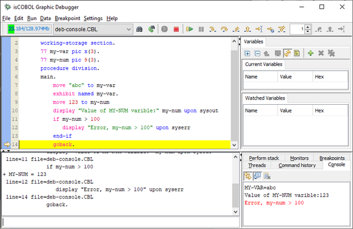
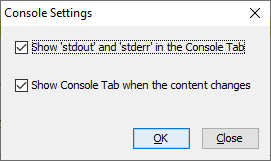

## isCOBOL Debugger

Starting from isCOBOL 2020R2, the isCOBOL Debugger has been enhanced and can now debug programs without having access to source files. When compiled with the -d or -dx options, the compiler now embeds an encrypted copy of the source code in the compiled .class file. Such a .class file can now be fully debugged anywhere. This is completely transparent for developers, who will have access to the COBOL source during a debugging session as they had previously, and can take advantage of the same debugger commands that need references to source code lines, such:

```cobol
br 123 MYPROG.cbl
```

to set a breakpoint on line 123 of MYPROG.cbl program.

This is a major improvement that enhances the usability of the isCOBOL Debugger in any scenario, from stand-alone debugging (iscrun –d PROGNAME), thin-client debugging (iscclient –d –hostname ip –port n PROGNAME), and remote debugging for all other architectures (iscrun –d –r hostname port)

The Debugger can still load source files from disk if the .class programs are compiled with a previous compiler release for backward compatibility.

In addition, Debugger now has a new integrated View named Console in the isCOBOL IDE that has the ability to attach and de-attach the standard sysout and syserr in its view. When the Console is attached, all the sysout and the syserr output is shown in the new View, using black and red colors respectively. When the Console is de-attached, all the sysout and syserr are shown back in the system console. This results in a clearer view, where the Output View is on the bottom-left corner and shows the results of commands executed from the developer and the single line of code that is executed with “step” command, and the Console view, when attached to activate, is shown in the bottom-right corner and shows the sysout/syserr produced by COBOL program or by the isCOBOL runtime error handling.

In Figure 14, Debugger Console view, the bottom-right portion of the Console view shows the attached sysout/syserr. A pop-up menu is also available to Copy, Select and Clean the content. Figure 15, Debugger Console settings, shows the dialog that appears when selecting the Window menu item Settings – Console, that allows redirection of sysout/syserr which is especially useful in Thin Client, where this change is not dynamic.

Figure 14. Debugger Console view

Figure 15. Debugger Console settings
