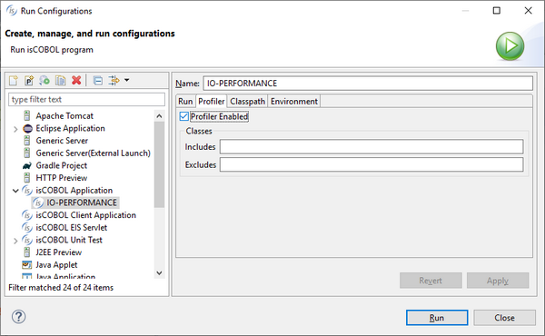
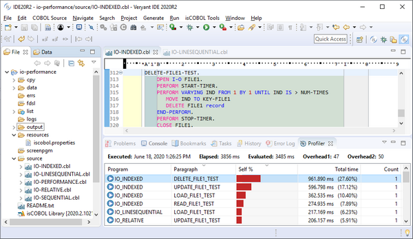
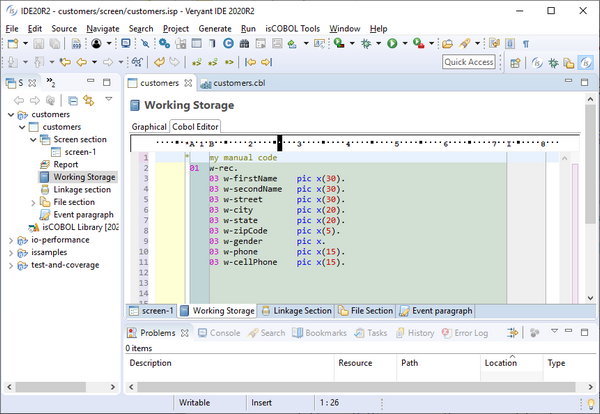

## isCOBOL IDE enhancements

The Profiler feature can now be executed from the isCOBOL 2020 R2 IDE, and a specific View is provided to show and analyze the results of the profiling process.

Figure 6, isCOBOL Profiler in isCOBOL IDE shows how to enable profiling on specific programs. By default, all programs are included in Profiler, and the results gathered by the analysis are available in the Profiler View, as shown in Figure 7, isCOBOL Profiler View.

Figure 6. isCOBOL Profiler in isCOBOL IDE

Figure 7. isCOBOL Profiler View

Double clicking an item in the Profiler View opens the selected program in the Editor, with the cursor located at the specific paragraph, helping developers speed up the process of identifying bottlenecks to optimize the code for better performance.

The isCOBOL IDE’s Screen Painter now supports manual editing in Working Storage, Linkage Section and FD sections, to complement the Graphical editor previously available.

Changes made manually are available in the Screen Painter immediately. This feature will be appreciated by COBOL developers who would prefer to code by hand instead of through the Graphical editor.

Figure 8, isCOBOL IDE Cobol Editor, shows the Cobol Editor section of the Working Storage painter, where a group level variable is manually coded. The Painter will append the manual code fragment in the generated source code after the variables defined in the Graphical editor.

Figure 8. isCOBOL IDE Cobol Editor
