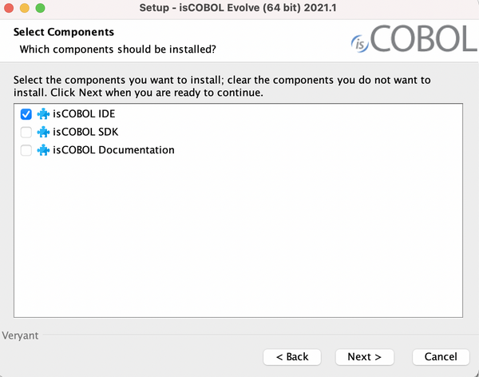
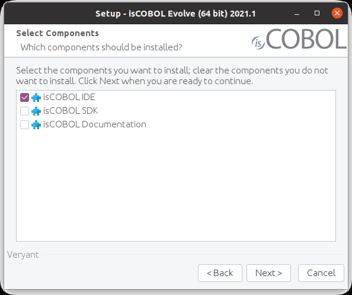
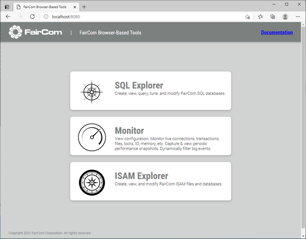
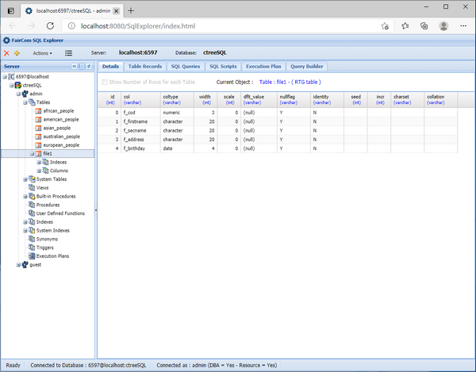
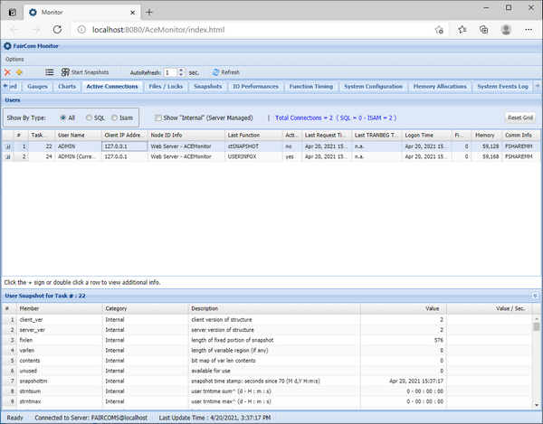
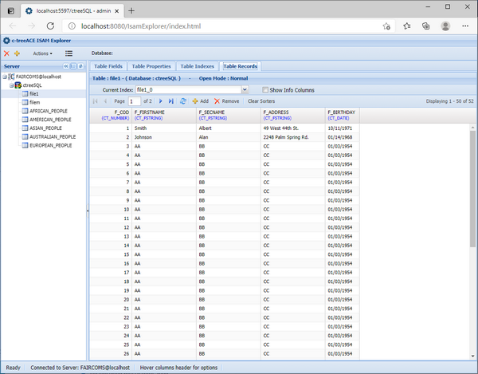
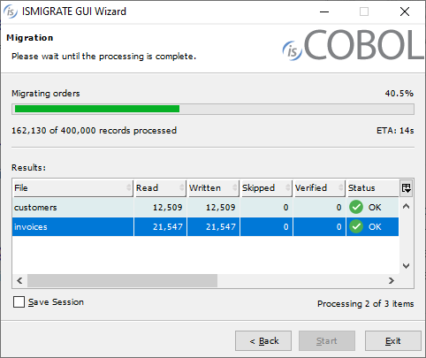
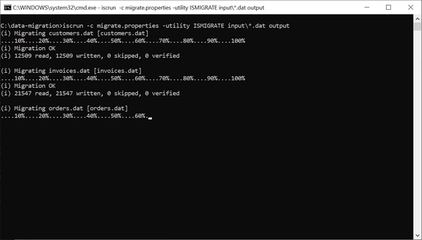
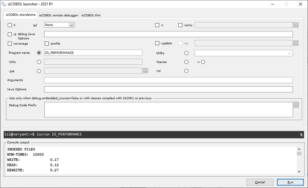

## Additional improvements

All of the Veryant setups have been improved. A new c-tree RTG v3 release is included in isCOBOL Evolve 2021R1 and several utilities have been upgraded.

### Veryant setups

Two new graphical setups are available in the appropriate format to install isCOBOL Evolve: for Mac OS in .dmg format, and for the Linux operating system in .sh shell command.

The isCOBOL Evolve setup now includes both IDE and SDK products, making it easier to install products for developers that use the Eclipse-based IDE environment or for those who use command line environments using the tools of their choice.

Figure 28, New Mac setup, and Figure 29, New Linux setup, show the new look of the graphical installers.

Figure 28. New Mac setup

Figure 29. New Linux setup

The command-line setups, in .tar.gz format, are still available for the SDK product. In addition, a new “noarch” installer is available for a platform-independent installation, which can be useful when a COBOL application does not call C functions, hence there is no need to have native components for a pure Java application.

Windows setups have been improved, and they are now in .msi format to provide more flexibility during the installation process. The previous format, which was an .exe, is not available anymore.

### C-Tree RTG v3

isCOBOL Evolve 2021 R1 comes with a new C-tree major release.

C-Tree RTG V3, based on the V12 core technology, provides a series of features and improvements described below.

- Embedded Replication Agent

The Replication Agent is no longer a separate tool to be started, configured and maintained separately. The replication technology is now part of the C-Tree server itself. In order to activate the replication, all that is needed are the following steps, to be carried out on the target C-Tree server before starting it:

  1. Edit the ctsrvr.cfg configuration file and enable the plugin by removing the semicolon before PLUGIN ctagent
  2. Edit the ctreplagent1.cfg configuration file to provide source_server and target_server, for example:

```cobol
source_server FAIRCOMS@192.168.1.4
target_server FAIRCOMS@localhost
```

As always, the C-Tree server must be licensed for replication to be enabled, and the involved files must be under transaction logging.

- New replication features
The data replication can now be either synchronous or asynchronous.
The creation (OPEN OUTPUT) of new indexed files is now replicated as well.
- Browser-Based Tools

The SQL Explorer utility, the Monitor utility and the ISAM Explorer utility, previously available as .NET applications and Java applications, are now also available as web applications. The apps can now be used on platforms where a web-browser is provided, including mobile devices.

To use the web utilities, start the Faircom Web Server (fcWebServer), which isinstalled along with c-tree. This web server is currently available only for the Windows 64-bit platform and the Linux 64-bit platform. The web server listens for standard HTTP connections on the port 8080 and for secure HTTP connections (HTTPS) on the port 8090. These ports can be changed by editing the cthttpd.json configuration file.

Figure 30, Web dashboard, shows the home page of the Faircom’s web server, where you can choose which web utility to run.

Figure 30. Web dashboard

Figure 31, Web SQL Explorer, shows the layout of the browser-based SQL Explorer. This utility allows you to create, view, query, tune, and modify FairCom SQL databases.

Figure 31. Web SQL Explorer

Figure 32, Web Monitor, shows the layout of the browser-based Monitor. This utility allows you to monitor live connections, transactions, files, locks, IO, memory, etc. It also allows you to view configurations, capture and view periodic performance snapshots and dynamically filter log events.

Figure 32. Web Monitor

Figure 33, Web ISAM Explorer, shows the layout of the browser-based ISAM Explorer. This utility allows you to create, view, and modify c-tree ISAM files and databases.

Figure 33. Web ISAM Explorer

### IsCOBOL Utilities

The ISMIGRATE utility now shows the tool’s progress during the migration of each file. This progress bar is available in both GUI mode and command-line mode. When run in a GUI environment it also shows the estimated remaining time necessary to complete the migration of the file.

As shown in Figure 34, ISMIGRATE GUI progress, the file “customers” is being processed, 40.5 % of the records are migrated and the estimated time remaining is 14 seconds.

Figure 34. ISMIGRATE GUI progress

Figure 35, ISMIGRATE command-line progress, showsthe same migration running in command-line mode

Figure 35. ISMIGRATE command-line progress

The ISMIGRATE tool also provides the ability to discard records during migration using the configuration option:

```cobol
iscobol.ismigrate_hook
```

to call a hook program used to filter records. The record being processed is passed in the linkage section of the hook program, and if the hook program exits with a negative return code, for example GOBACK -1, then the record is skipped by ISMIGRATE.

The ISL utility now supports a Console output view, to show the output of iscrun or iscclient when running batch programs. When ISL is running, there is no need to switch to the terminal to see the console output, everything is monitored by the utility.

As shown in Figure 36, ISL console, the output of the batch program IO_PERFORMANCE is shown in the new Console output section at the bottom of the screen.

Figure 36. ISL console
