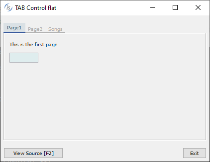
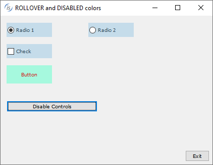
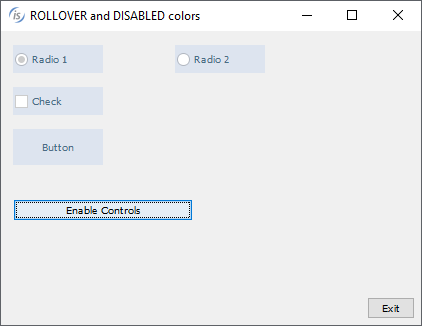
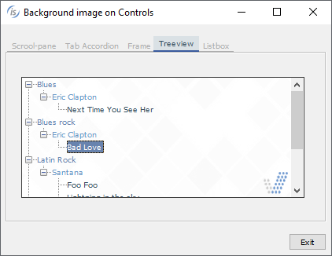
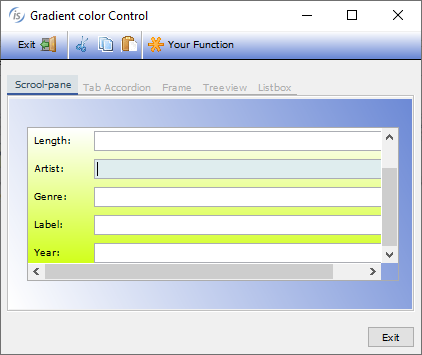
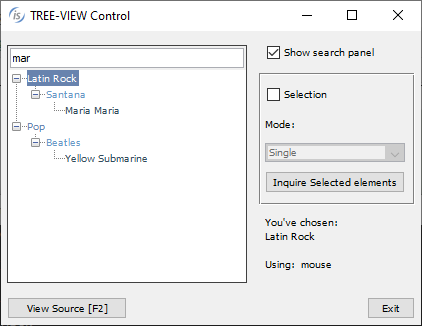
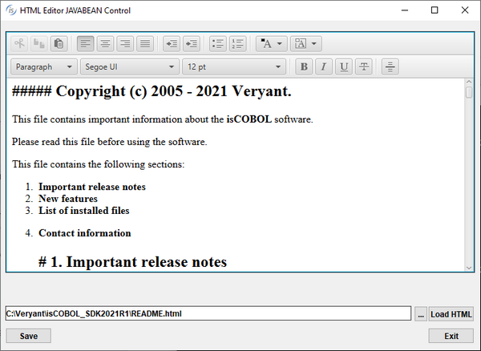

## GUI enhancements

Many improvements to GUI controls have been implemented in this release. The tabcontrol has been enhanced allowing customization of colors and borders. Check-box, Push-buttons and Radio-buttons can now have rollover and disabled colors. All the container controls can now use a background image or gradient colors. Additionalproperties have been added in the supported GUI control syntax to allow a richer user interface.

### Tab-control enhancements

The isCOBOL compiler now supports new properties in a tab-control, allowing more customization. This is the list of new properties supported by this control:

- ACTIVE-TAB-BORDER-COLOR sets the border color of the active tab.
- ACTIVE-TAB-BORDER-WIDTH sets the width of the four borders of the active tab
- ACTIVE-TAB-COLOR, ACTIVE-TAB-BACKGROUND-COLOR and ACTIVE-TABFOREGROUND-COLOR set the color of the active tab’s title page
- TAB-BORDER-COLOR sets the border color of tabs
- TAB-BORDER-WIDTH sets the border widths of every tab in a Tab-Control control (top, left, bottom and right)
- TAB-WIDTHS is useful to set the size of each tab’s title page

The new NO-BOX style is useful to completely remove the tab borders.

In addition, existing properties previously supported only on Accordion tab-controls are now supported on all tab-control types:

TAB-COLOR, TAB-BACKGROUND-COLOR and TAB-FOREGROUND-COLOR set the color of the page titles.

TAB-FLAT sets the flat style for pages.

An example of a flat tab-control with customized colors and borders isshown below:

```cobol
  03 tb1-container tab-control
     line 2 col 2 lines 17 cells size 68 cells
     allow-container tab-flat
     active-tab-border-width (0 0 3 0)
     tab-border-width (0 0 2 0)
     tab-foreground-color rgb x#ACACAC
     tab-border-color rgb x#ACACAC
     active-tab-border-color rgb x#395a9d
     active-tab-background-color rgb x#dae1e5
     active-tab-foreground-color rgb x#354c5c
     .
```

Figure 13, Flat Tab-control, shows a program running with the tab-control containing the control defined in the code snippet. The active page is marked with a colored underlined border, typical of modern web applications.

Figure 13. Flat Tab-control

### Rollover and Disabled colors

The check-box, push-button and radio-button controls can now have specific rollover and disabled colors: when the cursor pointer is over a control the rollover color is applied, when the control is disabled the disabled color is applied.

The new properties to set the rollover color are: ROLLOVER-COLOR to set the COBOL color for both background and foreground, or ROLLOVER-BACKGROUND-COLOR and ROLLOVER-FOREGROUND-COLOR to set the background and foreground colors separately.

The properties to set the disabled color are: DISABLED-COLOR and DISABLEDBACKGROUND-COLOR, DISABLED-FOREGROUND-COLOR.

The following code snippet declares a push-button with the new color properties:

```cobol
 03 pb1 push-button
    line 8 col 3 lines 2 size 15 cells
    title "Button" self-act
    enabled e-controls
    flat
    background-color rgb x#C5DCEA
    foreground-color rgb x#354C5C
    Disabled-Background-Color rgb x#DDE4EF
    Disabled-Foreground-Color rgb x#4B6C83
    Rollover-Background-Color rgb x#A6F9DE
    Rollover-Foreground-Color rgb x#D51515
    .
```

Figure 14, Rollover colors and Figure 15, Disabled colors show the new properties in action.

In Figure 14 the mouse is over the push-button labelled “Button”, and in Figure 15 all

controls are disabled.

Figure 14. Rollover colors

Figure 15. Disabled colors

### Background image and gradient on containers

Container controls like frame, list-box, ribbon, scroll-pane, tab-control, tree-view, tool-bar and window can now have a background image. This can help in modernizing COBOL applications.

The properties to set the background image are: BACKGROUND-BITMAP-HANDLE to set the handle of a loaded image and BACKGROUND-BITMAP-SCALE to specify the image scaling rule to apply. The supported values are the same as the existing property BITMAPSCALE:

- 0 (default) = to maintain the original image without altering it. The image is cropped if larger than the available space, or is aligned in the top-left corner if it’s smaller
- 1 = to resize the image automatically to fit completely the control area. The aspect ratio may not be preserved with this option
- 2 = to resize the image, keeping the aspect ratio. The image may not fill the available space completely, if the aspect ratio of the control is not the same as the image

The following code snippet declares a tree-view with a background image with rule of scale 1:

```cobol
05 Tv1 tree-view
   line 3 col 4 lines 11 size 60
   buttons lines-at-root show-sel-always
   selection-background-color rgb x#6883AE
   selection-foreground-color rgb x#FFFFFF
   background-bitmap-handle hWatermark
   background-bitmap-scale 1.
```

Figure 16, Background image on container controls, shows the result of code-snipped of tree-view definition.

Figure 16. Background image on container controls

The same list of “container” controls also support gradient colors, while in previous releases gradients were supported only on a window.

The following code snippet shows a portion of a screen section where a tab-control and a scroll-pane are declared. There is also a procedure division snippet code that shows the creation of a tool-bar control:

```cobol
 03 tb1-container tab-control
    line 2 col 2 lines 17 cells size 68 cells
    …
    gradient-color-1 w-gradient-color-blue-1 
    gradient-color-2 w-gradient-color-blue-2 
    gradient-orientation gradient-northeast-to-southwest.
 03 tb1-container-page1 tab-group Tb1-container tab-group-value 1.
    05 scroll-pane-1 scroll-pane
       line 3 column 4 size 62 lines 11
       …
       gradient-color-1 w-gradient-color-yellow-1 
       gradient-color-2 w-gradient-color-yellow-2.
  …     
  display tool-bar control font control-font
       gradient-color-1 w-gradient-color-blue-1 
       gradient-color-2 w-gradient-color-blue-2 
       handle hToolBar.
```

Figure 17, Gradient on container controls, shows the gradient properties in action on the tool-bar, tab-control and scroll-pane defined in the previous code snippet.

Figure 17. Gradient on container controls

The new control options can easily be applied to existing programs using the “code injection” compiler feature, making modernization of existing programs as easy as adding a compiler configuration and recompiling.

### Additional GUI enhancements

The entry-field controlsupports a new property named TEXT-WRAPPING to set the rule for multiline wrapping; allowed values are:

- 0 AUTO-WRAP (default) implements CHAR-WRAP for entry-fields with national value set and WORD-WRAP otherwise
- 1 WORD-WRAP
- 2 CHAR-WRAP

Following is an example of declaring an entry-field with char-wrap:

```cobol
03 ef1 entry-field
   line 2 col 2 size 40 lines 10
   text-wrapping 2.
```

The tree-view control supports a new property, search-panel, to show a filtering field over the tree-view. For coherence, the grid supports the same property with same values:

-1: the search panel never appears on top of the control even if the user presses Ctrl-F

0: the search panel appears on top of the control when the user presses Ctrl-F. This is the default behavior for tree-view and grid

1: the search panel is always visible on top of the control. The user can’t dismiss it

The following code modifies a tree-view, making the search-panel always visible:

```cobol
modify Tv1 search-panel 1
```

The search panel is triggered by default when the user presses Ctrl+F, but it can be customized on a different key combination, for example Ctrl+G by setting the configuration option

```cobol
iscobol.key.*g=search=grid,print-preview,web-browser,tree-view

```

Figure 18, Tree-view search-panel, shows the items filtered after the user types “mar” as a filter. The search is case insensitive and the matching items will be rendered along with their parent items.

Figure 18. Tree-view search panel

The java-bean control can now contain a JavaFX component, increasing GUI choices. The example below shows how add a java-bean embedding an HTML editor JavaFX component:

```cobol
 03 jb-editor java-bean
    line 2, col 2, lines 20, size 78
    clsid "javafx.scene.web.HTMLEditor"
    object my-editor.
```

Figure 19, FX HTMLEditor in Java-bean, shows the HTMLEditor that appears in the COBOL window at runtime.

Figure 19. FX HTMLEditor in Java-bean

The date-entry control supports a new property, ILLEGAL-DATE-VALUE, to set the value returned in case an illegal date is entered, and is used as shown below:

```cobol
 03 de1 date-entry
    line 2, col 2, value-format DAVF-YYYYMMDD
    illegal-date-value 99991231.
```

In addition, the BORDER-COLOR and BORDER-WIDTH properties previously supported in Entry-fields are now supported on Date-entry and Push-button controls, resulting in richer border customization.

The C$OPENSAVEBOX routine will now use native dialogs when run on Microsoft Windows. The previous LAF-dependent user interface is still available when running isrun or isclient under Linux or Mac systems or under any web browser via WebClient.
