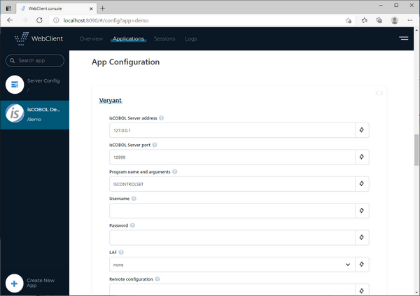
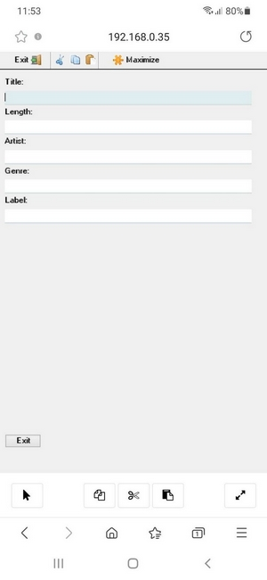
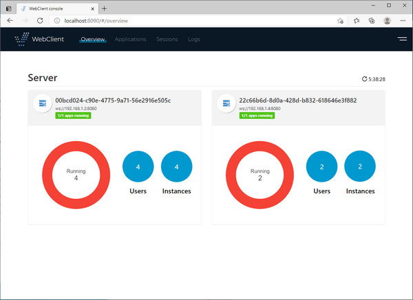
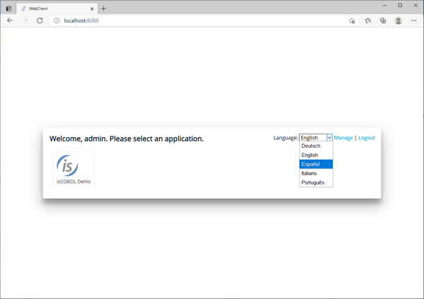
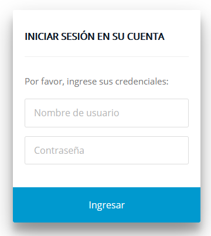

## WebClient

isCOBOL WebClient has been removed from the isCOBOL EIS suite of products, and is now a separate product that can be purchased as an add-on to the runtime system.

The isCOBOL Evolve 2021 R1 release of WebClient includes many new features and capabilities not available in previous versions:

- Support for Java 11

isCOBOL WebClient now supports both Java 8 and Java 11, while previous releases only supported Java 8. OpenJDK is also qualified to be used.

- Better handling of mobile devices, especially those with touch screens
- Support for Hi-DPI (Retina) display
 Accessibility support based on WAI-ARIA 1.2 standard
- New layout for the dashboard: the dashboard has been redesigned for better legibility and usability. For example, in the list of sessions, active and finished sessions are no longer merged together; they’re listed in separate pages. The app configuration page has been improved, with the configuration fields logically grouped in thematic areas, as depicted in Figure 8 - App configuration.

Figure 8 - App configuration

- Better handling of mobile devices, especially those with touch screens. As depicted in Figure 9 – WebClient Mobile bar, a new status bar is available for common screen’s operation like copy and paste.

Figure 9 - WebClient Mobile Bar

- Separate admin application

The admin application is now a separate application, running on a dedicated port and can manage multiple WebClient servers at once, a useful feature when deploying in a clustered environment.

By default, the WebClient server starts on port 8080 and the WebClient admin starts on port 8090. These default ports can be changed by editing the jetty.properties configuration files installed along with the product.

The multiple WebClient servers managed by the WebClient admin could reside either on the same server (listening on separate ports) or on separate servers. In order to manage multiple WebClient servers you must specify their WebSocket URL in the webclient/admin/webclient-admin.properties configuration file, e.g.

```cobol
webclient.server.websocketUrl = ws://localhost:8080,ws://server2:8080
```

To enhance security, the admin application and the WebClient server must share the same “secret key” in order to establish a connection. Edit the webclient/admin/webclient-admin.properties configuration file to set the secret key for the admin app. Edit the webclient/webclient.properties configuration file to set the secret key for a WebClient instance.

Having the WebClient admin separated from the WebClient servers is particularly useful in clustered Cloud or distributed environments to improve the scalability of the software. As an example, in an e-commerce application whose workload increases in specific periods of the year (i.e. Black Friday and Christmas) might require new servers to be added only in peak periods, to better support the increased number of requests.

All the servers can now be monitored and managed from your own PC having the WebClient admin running locally. Separating the admin console from the runtime section results in increased security, since the admin console does not need to be installed in production servers.

The Figure 10, Monitor two WebClient servers, shows how two WebClient servers appear in the admin application. In this instance, there are four sessions running on the first server and two sessions running on the second server.

Figure 10.- Monitor two WebClient servers

- Multilanguage interface

It’s now possible to choose the language that WebClient uses in the user interface.

Changing the language affects all the messages generated by WebClient (i.e. “Your network connection is slow”) as well as WebClient screens (i.e. the login screen).

Several languages are provided along with the product, and additional languages can be added by installing a dedicated msg.json file in the WebClient ‘s “lang” folder.

Figure 11, Language change, shows how to switch the language in the home page of WebClient.

Figure 11. Language change

Figure 12 – Spanish login, shows login screen after Spanish has been selected.

Figure 12 - Spanish login

- Tomcat compliant

Even though WebClient comes with an embedded Jetty server, it is also possible to deploy it in an external servlet container like Tomcat. Other J2EE servers can work as well, as long as they support the Servlet 3.0 spec.

To deploy WebClient to Tomcat follow these steps:

a. Make a copy of webclient-server.war from the isCOBOL SDK to Tomcat's webapps folder

b. In webclient.properties set the property webclient.server.websocketUrl to

```cobol
ws://localhost:<port>
```

with the port that Tomcat is running on

c. In catalina.properties add the following properties:

```cobol
webclient.warLocation=webapps/webclient-server.war
webclient.configFile=<path to WebClient’s webclient.config file>
webclient.tempDirBase=<path to WebClient’s tmp folder>
webclient.rootDir=<path to WebClient root>
```

Tomcat should be executed from its root folder, otherwise the path of webclient.warLocation needs to be adjusted.
