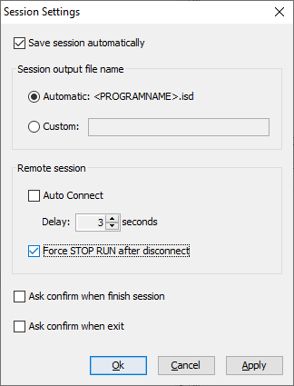
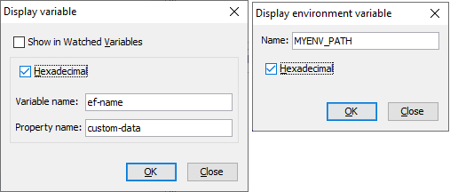

## isCOBOL Debugger

isCOBOL Remote Debugger is useful to debug processes that are running on a different computer, which is typical in architectures like isCOBOL Thin Client using the isclient –d option. Other applicable architectures such as Tomcat, WebClient and batch processes that are executed on a server without X11 support require the Debugger to be executed on a separate computer with a GUI environment.

In these scenarios the Remote Debugger is started by executing the “iscrun –d –r IP port” command.

The Remote Debugger has the ability to disconnect and reconnect, and with the latest release it has the option to issue a STOP RUN COBOL statement to terminate execution of the program after disconnecting. As shown in Figure 26, Debugger session settings, in order to activate this feature, simply check the new setting “Force STOP RUN after disconnect “ in the Session Settings window.

Figure 26. Debugger session settings

The debugger command "display" now supports -x option on properties and environment variables to show the value in hexadecimal for any piece of information inquired.

This is available in the debugger’s command-line, using the commands:

```cobol
display -x ef-name property custom-data
display -x -env MYENV_PATH
```

as well as the graphical debugger window, as shown in Figure 27, Debugger display windows, in “Display variable” and “Display environment variable”, checking the “Hexadecimal” box.

Figure 27. Debugger display windows

The isCOBOL Debugger has a new icon in the tool-bar, placed next to the combo box containing the source file name to identify whether sources are loaded from disk or extracted from a class.

By default, programs compiled with release 2020 R2 or greater will extract the source code from compiled classes, while programs compiled with previous releases will load source files from disk. Loading sources from disk can be forced by using a new debug configuration option:

```cobol
iscobol.debug.embedded_source=false
```

This is useful, for example, when debugging preprocessed COBOL sources.

The new source location icon helps understand how the source code has been loaded, especially in mixed scenarios where programs are compiled with different compiler releases.
