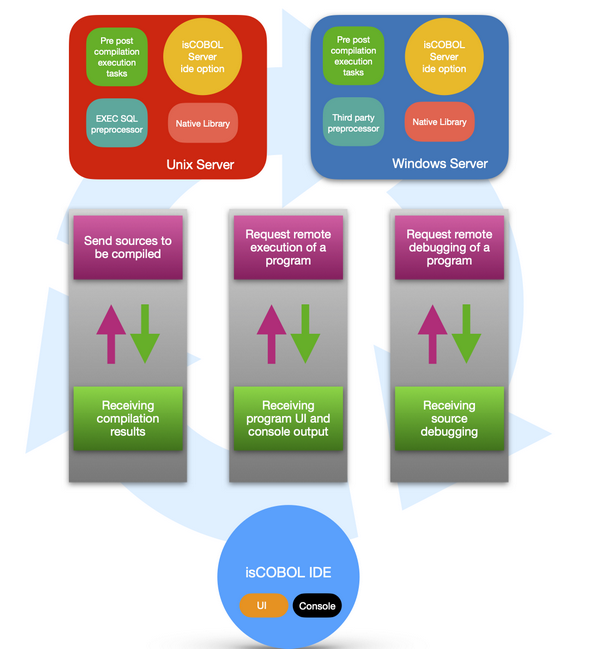
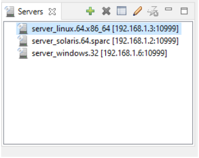
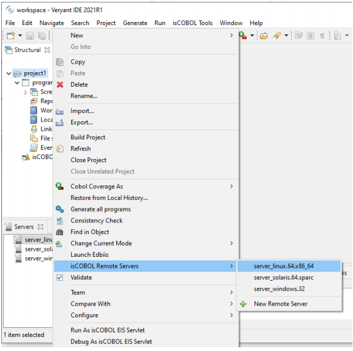
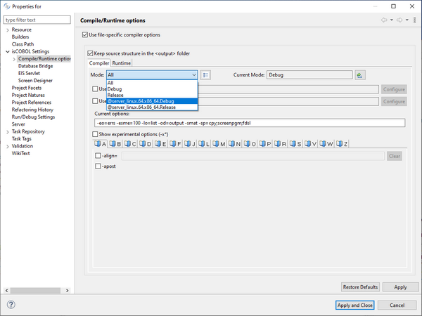
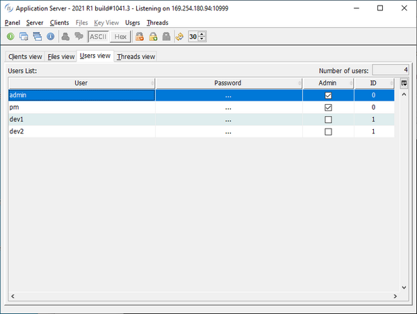
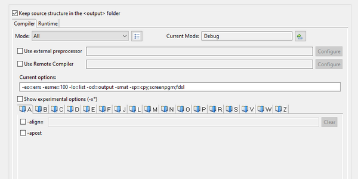
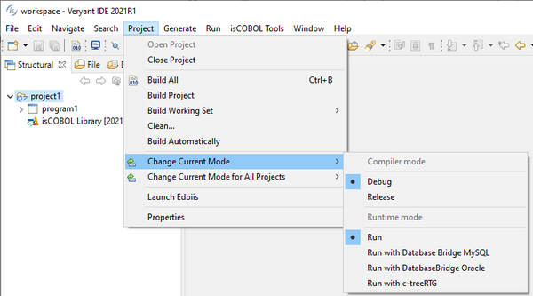

## isCOBOL IDE enhancements

The isCOBOL IDE, now based on Eclipse 2020-06 (4.16), offers a new feature to easily work with remote projects. Remote projects are defined by having local source code, but needing remote compilation and execution. Typical scenarios for remote projects are batch programs that need to be executed on a specific server, for instance if they make use of native calls or third-party pre-compilers. The IDE now allows you to manage such projects, allowing development on a desktop Operating System (Windows, MacOS or Linux), but actions such as compile, run and debug are executed remotely on a target server.

The layout of the Compile / Runtime options has been upgraded for remote projects, and also support local projects.

### Remote projects in the IDE

The isCOBOL IDE can now compile and run programs on a remote server instead of the development PC. This feature is particularly useful when you have to interact with specific software that might not be installed on your local PC but is available on a dedicated server machine.

Figure 1. Remote projects in the IDE architecture

To take advantage of this feature, the isCOBOL Server must be started with the -ide option on the remote server, e.g.

```cobol
iscserver -ide
```

When started with the -ide option, the isCOBOL Server acts as a remote compiler and application server for remote IDEs.

If the isCOBOL Server is run as a Windows Service, the remote project feature can be activated by adding the -Discobol.as.ide=true option to the isserver.vmoptions configuration file.

A remote server can be registered in the isCOBOL IDE using the new Servers view, which is available in the bottom left corner of the isCOBOL Perspective. Figure 2, IDE’s Servers view, shows the new view in action.

Figure 2. IDE’s Servers view

To register a server, click the green + button and fill out the form with the required information: a name of your choice to identify the server in the list, and the hostname and port where the remote server is listening.

To bind a project to a remote server, right click on the project name in the isCOBOL Explorer and choose the desired server from the list in isCOBOL Remote Servers, as depicted in Figure 3, Binding a project to a remote server.

Figure 3. Binding a project to a remote server

Once the project is bound to the remote server, new compile, runtime and debug modes become available in the project properties, as depicted in Figure 4, Remote compile modes.

Figure 4. Remote compile modes

Choosing a remote mode (a mode whose name starts with @) will cause the IDE to redirect the actions to the remote server.

When you compile on a remote server, the IDE pushes the source files to the server. The source files are compiled on the server and the IDE receives the compilation results.

When you run or debug on a remote server, the IDE becomes a Thin client of the server, which results in the program being run on the server, and the GUI rendered on the local PC.

The isCOBOL Server’s admin users can maintain the remote project modes through the Servers view. Administrators can edit existing projects or create new ones. isCOBOL Server’s standard users can only view and use the remote project modes, but they can’t edit them.

isCOBOL Server’s users are maintained using the isCOBOL Server’s administration panel. In Figure 5, isCOBOL Server’s users, for example, two admin users (admin and pm) and two standard users (dev1 and dev2) are configured.

Figure 5. isCOBOL Server’s users

### New Layout of Compile/Runtime options

The Compile/Runtime options screen has been redesigned, separating the Compile and Runtime options.

In previous versions of the IDE, Compile and Runtime options were merged in the same Mode, and compiling a project in Release mode and running it in Debug mode required switching modes between compiling to running. Moreover, modes could not be separated between compile and run phases.

Figure 6, Compile/Runtime options, shows the separation of mode selection for the compile and runtime.

Figure 6. Compile/Runtime options 

In addition, you can set the active Compile mode and the active Runtime mode in theProject -> Change Current Mode menu option; each mode will be used when compiling and running respectively. This is depicted in Figure 7, Active modes.

Figure 7. Active modes
