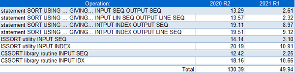
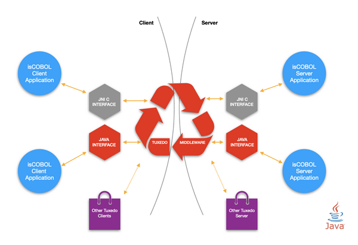

## isCOBOL Runtime

isCOBOL Evolve 2021R1 improves runtime performance across the board, new runtime configurations have been added to customize the behavior when running applications, and now there is support for Oracle Tuxedo.

### Sort performance

Sort operations are common in COBOL applications, from interactive applications, such as reading from indexed or sequential files and outputting a sorted file to be presented to the user, to batch applications, where usually an external utility, ISSORT, or a call to the library routine C$SORT are used to perform sorting operations. For both scenarios, the newest isCOBOL release has optimized the core of sort operations, and all COBOL programs will gain better performance as a result.

A table of performance gains is shown in Figure 20, Sort performances, comparing isCOBOL Evolve 2020R2 to isCOBOL Evolve 2021R1 using the same configuration:

```cobol
iscobol.sort.memsize=33554432
iscobol.sort.maxfile=8
```

The test was run in Windows 10 64-bit on an Intel Core i7 Processor 8550U+ clocked at 1.80 GHz with 16 GB of RAM, using Open-JDK 11.0.10. All times are in seconds, number of records involved in the sort: 1 million.

Figure 20. Sort performances

New configurations

Starting from the isCOBOL Evolve 2021 R1 release, all the configuration properties are searched for in the external environment, with the convention of having dots replaced by underscores in the name. This simplifies the migration of existing applications that only use environment variables instead of using a configuration properties file. For example, running the following statement:

```cobol
accept var from environment "myapp.var"
```

the value of the environment variable MYAPP_VAR is returned.

The following is the list of new runtime configurations:

```cobol
iscobol.apply_code_path=true
```

to apply code_prefix to absolute paths used in CALL statements.

By default, the configuration option is set to false, and the code_prefix is applied only to relative paths used in the CALL statement. As an example, a COBOL program that runs the following statement:

```cobol
CALL "/myapp/cobol/listusr"
```

with the configuration options:

```cobol
iscobol.apply_code_path=true
iscobol.code_prefix=/opt/company
```

will cause the call program to load the LISTUSR.class file from the directory /opt/company/myapp/cobol.

The configuration option

```cobol
iscobol.exception.dumpfile=value
```

is used to customize the name of the file generated when using the existing configuration iscobol.exception.message=3.

Special characters are supported in the value of the property, and act as a placeholder for the actual value:

- %p to identify the program name
- %d to identify the current date in the form YYYYMMDD
- %t to identify the current time in the form HHMMSSTTT
- %u to identify the username
- %h to identify the hostname

For example, if the following configuration is used:

```cobol
iscobol.exception.dumpfile=/tmp/logs/%u/%d-%t-%p.dump
iscobol.exception.message=3
```

the exception dump-file generated when user “user1” runs the program is named “20210420-115324678-PBATCH56.dump” and it is created in the /tmp/logs/user1 folder.

A “+” character can be used at the start the configuration option to append to an existing file instead of overwriting it.

```cobol
iscobol.extfh.keep_trailing_spaces=false
```

(default true) to remove trailing spaces in EXTFH interface. This is similar to other existing configurations for line sequential files, but this option is only used for the EXTFH interface.

The existing *iscobol.jdbc.timestampformat* now supports additional “S” values after the seconds “s”, to include microseconds in ESQL timestamps instead of just the milliseconds. This increases timestamp precision when inserting or retrieving such fields from a database. For example:

```cobol
iscobol.jdbc.timestampformat=yyyy-MM-dd-HH.mm.ss.SSSSSS
```

isCOBOL Evolve 2021 R1 implements a new routine, C$NCALLRUN, to query the number of programs called using CALL RUN that are still running. This provides better monitoring of runtime environments where CALL RUN statements are used to run concurrent batch processing. For example, the code snippet

```cobol
 perform test after until w-count = 0
    call "c$ncallrun" giving w-count
    call "c$sleep" using 0.5
 end-perform
```

shows how to wait for all threads generated by CALL RUN to terminate before exiting.

### Oracle Tuxedo integration

Tuxedo (Transactions for Unix, Extended for Distributed Operations) is a middleware platform used to manage distributed transaction processing in distributed computing environments. It distributes applications across multiple platforms, databases, and operating systems using message-based communications and distributed transaction processing.

isCOBOL developers using the Oracle Tuxedo platform for distributed transaction processing and message-based application development can create Tuxedo clients and Tuxedo services from COBOL applications. The isCOBOL Evolve 2021R1 is qualified for Tuxedo 12 on all supported platforms.

isCOBOL and Tuxedo can work together in a distributed processing (client/server) environment providing two flavors of execution:

- Legacy COBOL approach, based on calls to the C routines provided by Tuxedo
- Java approach, based on OOP Java methods used to create clients and services

In a distributed processing environment, the interaction occurs as depicted in Figure 21, Tuxedo diagram, where isCOBOL can be used to develop both Client and Server applications using the JNI C interface, to migrate previous COBOL dialects used in Tuxedo or taking advantage of a Java interface to have a more optimized multithread model.

Figure 21. Tuxedo diagram

The newest release of the isCOBOL runtime includes improvements to C interoperability by providing:
- a new configuration *iscobol.shared_dlopen_null=false* (default true) to specify if functions called by the COBOL program are searched for in the current process.
- two new functions in the C API, isCobolCallNoStop and isCobolCallNoStopEx, are used to call isCOBOL from C without terminating the process if a STOP RUN statement is executed in the COBOL code.

These new C API functions and configurations are available in a C context and can be also be used by other applications. They are automatically used in the Tuxedo integration.
