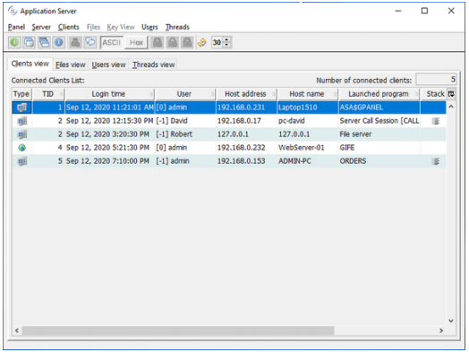
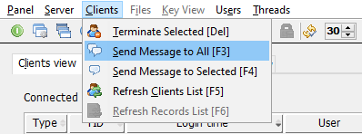
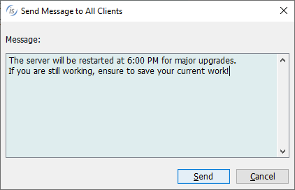
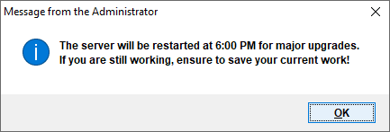

## isCOBOL Server

The routines available in the isCOBOL Application Server environment, that usually start with A$, have been improved to provide communications between connected Thin Clients and to query the logon time. These features are integrated in the isCOBOL Panel and are useful in all architectures: ThinClient, WebClient or a mixed Thin + Web clients.

### ApplicationServer library routines

A new routine, A$SEND_MESSAGE, is now available to send a message to a thread ID running in an ApplicationServer environment without Multitasking. The syntax of the library routine is:

```cobol
           CALL "A$SEND_MESSAGE" USING TID,
                                       msgText,
                                       msgTitle
```

where the first parameter specifies the recipients’ thread ID, the second specifies the text of the message and the third optional parameter specifies the title of the message box. By default, the message will appear as a standard graphical message box. This is usercustomizable by simply creating a program with the name A$CUSTOM_MESSAGE, and making it available in the client’s CLASSPATH or code\_prefix.

For example, the following program will display received messages as a Notification window:

```cobol
 program-id. "A$CUSTOM_MESSAGE".
 working-storage section.
 77 n-win handle of window.
 linkage section.
 77 msgText pic x any length.
 77 msgTitle pic x any length.
 screen section.
 01 n-screen.
    03 entry-field line 1, col 1
       lines 10 cells, size 40 cells
       no-box, multiline, read-only, value msgText.
 procedure division using msgText, msgTitle.
 main.
      display notification window bottom right
              lines 10 size 40 before time 500
              visible 0 handle n-win
      display n-screen upon n-win
      modify n-win visible 1
      goback.
```

The existing library routines A$LIST-USERS and A$CURRENT-USER now support an additional optional parameter that returns the user’s login time.

```cobol
 call "A$LIST-USERS" using listusr-next usrlist
                           usr-id usr-name 
                           usr-addr usr-pcname
                           usr-tid usr-prog
                           usr-type 
                           usr-logon-time
                           
 call "A$CURRENT-USER" using usr-id usr-name
                             usr-addr usr-pcname
                             th-id usr-prog
                             usr-type
                             usr-logon-time
```

where usr-logon-time is defined as:

```cobol
01 usr-logon-time pic x(16).
```

and contains the timestamp in YYYYMMDDHHNNSSCC format, where YYYY is the year, MM the month, DD the day, HH the hour, NN the minutes, SS the seconds and CC the hundreds of second. The time is returned in the UTC time zone.

### isCOBOL Panel

The isCOBOL Application Server Panel has been enhanced and uses the new features of A$\* routines, providing an additional column “Login time” that helps in sorting the Client connections, for example to easily identify which ones are the oldest. Figure 22, isCOBOL Panel, shows all the clients of different types, including File Server and remote calls, all having the Login time set.

Figure 22. isCOBOL Panel

The message sending capability has been integrated in the isCOBOL Panel, allowing messages to be sent from the Panel to all or to a selected list of connected clients.

In Figure 23, Clients menu, the Administrator is choosing to Send a message to all clients, and in Figure 24, Send message window, the text has been input. After pressing the button Send, the message will be delivered to connected ThinClients and WebClients, advising users of downtime due to maintenance. Figure 25, Message received from ThinClient, shows the message received on the ThinClient processes.

Figure 23. Clients menu

Figure 24. Send Message window

Figure 25. Message received from ThinClient
