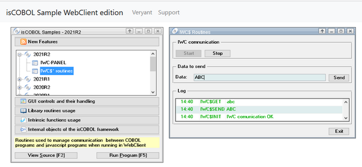
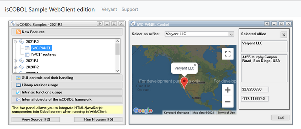
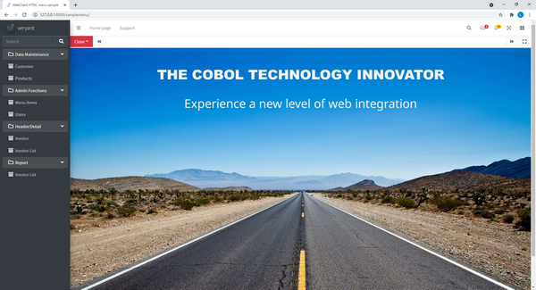
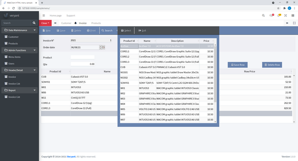

## WebClient integration with a web page

WebClient is Veryant’s solution to host desktop application in a web environment. Desktop applications will be rendered as HTML pages and will run unchanged in a browser. Using WebClient a desktop application can be embedded inside a custom-built web page to provide additional functionality.

With the 2021R2 release, the range of capabilities have been greatly expanded. isCOBOL applications can now interact with the underlying web page, and the page can invoke isCOBOL code. Additionally, a new IWC-PANEL component has been implemented to host web components inside COBOL screen sections.

Communications is based on messages that COBOL and the web page can exchange to perform tasks.

A message is a data structure composed of:

- *action*: a string containing the purpose of the message, and is required
- *data*: a string with the parameters for the action, an optional parameter
- *binaryData*: a byte array with parameters for the action, an optional parameter

COBOL programs have access to the following new routines:

- IWC$INIT to activate the communication between COBOL and the web page
- IWC$GET to read the data sent by the Javascript code in the web page
- IWC$SEND to send data to the web page
- IWC$STOP to stop the communication between COBOL and the web page

To embed a COBOL program in a web page when running in WebClient, thus enabling communication, a container web page needs to be provided, and the "Compositing Window Manager" setting in the WebClient configuration for the COBOL application needs to be enabled.

The web page needs to contain, as a minimum, the following code that defines a div element that will contain the COBOL application:

```cobol
<div class="webclientAppContainer webswing-element" 
            data-webswing-instance="webclientInstance">
    <div id="loading" class="ws-modal-container">
        <div class="ws-login">
         <div  class="ws-login-content">
            <div class="ws-spinner">
               <div class="ws-spinner-dot-1"></div> 
               <div class="ws-spinner-dot-2"></div>
            </div>
         </div>
         </div>
      </div>
   </div>
</div>
```

```cobol
var webclientInstance = {
   options: {
      autoStart: true,
      args: '',
      recording: getParam('recording'),
      debugPort: getParam('debugPort'),
      connectionUrl: '<URL of the webapp as defined in WebClient>',
   compositingWindowsListener:{
         windowOpening: function(win){},
         windowOpened:  function(win){},
         windowClosing: function(win){},
         windowClosed: function(win){},
         windowModalBlockedChanged: function(win){}
      },
      customization: function(injector) {
         injector.services.base.handleActionEvent = 
                  function(actionName, data, binaryData) {
            if (actionName == "action") {
   /* code to handle the action */
            }
         }
      }
   }
}
```

When WebClient loads the web page, it will enrich the webclientInstance object with additional properties and methods useful for interacting with the COBOL program.

The handleActionEvent callback is an event handler that will be called when the COBOL program executes the IWC$SEND routine, and any needed code to carry out the requested action can be added there.

To send an action from Javascript to the COBOL program the following code can be used:

```cobol
webclientInstance.performAction (
{actionName: 'EXECUTE_PGM', data: 'INVOICE_PRINT', binaryData: null}
)
```

The action details can be retrieved in COBOL by calling the IWC$GET routine.

The following code shows the COBOL side of the communication:

```cobol
       78  78-iwc-crt-status         value 1001.
       77  data-to-send              pic x any length.
       01  iwc-struct.
          03 iwc-action              pic x any length.
          03 iwc-data                pic x any length.
          03 iwc-bytes               pic x any length.
 
       ACTIVATE.
           call "IWC$INIT" using 78-iwc-crt-status 
                          giving return-code.
       SEND-TO-HTML.
           initialize iwc-struct.
           move "ComSample"  to iwc-action
           move data-to-send to iwc-data
           call "IWC$SEND"   using iwc-struct
                            giving return-code.
       READ-DATA-FROM-HTML.
           initialize iwc-action
           call "IWC$GET" using iwc-struct
                         giving return-code
           if iwc-action = "EXECUTE_PGM"
              call IWC-DATA 
           end-if.         
       DEACTIVATE.
           call "IWC$STOP" giving return-code.
```

Every time the web page sends a message to the application, the COBOL program can read it calling the IWC$GET routine. If a program is executing an ACCEPT statement, it will be terminated with the key-status specified in the IWC$INIT routine.

To send a message to the web page, the IWC$SEND can be called passing the same message structure iwc-struct described above. Communication can be stopped by calling the IWC$STOP routine.

The result of program running in WebClient is shown in Figure 1, IWC$ routines.

Figure 1. IWC$ routines



The window on the right shows the result of calling a JavaScript function that transforms the string it receives to lower case as the action data parameter and sends it back to the COBOL program using the performAction method. The COBOL program can read the result using the IWC$GET routine.

### Using Web Components in COBOL screen sections.

Starting from the 2021R2 release, custom HTML / JavaScript web components can be embedded in COBOL screen sections when running in WebClient, allowing the creation of hybrid apps that were not possible before. The feature is very powerful yet easy to use. On the COBOL side of the program, only COBOL knowledge is required, while on the web page and component creation and handling, HTML / Javascript and CSS knowledge is required, as development will be done using a web toolchain.

To host a Javascript component, a new IWC-PANEL control has been implemented for the SCREEN SECTION. The component is only visible when the application is run in a WebClient environment, and will be ignored when running as a desktop application.

IWC-PANEL acts as a placeholder in the HTML page, and the actual content will need to be injected from the HTML / Javascript page, just like it’s done in traditional web applications.

An example of the panel is provided in the code below:

```cobol
           03 f-map iwc-panel
                      js-name         "f-map"
                      line  5         column  2
                      size 68 cells   lines 15 cells 
                      value           fmap-struct
                      event procedure FMAP-PROC.
```

The VALUE property of the control holds the message structure used to send actions to the panel in the web page. The message is sent by performing a MODIFY statement on the value property. The event procedure will be called when the web page executes a performAction on the panel, and an INQUIRE on the value property of the IWC-PANEL will return the message that has been sent.

The JS-NAME property holds an identifier that will be sent to the web page upon creation, so that the corresponding web component can be created. For every IWC-PANEL in a form, a callback in the web page is called, with the details necessary to perform component initialization. The webclientInstance.options.compositingWindowsListener object defines callbacks for various events, ranging from windows opening, closing and IWC-PANEL creation.

An IWC-PANEL creation will trigger the windowOpened callback, and a reference to the IWC-PANEL is passed as function argument. The callback can check the .name property to determine which control has been created and react accordingly.

A sample code snippet is:

```cobol
…
compositingWindowsListener:{
 
windowOpened: function (win){
   if (win.name == 'map'){
     createMap(win);
   }
}
…
```

The webclientInstance object has a getWindows() method that will return all windows and IWC-PANEL that the COBOL application has created, along with the DOM (Document Object Model, the in-memory representation of the HTML page created by the browser) element of each.

A sample project is provided that shows how to integrate a Google map component in a COBOL application, and how to interact with it.

### How to integrate a Google map component

This code snippet below is taken from the Google maps integration sample, and shows the code in WORKING-STORAGE that defines the structure for the messages to be sent to and received from the web, the definition of the new IWC-PANEL control in the SCREEN SECTION and the PROCEDURE DIVISION showing sample code to invoke actions in the web page to perform specific tasks and handle incoming messages.

The snippet shows the interaction with a Google map element created in the page, and how to send JSON (the native Javascript data format) data as argument of the action. When the user selects an office from the COBOL combo-box, the MODIFY statement is executed on the IWC-PANEL, causing a “selectOffice” action with a JSON representation of the selected office to be sent to the web page, and the Javascript code on the page will center the map on the requested office location.

When the user clicks on a pin in the Google map, the Javascript program calls the panel’s performAction method, causing the IWC-PANEL event procedure to be called. Performing an INQUIRE on the value property of the panel will return the data structure sent by the JavaScript code.

```cobol
       WORKING-STORAGE SECTION.
       01  fmap-struct.
           03 fmap-ACTION PIC X any length.
           03 fmap-DATA   PIC X any length.
           03 fmap-BYTES  PIC X any length.
       
       SCREEN SECTION.
       01  Mask.
           03 f-map iwc-panel
                    js-name         "f-map"
                    line  5         column  2
                    size 68 cells   lines 15 cells 
                    value           fmap-struct
                    event procedure FMAP-PROC.
       ...      
       SHOW-ON-MAP.
           move "selectOffice"        to fmap-action
           move offices(office-index) to selected-office
           set objJsonStream to jsonStream:>new(selected-office, 1);;
           set strbuffer     to string-buffer:>new
           objJsonStream:>writeToStringBuffer(strbuffer)
           move strbuffer:>toString to fmap-data
           modify f-map value fmap-struct.  
 
       FMAP-PROC.
           if event-type = ntf-iwc-event
              inquire f-map value in fmap-struct
              evaluate fmap-action 
              when "pinClicked"
                    move fmap-data to sel-description 
              ...
              when "pinClosed"
              ...
              end-evaluate
           end-if.
```

The result of program running in WebClient is shown in Figure 2, IWC-PANEL control.

Figure 2. IWC-PANEL control



The new features let developers easily create a web portal with an HTML menu system that starts COBOL programs hosted in containers inside the main page. Several programs can be started at once and can be managed using the features described above. A sample menu application is included in the installation, that uses Iframes to hold each instance of COBOL programs, and can be easily inspected and customized to provide a full-blown web solution for legacy applications. The sample is an evolution of our trusty old isapplication sample, fully evolved to be a modern web application.

Taking some care when styling the COBOL application will make the end result look like a complete native web application, with the advantages of having a familiar COBOL development environment to provide modernization of code.

Figure 3, Web portal and WebClient, shows the result of running the new provided sample that uses the techniques described above to provide an integrated environment with HTML code and COBOL programs running together seamlessly.

Figure 3. Web portal and WebClient



Figure 4, HTML / JS and COBOL SCREEN, shows an HTML / JS menu that run COBOL programs with SCREEN SECTION styled to look like native web applications.

Figure 4. HTML/JS and COBOL SCREEN


