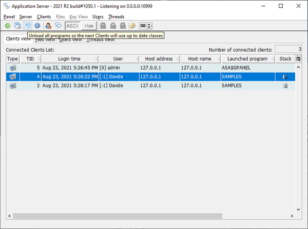
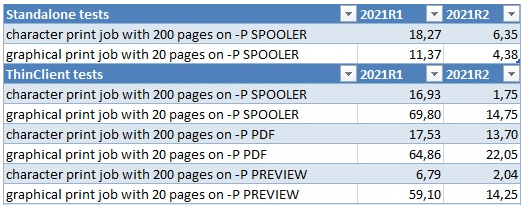

## isCOBOL Runtime

In the 2021R2 release several new configuration settings have been added:

*iscobol.code_prefix.reload=2* can be used to reload the whole set of classes specified in the code_prefix configuration variable after calling the C$UNLOAD library routine. This option can be used to automatically reload classes in a ThinClient installation after an upgrade, to ensure that all classes are updated.

The isCOBOL Server Panel has been upgraded to allow reloading of classes for applications running with the new configuration variable. The new button to force a reload is located in the tool-bar, as shown in Figure 5, isCOBOL Panel with new reload logic.

Figure 5. Web isCOBOL Panel with new reload button

New configurations have also been implemented to allow print jobs to be executed asynchronously. When a CLOSE print-file statement is executed, a thread that manages the entire print job is created, allowing execution to continue in the application so that users can continue to work without needing to wait for the print job to complete. The new configurations are:

*iscobol.print.spooler_async=true|false* (default: true) to set the print job to be run asynchronously

*iscobol.print.pdf_async=true|false* (default: false) to have the PDF print job to be executed asynchronously.

Performance of print jobs have been improved, both as a result of the async mode implementation and as a better Application Server TCP packet handling when running in ThinClient.

Figure 6, Print jobs comparison, shows the gains of printing using the new 2021R2 release compared to the previous 2021R1.

Figure 6. Print jobs comparison

All times are in seconds.

Hardware details of client machine:

Windows 10 Pro i7-8550U CPU @ 1.80GHz 16GB

Hardware details of server machine:

macOS Big Sur Apple M1 16GB.
