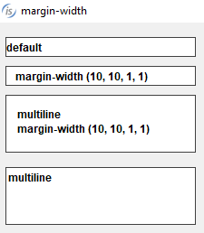
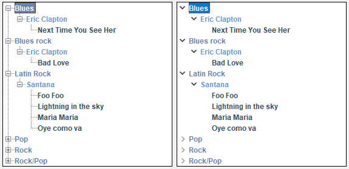
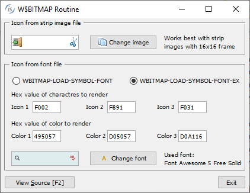
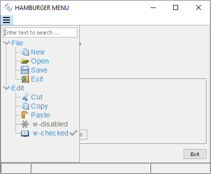
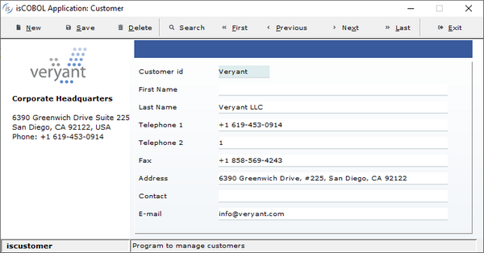
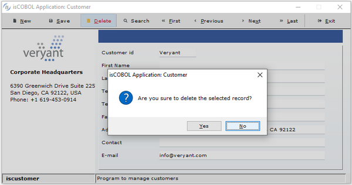
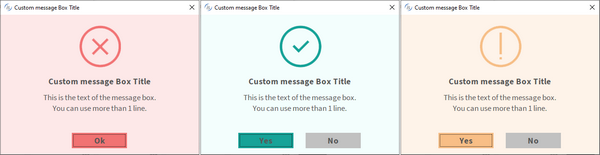

## GUI enhancements

Many improvements to GUI controls have been implemented in this release. Library routines W$BITMAP and W$MENU now allow merging different symbol fonts and to set new attributes in the Hamburger menu. New configuration settings can be used to modify the look and feel of modal windows and to have finer control with the LM_ZOOM layout manager.

### GUI controls

A new property named MARGIN-WIDTH is supported in Entry-Field controls to set or retrieve the spacing between text and borders. The property is a list of four values that specify the padding space in pixels from the top, left, bottom and right border respectively (the same rule of the existing BORDER-WIDTH property). When used on single line entry-fields, only the left and right borders are meaningful, since text is always vertically centered.

The same spacing applies to the PLACEHOLDER property, if defined. This feature, known also as Inset, helps in defining different spacing of different controls. Alternatively, you can use a different margin space in all entry-field controls of the entire isCOBOL application by using the compiler code injection feature.

For example, the entry-fields defined below use the new syntax in the second and third entry-fields:

```cobol
 03 entry-field 
    line 2  col 2 size 30 cells.    
 03 entry-field 
    line 4  col 2 size 30 cells
    margin-width (10, 10, 1, 1).    
 03 entry-field multiline line 6 col 2 lines 4 cells size 30 cells 
    margin-width (10, 10, 1, 1).    
 03 entry-field multiline line 11 col 2 lines 4 cells size 30 cells.

```

The result when running is shown in in Figure 8, *Entry-field MARGIN-WIDTH property*.

Figure 8. Entry-field MARGIN-WIDTH property



The FLAT style is now supported in Tree-View controls to have more modern-looking buttons when running with the Windows LookAndFeel. For example, having this code in the screen section declaration:

```cobol
 01  Mask.
    03 Tv1 tree-view buttons lines-at-root
           line 2 col 2 lines 17 size 40 cells
           show-sel-always selection-background-color rgb x#6883AE
                           selection-foreground-color rgb x#FFFFFF.
    03 Tv2 tree-view buttons lines-at-root FLAT
           line 2 col 44 lines 17 size 40 cells
           show-sel-always selection-background-color rgb x#6883AE
                           selection-foreground-color rgb x#FFFFFF.
```

with the FLAT style is set only in the second tree-view, will result in the running program looking as shown in Figure 9, *Tree-view FLAT style*, where you can notice the difference in the styling of the two tree view controls.

Figure 9. Tree-view FLAT style



The TRANSPARENT-COLOR property, already supported with BITMAP controls, is now supported on PUSH-BUTTON controls. A specific color can be specified to represent the transparent color in the button’s bitmap image, even if the bitmap has no transparency.

The layout-manager syntax now supports “max-font-zoom=n min-font-zoom=n” clauses to set the maximum and minimum zoom levels that can be applied during window resizing when used in conjunction with the LM-ZOOM layout manager. The values are expressed as a percentage in which the font will be altered. When the zoom level is outside this range, LM-ZOOM behaves exactly as LM-SCALE, resulting in changes only to the dimensions and coordinates of the controls without affecting the font size. For example, the code snippet:

```cobol
    77  my-lm-zoom handle of layout-manager LM-ZOOM
              "max-font-zoom=150 min-font-zoom=50".
```

declares a layout-manager for LM-ZOOM allowing font changes from 50% when decreasing and 150% when increasing.

A new event named MSG-FINISH-FILTER is fired in grid controls when the visible rows in the grids change because of changes applied using the Filters or Search panel features. This is useful if the program needs to be aware of a filter being applied to the grid’s content.

### Library routines

A new op-code named WBITMAP-LOAD-SYMBOL-FONT-EX in W$BITMAP library has been implemented to load icons and to merge different font symbols or font styles. This lets you create a handle with a strip of icons loaded from different font handles, or from the same handle but with different styles, such as the color. The code snippet:

```cobol
 initialize wbitmap-lsf-data       
 move h-font        to wbitmap-lsf-font(1)
 move character-1-n to wbitmap-lsf-characters(1)
 move color-1-hex   to wrk-color-hex
 perform CALCULATE-COLOR
 move wrk-color     to wbitmap-lsf-color(1)
 move h-font        to wbitmap-lsf-font(2)
 move character-2-n to wbitmap-lsf-characters(2)
 move color-2-hex   to wrk-color-hex
 perform CALCULATE-COLOR
 move wrk-color     to wbitmap-lsf-color(2)
 move h-font        to wbitmap-lsf-font(3)
 move character-3-n to wbitmap-lsf-characters(3)
 move color-3-hex   to wrk-color-hex
 perform CALCULATE-COLOR
 move wrk-color  to wbitmap-lsf-color(3)
 call "W$BITMAP" using wbitmap-load-symbol-font-ex,
                       16, wbitmap-lsf-data
                giving h-font-icon
```

creates the handle h-font-icon with 3 icons from different characters of the same font handle (h-font in this case loaded from Font Awesome 5 Free Solid) but using 3 different colors, and the 3 images can be used with the standard bitmap-handle and bitmap-number syntax as shown in the entry-field and push-button in Figure 10, *WBITMAP-LOAD-SYMBOL-FONT-EX new op-code*.

Figure 10. WBITMAP-LOAD-SYMBO-FONT-EX new op-code



New attributes for the W$MENU library have been added to customize the hamburger menu layout and behavior. This is the list of new attributes:

- EXPANDED, to specify if the menu items with children should be automatically expanded
- HEIGHT, to set the height in pixels of the area covered by the hamburger menu
- LAYOUT-MANAGER, to set the rules of layout-manager bound to the menu that will applied when the window is resized while the menu is open
- SEARCH-PANEL, to enable the tree view’s search panel, allowing the user to filter the content
- STATUS-BAR-COVERING, to prevent the hamburger menu’s tree view to overlap the window’s status bar.

For example, this code snippet sets three of the new attributes:

```cobol
 call "w$menu" using wmenu-set-attribute, "expanded", "yes"
 call "w$menu" using wmenu-set-attribute, "search-panel", "yes"
 call "w$menu" using wmenu-set-attribute, "status-bar-covering", "no"
```

and in Figure 11, *Hamburger menu new attributes*, you can see the new look of the hamburger menu when opened.

Figure 11. Hamburger menu new attributes



The W$CREATEFONT library routine can now load fonts that have been embedded in the class using the COPY RESOURCE directive. This allows you to use a font without needing it to be installed on the client PC. For example, this code snippet:

```cobol
 copy resource "../resources/Font Awesome 5 Free-Solid-900.otf".
 call "w$createfont" using "Font Awesome 5 Free-Solid-900.otf" 
                           "Font Awesome 5 Free Solid".
```

uses the COPY RESOURCE directive to include that .otf file in the class at compile time, and the W$CREATEFONT to load it.

### Configuration settings

New configuration settings have been implemented:

- *iscobol.gui.windows_darkening=n* to specify the opacity of the parent window when modal floating windows and message boxes are opened. A positive value ranging from 1 to 100 specifies the level of darkening with 1 representing an imperceptible darkening and 100 representing the black color, while a negative value ranging from -1 to -100 specifies the level of transparency with -1 representing an imperceptible transparency and -100 representing full transparency.

This is especially useful with applications running in WebClient, to emulate the effect of modern web applications when modal windows are opened. Thin Client applications can also take advantage of this property for a more modern look and feel of the application.

For example, configuring: iscobol.gui.windows_darkening=15 the window shown in Figure 12, *Window before darkening effect*, has its normal color during the accept, but when the message box appears, the color is automatically changed and shown in in Figure 13, *Window after darkening effect*.

Figure 12. Window before darkening effect



Figure 13. Window after darkening effect



- *iscobol.gui.layout_manager.max_font_zoom=n* to specify the upper limit for the font increase performed by the LM-ZOOM layout manager
- *iscobol.gui.layout_manager.min_font_zoom=n* to specify the lower limit for the font reduction performed by the LM-ZOOM layout manager
- *iscobol.gui.light_gray_is_transparent=false* to avoid the transparent effect to be applied automatically on color 0xc0c0c0

Additionally, in the existing configuration *iscobol.gui.messagebox.custom_prog*, the value of the program name can be followed by comma and a letter to specify the program location. When ‘C’ is used, the program is searched for in the client machine, otherwise it’s searched for in the server machine. For example, configuring:

```cobol
iscobol.gui.messagebox.custom_prog=CUSTOMMSG,S
```

the Cobol program named CUSTOMMSG is called when programs display a MESSAGE BOX, and this program is searched for on the Server. Figure 14, *An example of a custom message box*, shows some message box fully customized.

Figure 14. An example of a custom message box


