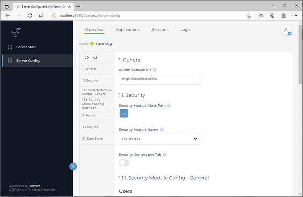
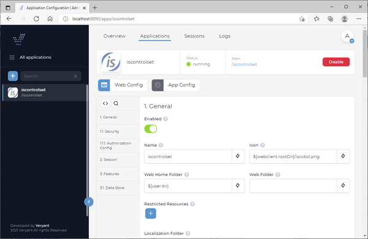
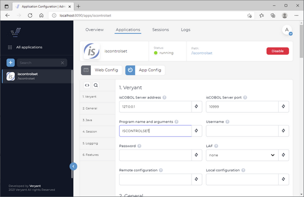
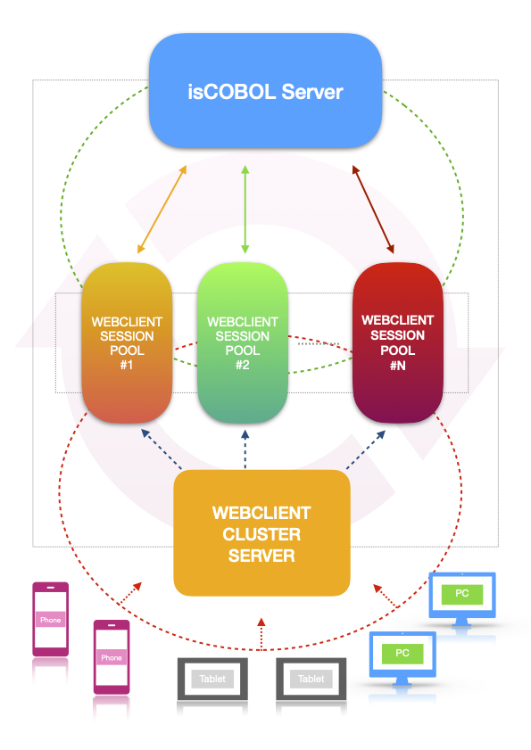
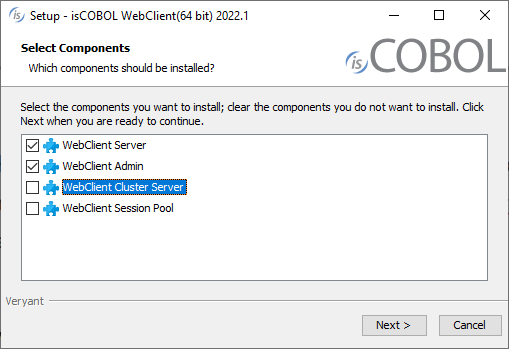
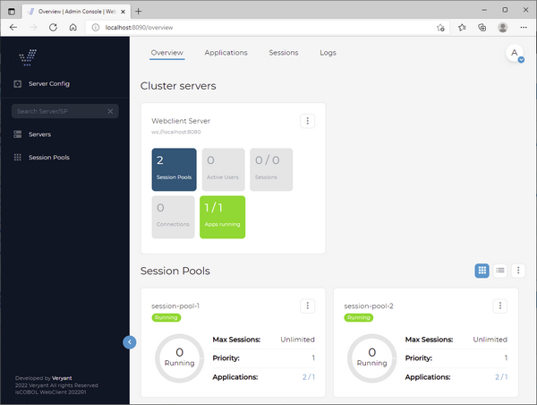
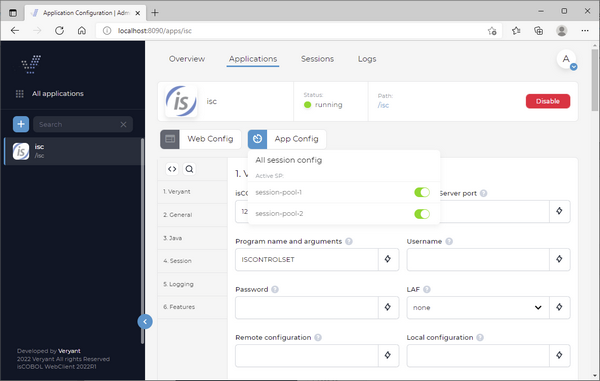

## WebClient

isCOBOL WebClient, Veryant’s solution for running desktop applications in a browser, has a more modern and better organized administration console in the 2022R1 release that makes configuration easier, and includes a new balancing solution.

### New administration user interface

The admin user interface has received an overhaul, and is now more structured in how all parameters are presented to the administrator. It provides categories that logically group parameters, making it much easier to navigate settings, both for server configuration and application configuration.

A server status page lets you keep track of the number of session pools available to applications, the number of currently active users, the number of running sessions, how many connections are established, and the number of configured and enabled applications.

The sessions’ view allows administrators to monitor currently running applications, and, if allowed, to view and take control of users’ sessions.

Figures 1, 2 and 3 depict the new administration panel, and the new grouping of the configuration items in categories.

Figure 1 – Server configuration page

Figure 2 – Web application configuration

Figure 3 – Application configuration

### WebClient Balancer

WebClient now supports balancing through clustering; separating WebClient into modules that can be divided into multiple instances on multiple servers to enable you to handle larger loads. These modules are

- WebClient Cluster Server which handles web requests
- Application pool which handles running COBOL applications
- Admin Console which handles the server administration pages.

A minimal installation requires 1 cluster server and 1 session pool, and more cluster servers can be added for redundancy. As a general rule, no more than 2 cluster servers should ever be needed in most cases, as it is a very lightweight task that basically resends messages from the application instance and the browser. It also picks an application pool in which to run the requested application.

Session pools can be scaled dynamically, based on the number of connected users or resource usage. Cluster Server is a stateless web server, which means that if you have multiple Cluster Servers it doesn't matter which server you connect to from the browser, even on refresh, the browser connection will always find the way to its application instance. If you have multiple Cluster Servers deployed and one of the Cluster Servers terminates, all the browser connections to this server can be reconnected through the other running Cluster Server without terminating the application instance.

Inside Cluster Server is a built-in mechanism - a Session Pool balancer. This mechanism is responsible for finding a free Session Pool where a new instance will be started. The WebClient balancer uses a round-robin algorithm.

Everything in your application that is related to web is configured and provided through the Cluster Server. This includes security (SSL, authentication, and logout), translations, fonts and custom web resource handling. On the other hand, everything related to your application binary is configured and handled in Session Pool. Because of this the webclient.config file needs to be divided into 2 separate configuration files - webclient-server.config which is used by Cluster Server and webclient-app.config which is used by Session Pool.

A single Admin console can be used to handle configuration of all Cluster Servers by configuring the list of websocket URLs of all Cluster Servers in the Admin Console configuration file.

Modules inside a Cluster deployment are connected through WebSocket. To make sure that no other malicious servers connect to your Cluster Servers, all modules must share the same secret key which is used in handshake when establishing the websocket communication. The secret key is defined in webclient.properties, webclient-sessionpool.properties and webclient-admin.properties as property webclient.connection.secret. Please change this secret key to your random value before going into production. This secret key is also used for signing JWT tokens that are used for user session cookies. Make sure you use only alphanumeric characters in the secret key, and do not use any special characters.

Figure 4 – *Communication flow* describes the flow of communication between devices running the application. A device connects to the WebClient balancer, which connects to a Cluster Server. The server will run an application using one of the available session pools.

Figure 4 – Communication flow

To work with the new cluster solution, we removed WebClient product from the isCOBOL SDK installer and we created a new installer for WebClient. In the new installer, named WEBC, you to choose which components you need to install as shown in Figure 5, *New WEBC installer*.

Figure 5. New WEBC installer

The WebClient Server and WebClient Admin components are the standard ones, already available in previous releases. These products start processes using the wrapper commands webcclient and webcclient-admin, or the equivalent webclient and webclient-admin for services.

The new component named WebClient Cluster Server can be started with the new wrapper command webcclient-cluster or webclient-cluster for services.

The last component, named WebClient Session Pool, can be started with the new wrapper command webcclient-session or webclient-session for services.

After configuring and starting the appropriate processes on the different servers, the WebClient Admin web application will look like in Figure 6, *Session Pools shown in the Admin page*.

Figure 6. Session Pools shown in the Admin page

So, from the Applications tab you can associate the desired Session Pools through the clock icon in the App Config button, as shown in Figure 7, *Associate Pools to the App*.

Figure 7. Associate Pools to the App

In addition, starting from 2022R1 release a new wrapper command is available to start in just 1 process both the WebClient Server and the Admin. The name of the wrapper is webcclient-and-admin or webclient-and-admin for services. This approach, simplify the testing environment, but is not suggested for production environments.
