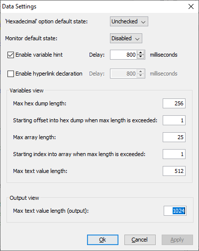

## isCOBOL Debugger

The isCOBOL Debugger has been enhanced in the 2022R1 release to better manage the Output view. These are the features added:

- A new Data Setting is available to set the max text length in the Output view. This affects the double click on the data item or the command-line DISPLAY command, since both show the content of the variable in the Output view. When a variable has a long text such as a PIC X ANY LENGTH or a PIC X(5000), it can be useful to define a limit to reduce the text shown. If the text is longer, then the characters “…” are shown after the limit. As shown in in Figure 15, *Max text value length*.

Figure 15. Max text value length



• Data items can now be selected using the keyboard in the selected line pressing Tab or Shift+Tab. This makes it easy to use using the Debugger with the keyboard. Tab moves the selection to the next data item, while Shift+Tab moves the selection to the previous one.

For example, when selecting a source line that contains:

```cobol
 move w-customer-code   to fd-customer-code
```

it is now possible to press Shift+Tab (or Tab 2 times) to select the second data item. Pressing Ctrl+D or Ctrl+Q will cause the “Display variable” window or the “Quick Watch” window to appear with variable name fd-customer-code already entered in the field used to specify the variable name.

- Better focus management of the Debugger command line area. When the focus is moved from the Debugger command line area to another view, such as Perform stack, Breakpoints, Monitors, Current Variables, there is no need to move the focus back again to the command line area to insert a new command. In every Debugger view, when pressing an alphabetic character for commands, like D to insert the Display command or M to insert the Monitor command, the focus is automatically given to the command line area and the pressed character is input to complete the command.
