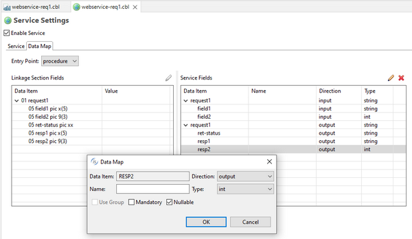

## isCOBOL EIS

isCOBOL EIS, Veryant’s solution to write web-enabled COBOL programs, is constantly updated to provide more comprehensive web solutions. In isCOBOL 2022R1, the HTTPClient class can set and get timeouts, the $ELK directives used to generate the ServiceBridge programs have been enhanced and new configuration settings are available.

### HTTPClient

HTTPClient is a class that enables COBOL programs to interact with Web Services. This class has been updated to manage the Timeout during connections and reads.

The new method signatures are shown below:

- public void setConnectTimeout(java.lang.Double)
- public void setReadTimeout(java.lang.Double)
- public java.lang.Double getConnectTimeout()
- public java.lang.Double getReadTimeout()

If the connect or read operation is not completed within the timeout value, an exception will be raised. This can be used to avoid having a program hangs if a URL is not responding, and without needing to add additional code to avoid this situation.

### $ELK directives

When generating service bridge programs, $ELK directives help to better describe the operations and parameters that need to be passed when consuming web services. In this release, a new directive named $ELK NULLABLE is supported to set a field value to null in the Json stream. Also, the IDE Service Bridge editor has been updated to give the ability to generate this new directive in the linkage section of Cobol source.

An example is shown in Figure 16, *Nullable in Service Editor*.



The Nullable check-box has been checked on the output field resp2, so in the Cobol source the linkage section will be updated as:

```cobol
      $elk output
      $elk nullable
           05 resp2 pic 9(3).
```

and in the generated program restwebservice-req1.cbl, the Json definition of the response will be:

```cobol
 01  response-varout identified by "Response".
   02  request1-out identified by "request1_out".
     06   RET-STATUS-outvar identified by "ret_status".
        07  ret_status-out   pic x any length.
     06   RESP1-outvar identified by "resp1" is nullable.
        07  resp1-out   pic x any length.
     06   RESP2-outvar identified by "resp2" is nullable.
        07  resp2-out   pic 9(3).
```

COBOL programs can then set null values in the field’s initialization, instead of using spaces for pic x data items, or 0 in pic 9 data items.

The Json stream returned to the client consumer of this REST web service will be:

```cobol
{
   "Response":{
      "request1_out":{
         "ret_status":"OK",
         "resp1":null,
         "resp2":null
      }
   }
}
```

In addition, the existing base64Binary and hexBinary values supported in the $elk type directive (previously supported only by SOAP web services) can now also be set when using REST web services. For example, the code snippet:

```cobol
       01 request1 identified by "request1".
      $elk input
      $elk type=base64Binary
           05 field1 pic x any length.
      $elk output
      $elk type=hexBinary
           05 field2 pic x any length.
```

defines a Json stream structure where the input to field1 contains a base64Binary parameter type, and the output to filed2 is returned as hexBinary type.

Configuration settings

New configuration settings have been implemented to customize the initialization of items in the stream structure:

- *iscobol.xmlstream.initialize_on_read=true* to initialize the data item associated to the xml stream object
- *iscobol.jsonstream.initialize_on_read=true* to initialize the data item associated to the json stream object
