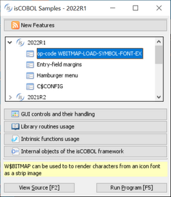
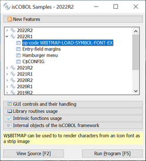
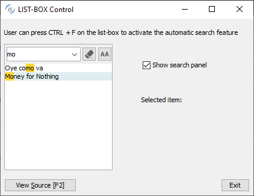

## GUI enhancements

Many improvements to GUI controls have been implemented in this release. The isCOBOL framework is now fully dpi-aware. New properties and events are supported on several controls to enhance and improve GUI applications.

### Fully dpi-aware

High DPI screens are common, and DPI scaling is essential to ensure the correct scaling of graphical screens across devices.

High DPI screens have higher pixel density compared to regular screens, and not scaling correctly could result in screen fonts being too small to be readable, or just not looking good. Applications are defined as DPI-aware if they can scale fonts and images to maintain the correct aspect-ratio and quality across devices.

When running an application in Windows, for example, if the application is not dpi-aware (known also as dpi-unaware), the operating system automatically manages the dpi scaling, but causes quality loss as a result of the upscaling. Starting from isCOBOL 2022 R2, the framework is dpi-aware and can scale to maintain a good quality output.

For example, running the Samples menu program on a 144 DPI display (a Windows system with 150% character size scaling) with isCOBOL 2022 R1 or previous versions, the screen looked like Figure 2, *Samples menu program not dpi-aware*.





Running the same sample program on the same 168 DPI display with isCOBOL 2022 R2, the screen looks like Figure 3. *Samples menu program dpi-aware*.

Previous isCOBOL versions used a virtualized dpi-aware approach, increasing the pixel representation and losing quality, while the new isCOBOL version uses a real dpi-aware scaling, increasing the font sizes to keep a high-quality look. The same applies to images and icons.

If the previous virtualized dpi-aware approach is needed, it can be restored on Windows systems as follows: locate the isrun.exe (or the executable file used to start the program), right click on it and choose the “Properties” menu item, navigate to the “Compatibility” tab, click on “Change high DPI settings”, check the “Override high DPI scaling behavior” and choose “System” for “Scaling performed by:”.

### New controls features

Several graphical controls that have been improved in the latest release:

- Check-Box and Radio-Button controls are now affected by a new configuration option named *iscobol.gui.icons_scaling*. When it is set to true, resizing by using the LMZOOM layout-manager automatically scales the icons of the screen’s Check-Box and Radio-Button controls.

- Check-Box, Radio-Button and Push-Button controls now support the BITMAP-SCALE property, previously supported only on bitmap controls. When using bitmaps on the check-box, radio-button, and push-button controls with the new BITMAP-SCALE property set to 1, the bitmap is resized along with the window when using the LMZOOM layout manager. This property affects all the bitmaps that are defined in Bitmap-Default, Bitmap-Disabled, Bitmap-Disabled-Selected, Bitmap-Number, BitmapPressed, Bitmap-Rollover, Bitmap-Rollover-Selected and Bitmap-Selected for controls that have only a bitmap, or both bitmap and text with the position defined in the TitlePosition property. A code snippet of controls with the new property is shown below.

```cobol
03 check-box ...
   bitmap bitmap-handle bmp-handle bitmap-width 19
   bitmap-number 1 bitmap-rollover 2
   bitmap-scale 1.
03 push-button ...
   bitmap bitmap-handle bmp-handle bitmap-width 19
   bitmap-number 3 bitmap-rollover 4
   bitmap-scale 1.
03 radio-button ...
   bitmap bitmap-handle bmp-handle bitmap-width 19
   bitmap-number 5 bitmap-rollover 6
   bitmap-scale 1.
```

- Check-Box supports two new properties named CHECK-ON-VALUE and CHECK-OFFVALUE allowing you to specify alphanumeric values associated with checked and unchecked states. This simplifies the management of check-boxes that need to store a different value than default numeric values 0 and 1, for example a flag that is stored with N and Y. Here’s a code snippet of a check-box with a pic x variable set to N or Y:

```cobol
 77 w-flag pic x.
 ...
   03 check-box ...
      check-off-value "N" check-on-value "Y"
      value w-flag.
```

This new syntax is also useful when placing the check-box controls inside a grid using the statement “Display Check-Box upon GridName (-1, 3)” to show different values in the grid filter when the column includes a check-box.

- Radio-Button supports alphanumeric values in the property Group-Value, allowing a pic x variable to be used to hold the selection in a radio button group instead of the default numeric variable. Here’s a code snippet of radio buttons with a pic x(n) variable than can be set to “A” “B” or “C”:

```cobol
 77 w-type pic x.
 ...
   03 radio-button ...
      group 1 group-value "A" value w-type.
   03 radio-button ...
      group 1 group-value "B" value w-type.
   03 radio-button ...
      group 1 group-value "C" value w-type.
```

- Push-Button supports a new property named ROLLOVER-BORDER-COLOR to specify the border color of flat buttons when the mouse hovers on the control and can be used in conjunction with the existing properties Rollover-Background-Color and Rollover-Foreground-Color. A code snippet of a button with the new property is shown below:

```cobol
03 push-button flat ...
   rollover-background-color rgb x#A6F9DE
   rollover-foreground-color rgb x#D51515
   rollover-border-color     rgb x#990066.
```

- Grid and List-Box controls support a new property named EXPORT-FILE-OPEN to automatically open an Excel file after it has been produced by the Export feature. This simplifies the opening of the files created on the client. Here’s a code snippet of controls with the new property:

```cobol
03 list-box ...
   export-file-name w-path
   export-file-format "xlsx"
   export-file-open 1.
03 grid ...
   export-file-name w-path
   export-file-format "xlsx"
   export-file-open 1.
```

- List-Box now supports the SEARCH-PANEL property using the same rules as defined in the grid control to manage the search feature. By default, this property is set to 0, making the search panel appear on top of the control only when the user presses the Ctrl-F keyboard shortcut. By setting the property to 1, the search panel will always be visible at the top of the List-box. To completely disable the search panel, the property can be set to -1. You can to change the shortcut key used to open the search panel with the keystroke configuration setting. To set the shortcut to Ctrl+G instead of Ctrl+F, for example, use the setting:

```cobol
iscobol.key.*g=search=list-box
```

The following is a code snippet of a list-box with the new property set to 1 and Figure 4, List-box search-panel in action, showing the search panel used to filter the content of items loaded in the list-box.

```cobol
03 list-box ...
   search-panel 1
```

Figure 4. List-box search-panel in action.

- Tree-View supports a new MSG-MOUSE-CLICKED event, fired by both the standard Tree and Table-View tree when the NOTIFY-MOUSE style is set. This allows an action to be performed when clicking on an item instead of the standard double-click. When used on a Table-View, the special name EVENT-DATA-1 is set to the column number where the click happened. Here's a code snippet to use the new event supported:

```cobol
 03 tv1 tree-view table-view ...
    display-columns (1, 20)
    notify-mouse event tv1-event.
 ...
tv1-event.
    Evaluate event-type
    ...
    when msg-mouse-clicked
       if event-data-1 = 1 | click on first column
    ...
       end-if
    end-evaluate.
```
