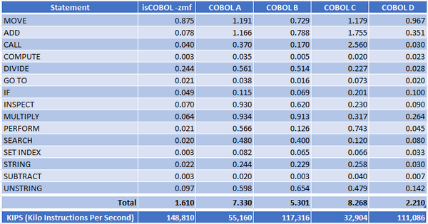

## isCOBOL Compiler

The isCOBOL 2022 R2 compiler includes a new feature that allows developers to write a PreProcessor in COBOL or in Java to integrate custom logic to be applied to source code.

Compatibility with other COBOL dialects and performances has been improved to simplify migrations, and isCOBOL ESQL has been improved to ease migration from IBM DB2 PRE and Oracle Pro\*COBOL (ESQL precompilers).

### PreProcessor integration

A new compiler configuration,“iscobol.compiler.custompreproc”, has been added to enable Preprocessor parsing. Set this configuration to one or more classes that implement the isCOBOL compiler interface “com.iscobol.compiler.custpreproc.LinePreProcessor". For example, when compiling a program with this set in the configuration:

```cobol
iscobol.compiler.custompreproc=MyPreProc SecondPreProc
```

the compiler will pass every line of the source code being compiled to the MyPreProc class, which may perform source code changes. The resulting line is then passed to the SecondPreProc class, which can perform additional changes, and the resulting source code line is finally passed to the compiler for compilation.

isCOBOL already supports the use of the compiler option "iscobol.compiler.regexp” that can be used to replace text within the source code, but the new PreProcessor feature is more flexible and allows the parsing of multiple lines of code for analysis.

Both configuration options can be used simultaneously, letting you make complex code substitutions. The regexp will be executed first, then the custom preprocessor.

To implement the com.iscobol.compiler.custpreproc.LinePreProcessor interface, the class needs to include a “process” method with the signature:

```cobol
public void process(java.lang.String originalLine, 
          int sourceFormat, 
          java.lang.String fileName, 
          int lineNumber, 
          java.lang.String[] compilerOptions, 
          com.iscobol.compiler.custpreproc.ProcessResult result) 
   throws com.iscobol.compiler.custpreproc.ProcessException
```

So, the source can be written in COBOL declaring a CLASS-ID that has a METHOD-ID receiving these parameters:

```cobol
 class-id. MyPreProc as "MyPreProc" implements LinePreProcessor.
 repository.
 class LinePreProcessor as "com.iscobol.compiler.custpreproc.LinePreProcessor"
 class ProcessResult as "com.iscobol.compiler.custpreproc.ProcessResult"
 class ProcessException as "com.iscobol.compiler.custpreproc.ProcessException"
 ...
 method-id. process as "process".
 linkage section.
 77 original-line object reference "java.lang.String".
 77 source-format object reference "int".
 77 source-file-name object reference "java.lang.String".
 77 line-number object reference "int".
 77 compiler-options object reference "java.lang.String[]".
 77 result object reference ProcessResult.
 procedure division using original-line,
                          source-format,
                          source-file-name,
                          line-number,
                          compiler-options,
                          result
                  raising ProcessException.
```

For example, this method can be used to implement custom logic to write comments for a block of code, or to replace some code with another. You can also return Warnings or Errors exactly like the standard compiler produces. Another example use of the PreProcessor is to enforce or suggest code changes to comply with a desired standard set of rules.

When compiling sources with the -lf option, the resulting .list file will contain the output after the processing executed by the preprocessor classes is finished.

When debugging a COBOL program compiled using the preprocessor, the source shown will be the original source, as written by the developer, but the instructions executed will be the result of the preprocessor output.

To better follow the logic of the class-id MyPreProc, you can debug the COBOL source with the Remote Debugger feature. To do that, first compile with this variable set in the configuration:

```cobol
iscobol.compiler.rundebug=2
```

and start the Remote Debugger with the command:

```cobol
iscrun –d –r
```

This will start the Remote Debugger on the default localhost using the default port number 9999 where the compilation process is waiting for the debugger execution. If the compilation is executed on a different server, you can pass the hostname of that server when launching the Remote Debugger.

For additional details on this feature, refer to the updated 2022 R2 documentation and new samples installed in the sample folder “compiler-pre-process”.

### Option to generate optimized class

isCOBOL 2022 R2 provides a new compiler option named “-zmf” that internally activates a new compiler engine designed to maximize runtime performance and minimize resource usage. The new compiler engine has been developed for maximum compatibility with Enterprise IBM Cobol and Micro Focus COBOL. This early version can be used for batch COBOL programs without user interface. There are some syntax limitations as well in this first version.

The new compiler engine uses top-down (recursive descent) parsers as opposed to bottom-up parsers generated by a YACC-like tool. Based on the most popular parser generator, JavaCC, the new compiler engine runs in three steps:

1. COBOL syntax validation
2. Walk to collect data and to generate functions
3. Emitters, LAMBDA based to emit Java classes

As shown Figure 1, *NCR CSAMPLE Benchmark*, performance comparison was made using NCR CSAMPLE benchmark test between isCOBOL 2022 R2 with “-zmf” and other COBOL compilers from the market. The test was run on Windows 11 Pro 64-bit with i7-8550U CPU @ 1.80GHz and 16 GB of RAM. The test shows that isCOBOL’s new compiler engine beat our competitors by running 13% - 80% faster and executing at least 22% more instructions per second.

Figure 1. NCR CSAMPLE Benchmark.

### Improved Compatibility with other COBOLs

Enhancements have been implemented in this release to improve compatibility with MicroFocus COBOL, such as:

- support for THREAD-LOCAL-STORAGE SECTION and IS THREAD-LOCAL clauses.

The THREAD-LOCAL-STORAGE Section describes data which is unique to each thread, useful for resolving contention problems related to concurrent access to the same dataitem. If a data-item is declared inside this new SECTION, every thread has its own copy of the variable instead of sharing the same with other threads.

The IS THREAD-LOCAL clause can be used in the WORKING-STORAGE SECTION or on the FD level to declare that a data-item or File Record needs to be treated with the thread logic described above, making every thread access its separate variables or record definitions.

Here is a code snippet that shows how to declare variables in the THREAD-LOCALSTORAGE SECTION and variables and FD with the THREAD-LOCAL clause:

```cobol
 file section.
 fd file-prod is thread-local.
 01 prod-rec.
    03 prod-key pic 9(4).
    03 prod-desc pic x(90).
 working-storage section.
 77 thr1 handle of thread.
 77 thr2 handle of thread.
 77 counter pic 9(4) value 0 is thread-local.
 thread-local-storage section.
 01 w-rec.
    03 w-key pic 9(4).
    03 w-desc pic x(90).
```

- new compiler option -smfu to manage the Underscore in sources with MF compatibility

With isCOBOL, underscore and hyphen are treated as the same character, but in the MicroFocus compiler the underscore and hyphen are 2 different characters. When a COBOL program contains the same variable or paragraph name, with the only difference being an underscore and hyphen, the isCOBOL compiler will throw a Severe “Ambiguous identifier” and “Duplicate procedure name” error message when compiling.

With the new compiler option –smfu, isCOBOL treats underscore and hyphen as 2 different characters, allowing sources as described to be compiled without errors.

For example, the following code can be compiled correctly:

```cobol
working-storage section.
 77 my-var pic x.
 77 my_var pic x.
 ...
 procedure division.
 ...
     move "a" to my-var.
     move "b" to my_var.
     perform SHOW-MY-VAR.
     perform SHOW-MY_VAR.
 SHOW-MY-VAR.
     display "my-var=" my-var.
 SHOW-MY_VAR.
     display "my_var=" my_var.
```

- the semicolon is now accepted by the compiler as universal path separator

This simplifies sharing file paths between operating systems. Windows uses the “;” as a path separator, while MacOS and Linux use “:”. The isCOBOL compiler will translate the universal path separator, “;”, to the OS-specific character.

For example, the following command used to compile on Windows:

```cobol
iscc –sp=copylib;other-copy/cpy program-name
```

can now be used without changes when compiling in Linux or MacOS.

This change also benefits the isCOBOL IDE when sharing the same Workspace to compile programs using different operating systems such as Windows, Linux and MacOS.

Enhancements have been made in this release to improve compatibility with IBM COBOL, such as:

- support for JSON PARSE and JSON GENERATE statements.

The existing XML PARSE and XML GENERATE statements gave you the ability to manage XML streams, and starting from this release, the JSON PARSE and JSON GENERATE statements are supported to manage JSON streams.

isCOBOL already supports the “com.iscobol.rts.JSONStream” class to manage JSON streams, but now direct migration from IBM COBOL sources that contain these statements is supported by the compiler. Here’s a code snippet of the instructions:

```cobol
working-storage section.
 ...
 01 Grp.
    05 Acc-No pic AA9999.
    05 More.
       10 code pic S99V9 occurs 2.
    05 cr-date pic 99/99/9999.
 01 json-stream pic x(80).
 01 i binary pic 99.
 procedure division.
 ...
    initialize grp
    move "AB1234" to acc-no
    move 1.2 to code(1) 
    move -3 to code(2)
    move "01/07/2022" to cr-date
    JSON GENERATE json-stream from grp 
         count i
         name of code is 'Value'
         suppress cr-date
         on exception
             display "Error on JSON generate"
        not on exception
             display "Successful JSON generate"
    end-json.
 
    initialize grp
    JSON PARSE json-stream into grp
         with detail
         name of code is 'Value'
    end-json.
```

The generated JSON will be:

```cobol
{"Grp":{"Acc-No":"AB1234","More":{"Value":[1.2,-3.0]}}}
```

When the COBOL program receives a JSON stream, the JSON PARSE statement will parse the stream and set the values in the corresponding WORKING STORAGE items.

### Improved Compatibility with other ESQL Precompilers

Enhancements have been made in this release to improve compatibility with RDBMS PreCompilers such as IBM DB2 PRE and Oracle Pro\*COBOL.

- Support for Common Table Expressions (CTE)

A Common Table Expression (CTE) is the result set of a query which exists temporarily and for use only within the context of a larger query. The result of a CTE is not stored and exists only for the duration of the query. CTEs enable users to easily write and maintain complex queries with increased readability and simplification. This reduction in complexity is achieved by deconstructing ordinarily complex queries into simple blocks to be used and reused as necessary in rewriting the query. CTEs initiate with the WITH keyword. Here’s a code snippet as an example:

```cobol
EXEC SQL 
    DECLARE CUR CURSOR FOR
    WITH Sales_CTE AS 
        ( SELECT SalesPersonID, SalesOrderID, YEAR(OrderDate) AS SalesYear 
                 INTO :wrk-person-id, :wrk-order-id, :wrk-year 
                 FROM Sales.SalesOrderHeader 
                WHERE SalesPersonID IS NOT NULL ) 
    SELECT SalesPersonID, COUNT(SalesOrderID) AS TotalSales, SalesYear 
          FROM Sales_CTE 
          GROUP BY SalesYear, SalesPersonID 
          ORDER BY SalesPersonID, SalesYear
 END-EXEC.
```

Note that some databases might not support this syntax, so ensure it’s supported by your RDBMS before using. The larger RDBMS like IBM DB2, Oracle, Postgres, and Microsoft SQL Server support it.

- Ability to specify stored procedure and function names through host variables

Previously, the ESQL CALL statement required the procedure or function name to be a constant string. Now in 2022 R2 the name can be specified using host variables. For example:

```cobol
 MOVE "myproc" TO WRK-PROC-NAME.
 EXEC SQL
      CALL :wrk-proc-name (:wrk-param-1 IN, :wrk-param-2 IN) 
                      INTO :wrk-result
 END-EXEC.
```

This feature lets you write more dynamic code.

- Support for Oracle Pro\*COBOL SQLDA structure

The compatibility with ESQL preprocessors has been increased in this version by supporting the Oracle Pro\*COBOL format of the SQLDA structure. An SQLDA (SQL Descriptor Area) is a set of group items that store all the information the database needs about select-list items or place-holders for bind variables, except their values.

Previously, SQLDA was supported only in compatibility with the IBM DB2 preprocessor.

From the new isCOBOL 2022 R2 release, SQLDA is also supported with Oracle Pro\*COBOL.

The SQLDA structure from Oracle Pro\*COBOL is defined as follows:

```cobol
01 SELDSC. 
 02 SQLDNUM PIC S9(9) COMP VALUE 100.
 02 SQLDFND PIC S9(9) COMP.
 02 SELDVAR OCCURS 100 TIMES. 
  03 SELDV PIC S9(9) COMP. 
  03 SELDFMT PIC S9(9) COMP. 
  03 SELDVLN PIC S9(9) COMP. 
  03 SELDFMTL PIC S9(4) COMP. 
  03 SELDVTYP PIC S9(4) COMP. 
  03 SELDI PIC S9(9) COMP. 
  03 SELDH-VNAME PIC S9(9) COMP. 
  03 SELDH-MAX-VNAMEL PIC S9(4) COMP. 
  03 SELDH-CUR-VNAMEL PIC S9(4) COMP. 
  03 SELDI-VNAME PIC S9(9) COMP. 
  03 SELDI-MAX-VNAMEL PIC S9(4) COMP. 
  03 SELDI-CUR-VNAMEL PIC S9(4) COMP. 
  03 SELDFCLP PIC S9(9) COMP. 
  03 SELDFCRCP PIC S9(9) COMP. 
01 XSELDI.
 03 SEL-DI OCCURS 100 TIMES PIC S9(4) COMP. 
01 XSELDIVNAME.
 03 SEL-DI-VNAME OCCURS 100 TIMES PIC X(80).
01 XSELDV.
 03 SEL-DV OCCURS 100 TIMES PIC X(80). 
01 XSELDHVNAME.
 03 SEL-DH-VNAME OCCURS 100 TIMES PIC X(80).
01 BNDDSC. 
 02 SQLDNUM PIC S9(9) COMP VALUE 100.
 02 SQLDFND PIC S9(9) COMP.
 02 BNDDVAR OCCURS 100 TIMES.
  03 BNDDV PIC S9(9) COMP.
  03 BNDDFMT PIC S9(9) COMP.
  03 BNDDVLN PIC S9(9) COMP.
  03 BNDDFMTL PIC S9(4) COMP.
  03 BNDDVTYP PIC S9(4) COMP.
  03 BNDDI PIC S9(9) COMP.
  03 BNDDH-VNAME PIC S9(9) COMP.
  03 BNDDH-MAX-VNAMEL PIC S9(4) COMP.
  03 BNDDH-CUR-VNAMEL PIC S9(4) COMP.
  03 BNDDI-VNAME PIC S9(9) COMP. 
  03 BNDDI-MAX-VNAMEL PIC S9(4) COMP. 
  03 BNDDI-CUR-VNAMEL PIC S9(4) COMP. 
  03 BNDDFCLP PIC S9(9) COMP. 
  03 BNDDFCRCP PIC S9(9) COMP. 
01 XBNDDI. 
 03 BND-DI OCCURS 100 TIMES PIC S9(4) COMP.
01 XBNDDIVNAME.
 03 BND-DI-VNAME OCCURS 100 TIMES PIC X(80).
01 XBNDDV.
 03 BND-DV OCCURS 100 TIMES PIC X(80).
01 XBNDDHVNAME.
 03 BND-DH-VNAME OCCURS 100 TIMES PIC X(80).
```

These data items are used in DESCRIBE, OPEN and FETCH ESQL statements, for example:

```cobol
EXEC SQL DESCRIBE BIND VARIABLES FOR Stmt1 INTO BNDDSC END-EXEC.
 EXEC SQL DESCRIBE SELECT LIST FOR Stmt1 INTO SELDSC END-EXEC.
 EXEC SQL OPEN Cur1 USING DESCRIPTOR BNDDSC END-EXEC.
 EXEC SQL FETCH Cur1 USING DESCRIPTOR SELDSC END-EXEC.
```
